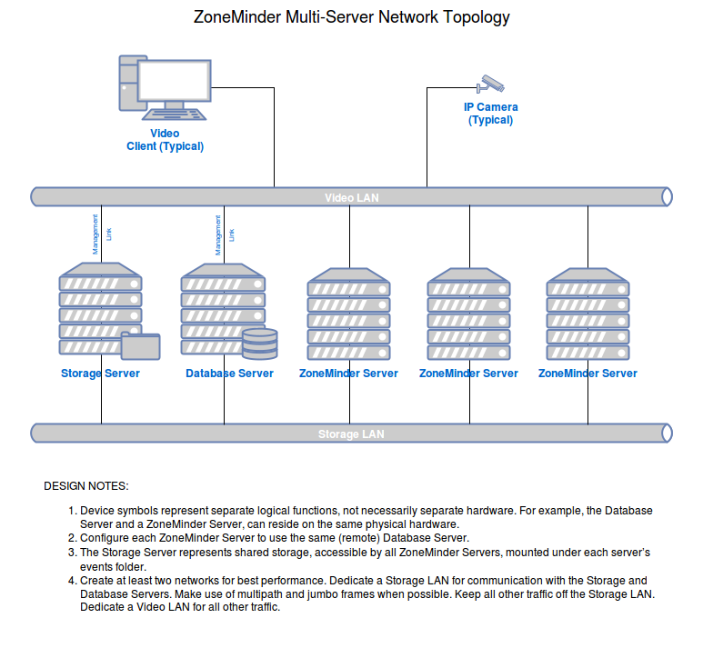

Multi-Server Install
====================

It is possible to run multiple ZoneMinder servers and manage them from a single interface. To achieve this each zoneminder server is connected to a single shared database server and shares file storage for event data.

New installs
------------

1. Follow the normal instructions for your distro for installing ZoneMinder onto all the ZoneMinder servers in the normal fashion. Only a single database will be needed either as standalone, or on one of the ZoneMinder Servers.

2. On each ZoneMinder server, edit zm.conf. Find the ZM_DB_HOST variable and set it to the name or ip address of your Database Server.

3. Copy the file /usr/share/zoneminder/db/zm_create.sql from one of the ZoneMinder Servers to the machine targeted as the Database Server.

4. Install mysql/mariadb server onto the Database Server.

5. It is advised to run "mysql_secure_installation" to help secure the server.

6. Using the password for the root account set during the previous step, create the ZoneMinder database and configure a database account for ZoneMinder to use:

::

  mysql -u root -p < zm_create.sql
  mysql -u root -p
    mysql> grant all on zm.* to 'zmuser'@'%' identified by 'zmpass';
    mysql> exit;
  mysqladmin -u root -p reload

The database account credentials, zmuser/zmpass, are arbitrary. Set them to anything that suits your environment.
Note that these commands are just an example and might not be secure enough for your environment.

7. If you have chosen to change the ZoneMinder database account credentials to something other than zmuser/zmpass, you must now update zm.conf on each ZoneMinder Server. Change ZM_DB_USER and ZM_DB_PASS to the values you created in the previous step.

Additionally, you must also edit /usr/share/zoneminder/www/api/app/Config/database.php in a similar manner on each ZoneMinder Server. Scroll down and change login and password to the values you created in the previous step.

8. All ZoneMinders Servers must share a common events folder. This can be done in any manner supported by the underlying operating system. From the Storage Server, share/export a folder to be used for ZoneMinder events.

9. From each ZoneMinder Server, mount the shared events folder on the Storage Server to the events folder on the local ZoneMinder Server.

NOTE: The location of this folder varies by distro. This folder is often found under "/var/lib/zoneminder/events" for RedHat based distros and "/var/cache/zoneminder/events" for Debain based distros. This folder is NOT a Symbolic Link!

10. Open your browser and point it to the web console on any of the ZoneMinder Servers (they will all be the same). Open Options, click the Servers tab,and populate this screen with all of your ZoneMinder Servers.

11. When creating a new Monitor, remember to select the server the camera will be assigned to from the Server drop down box.
