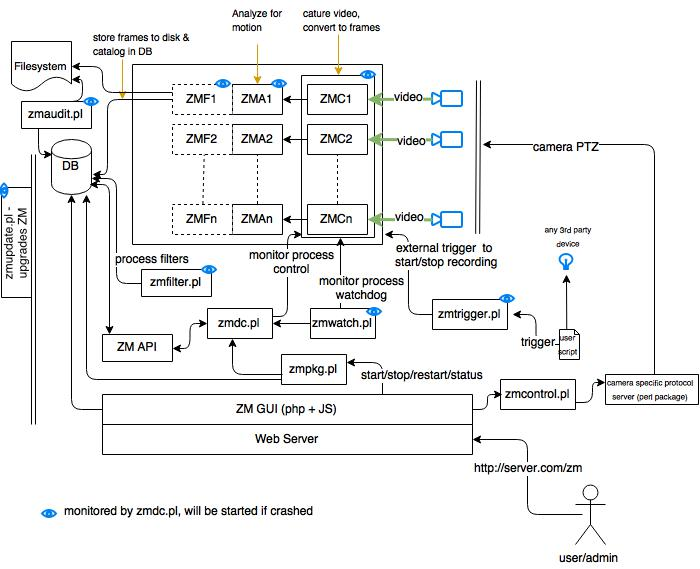

Components
==========

ZoneMinder is not a single monolithic application but is formed from several components. These components primarily include executable compiled binaries which do the main video processing work, perl scripts which usually perform helper and/or external interface tasks and php web scripts which are used for the web interface.

System Overview
----------------
Depicted below is a high level diagram of the ZoneMinder system with key components 

A brief description of each of the principle components follows.

Binaries
--------
**zmc**
  This is the ZoneMinder Capture daemon. This binary's job is to sit on a video device and suck frames off it as fast as possible, this should 	run at more or less constant speed.
**zma**
  This is the ZoneMinder Analysis daemon. This is the component that goes through the captured frames and checks them for motion which might generate an alarm or event. It generally keeps up with the Capture daemon but if very busy may skip some frames to prevent it falling behind.
**zms**
  This is the ZoneMinder Streaming server. The web interface connects with this to get real-time or historical streamed images. It runs only when a live monitor stream or event stream is actually being viewed and dies when the event finishes or the associate web page is closed. If you find you have several zms processes running when nothing is being viewed then it is likely you need a patch for apache (see the Troubleshooting section). A non-parsed header version of zms, called nph-zms, is also installed and may be used instead depending on your web server configuration.
**zmu**
  This is the ZoneMinder Utility. It's basically a handy command line interface to several useful functions. It’s not really meant to be used by anyone except the web page (there's only limited 'help' in it so far) but can be if necessary, especially for debugging video problems.

PHP
---
As well as this there are the web PHP files in the web directory. Currently these consist of a single skin with Classic and Flat styles.

**Classic**
  Original ZoneMinder skin
**Flat**
  An updated version of Classic skin, retaining the same layout with a more modern style. Originally a skin this is now just a CSS style.

Perl
----
Finally some perl scripts in the scripts directory. These scripts all have some configuration at the top of the files which should be viewed and amended if necessary and are as follows.

**zmpkg.pl**
  This is the ZoneMinder Package Control script. This is used by the web interface and service scripts to control the execution of the system as a whole.
**zmdc.pl**
  This is the ZoneMinder Daemon Control script. This is used by the web interface and the zmpkg.pl script to control and maintain the execution of the capture and analysis daemons, amongst others. You should not need to run this script yourself, although you can use it to start/top individual ZM processes.
**zmfilter.pl**
  This script controls the execution of saved filters and will be started and stopped by the web interface based on whether there are filters that have been defined to be autonomous(background). This script is also responsible for the automatic uploading of events to a 3rd party server.  Prior to 1.32 there was one zmfilter.pl process.  In 1.32 onwards we start a zmfilter.pl process for each background filter so that the processing time of one filter doesn't delay the processing of another filter.
**zmaudit.pl**
  This script is used to check the consistency of the event file system and database. It can delete orphaned events, i.e. ones that appear in one location and not the other as well as checking that all the various event related tables are in line. It can be run interactively or in batch mode either from the command line or a cron job or similar. In the zmconfig.pl there is an option to specify fast event deletes where the web interface only deletes the event entry from the database itself. If this is set then it is this script that tidies up the rest.  We do not recommend fast event deletion and we do not recommend having zmaudit.pl run in the background.  It is a very ram cpu and disk io intensive program, constantly scanning every event.  Please run it manually or from a cron job on weekends or something.
**zmwatch.pl**
  This is a simple script purely designed to keep an eye on the capture daemons and restart them if they lockup. It has been known for sync problems in the video drivers to cause this so this script makes sure that nothing important gets missed.
**zmupdate.pl**
  Currently this script is responsible for checking whether a new version of ZoneMinder is available and other miscellaneous actions related to upgrades and migrations. It is also intended to be a ‘one stop shop’ for any upgrades and will execute everything necessary to update your installation to a new version.
**zmvideo.pl**
  This script is used from the web interface to generate video files in various formats in a common way. You can also use it from the command line in certain circumstances but this is not usually necessary.
**zmx10.pl**
  This is an optional script that can be used to initiate and monitor X10 Home Automation style events and interface with an alarm system either by the generation of X10 signals on ZoneMinder events or by initiating ZoneMinder monitoring and capture on receipt of X10 signals from elsewhere, for instance the triggering of an X10 PIR. For example I have several cameras that don’t do motion detection until I arm my alarm system whereupon they switch to active mode when an X10 signal is generated by the alarm system and received by ZoneMinder.
**zmtrigger.pl**
  This is an optional script that is a more generic solution to external triggering of alarms. It can handle external connections via either internet socket, unix socket or file/device interfaces. You can either use it ‘as is’ if you can interface with the existing format, or override connections and channels to customise it to your needs. The format of triggers used by zmtrigger.pl is as follows "<id>|<action>|<score>|<cause>|<text>|<showtext>" where

  * 'id' is the id number or name of the ZM monitor.
  * 'action' is 'on', 'off', 'cancel' or ‘show’ where 'on' forces an alarm condition on, 'off' forces an alarm condition off and 'cancel' negates the previous 'on' or 'off'. The ‘show’ action merely updates some auxiliary text which can optionally be displayed in the images captured by the monitor. Ordinarily you would use 'on' and 'cancel', 'off' would tend to be used to suppress motion based events. Additionally 'on' and 'off' can take an additional time offset, e.g. on+20 which automatically 'cancel's the previous action after that number of seconds.
  * 'score' is the score given to the alarm, usually to indicate it's importance. For 'on' triggers it should be non-zero, otherwise it should be zero.
  * 'cause' is a 32 char max string indicating the reason for, or source of the alarm e.g. 'Relay 1 open'. This is saved in the ‘Cause’ field of the event. Ignored for 'off' or 'cancel' messages.
  * 'text' is a 256 char max additional info field, which is saved in the ‘Description’ field of an event. Ignored for 'off' or 'cancel' messages.
  * 'showtext' is up to 32 characters of text that can be displayed in the timestamp that is added to images. The ‘show’ action is designed to update this text without affecting alarms but the text is updated, if present, for any of the actions. This is designed to allow external input to appear on the images captured, for instance temperature or personnel identity etc.

  Note that multiple messages can be sent at once and should be LF or CRLF delimited. This script is not necessarily intended to be a solution in itself, but is intended to be used as ‘glue’ to help ZoneMinder interface with other systems. It will almost certainly require some customisation before you can make any use of it. If all you want to do is generate alarms from external sources then using the ZoneMinder::SharedMem perl module is likely to be easier.
**zmcamtool.pl**
  This optional script is new for the upcoming 1.27 release of ZoneMinder. It is intended to make it easy to do the following: bring in new ptz controls and camera presets, convert existing monitors into presets, and export custom ptz controls and presets. For the initial release, this script is not integrated into the UI and must be called from the command line.  Type ''zmcamtool.pl --help'' from the command line to get an explanation of the different arguments one can pass to the script.
**zmcontrol-\*.pl**
  These are a set of example scripts which can be used to control Pan/Tilt/Zoom class cameras. Each script converts a set of standard parameters used for camera control into the actual protocol commands sent to the camera. If you are using a camera control protocol that is not in the shipped list then you will have to create a similar script though it can be created entirely separately from ZoneMinder and does not need to named as these scripts are. Although the scripts are used to action commands originated from the web interface they can also be used directly or from other programs or scripts, for instance to implement periodic scanning to different presets.
**zmtrack.pl**
  This script is used to manage the experimental motion tracking feature. It is responsible for detecting that an alarm is taking place and moving the camera to point to the alarmed location, and then subsequently returning it to a defined standby location. As well as moving the camera it also controls when motion detection is suspended and restored so that the action of the camera tracking does not trigger endless further alarms which are not justified.
**zm**
  This is the (optional) ZoneMinder init script, see below for details.

**zmeventnotification.pl**
  This is an optional 3rd party real time event notification server that also provides push notifications for zmNinja as well as machine learning powered object/face-detection. Please see `Event Notification Server Documentation <https://zmeventnotification.readthedocs.io/en/latest/index.html>`__ for more details (Note that the machine learning components are optional, and are developed in Python3)

Finally, there are also a number of ZoneMinder perl modules included. These are used by the scripts above, but can also be used by your own or 3rd party scripts. Full documentation for most modules is available in ‘pod’ form via ‘perldoc’ but the general purpose of each module is as follows.

**ZoneMinder.pm**
  This is a general ZoneMinder container module. It includes the Base.pm, Config.pm Debug.pm, Database.pm, and SharedMem.pm modules described below. It also exports all of their symbols by default. If you use the other modules directly you have request which symbol tags to import.
**ZoneMinder/Base.pm**
  This is the base ZoneMinder perl module. It contains only simple data such as version information. It is included by all other ZoneMinder perl modules
**ZoneMinder/Config.pm**
  This module imports the ZoneMinder configuration from the database.
**ZoneMinder/Debug.pm**
  This module contains the defined Debug and Error functions etc, that are used by scripts to produce diagnostic information in a standard format.
**ZoneMinder/Database.pm**
  This module contains database access definitions and functions. Currently not a lot is in this module but it is included as a placeholder for future development.
**ZoneMinder/Event.pm**
  This module contains functions to load, manipulate, delete, copy, move events.
**ZoneMinder/Filter.pm**
  This module contains functions to load, execute etc filters.
**ZoneMinder/SharedMem.pm**
  This module contains standard shared memory access functions. These can be used to access the current state of monitors etc as well as issuing commands to the monitors to switch things on and off. This module effectively provides a ZoneMinder API.
**ZoneMinder/ConfigAdmin.pm**
  This module is a specialised module that contains the definition, and other information, about the various configuration options. It is not intended for use by 3rd parties.
**ZoneMinder/Control/\*.pm**
  These modules contain implementations of the various PTZ protocols.
**ZoneMinder/Trigger/\*.pm**
  These modules contain definitions of trigger channels and connections used by the zmtrigger.pl script. Although they can be used ‘as is’, they are really intended as examples that can be customised or specialised for different interfaces. Contributed modules for new channels or connections will be welcomed and included in future versions of ZoneMinder.
