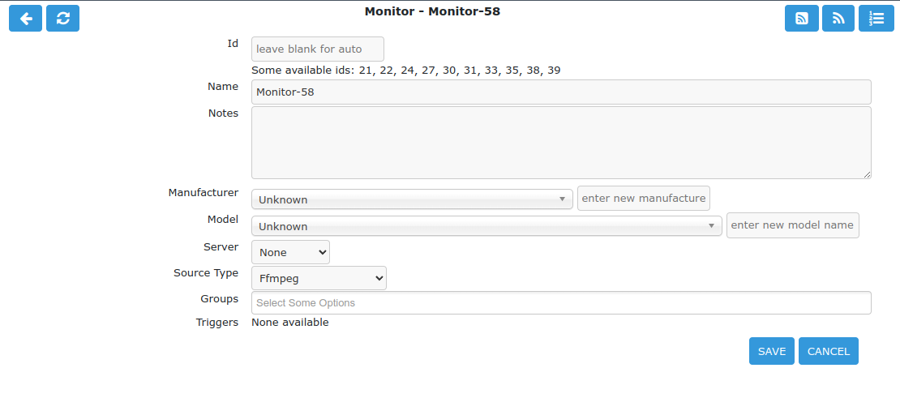
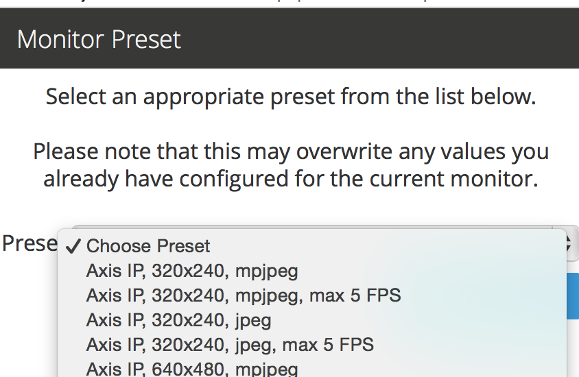

Defining Monitors
=================

To use ZoneMinder properly you need to define at least one Monitor. Essentially, a monitor is associated with a camera and can continually check it for motion detection and such like.

You can access the monitor window by clicking on the "Add New Monitor" button, or by clicking on the "Source" column of a predefined monitor.

There are a small number of camera setups that ZoneMinder knows about and which can be accessed by clicking on the ‘Presets’ link. Selecting one of the presets will fill in the monitor configuration with appropriate values but you will still need to enter others and confirm the preset settings. Here is an example of the presets window:

The options are divided into a set of tabs to make it easier to edit. You do not have to ‘save’ to change to different tab so you can make all the changes you require and then click ‘Save’ at the end. The individual options are explained in a little more detail below,

Monitor Tab
-----------

Name 
    The name for your monitor. This should be made up of alphanumeric characters (a-z,A-Z,0-9) and hyphen (-) and underscore(_) only. Whitespace is not allowed. 

Server
    Multi-Server implementation allows the ability to define multiple ZoneMinder servers sharing a single database. When servers are configured this setting allows you nominate the server for each monitor.

Source Type 
    This determines whether the camera is a local one attached to a physical video or USB port on your machine, a remote network camera or an image source that is represented by a file (for instance periodically downloaded from a alternate location). Choosing one or the other affects which set of options are shown in the Source tab. 

Function 
    This essentially defines what the monitor is doing. This can be one of the following; 

        * None – The monitor is currently disabled. No streams can be viewed or events generated. Nothing is recorded.
        * Monitor – The monitor is only available for live streaming. No image analysis is done so no alarms or events will be generated, and nothing will be recorded.
        * Modect – or MOtion DEteCTtion. All captured images will be analysed and events generated with recorded video where motion is detected.
        * Record – The monitor will be continuously recorded. Events of a fixed-length will be generated regardless of motion, analogous to a conventional time-lapse video recorder. No motion detection takes place in this mode.
        * Mocord – The monitor will be continuously recorded, with any motion being highlighted within those events.
        * Nodect – or No DEteCTtion. This is a special mode designed to be used with external triggers. In Nodect no motion detection takes place but events are recorded if external triggers require it. 

    Generally speaking it is best to choose ‘Monitor’ as an initial setting here. 

Enabled 
    The enabled field indicates whether the monitor should be started in an active mode or in a more passive state. You will nearly always want to check this box, the only exceptions being when you want the camera to be enabled or disabled by external triggers or scripts. If not enabled then the monitor will not create any events in response to motion or any other triggers. 

Linked Monitors 
    This field allows you to select other monitors on your system that act as triggers for this monitor. So if you have a camera covering one aspect of your property you can force all cameras to record while that camera detects motion or other events. You can either directly enter a comma separated list of monitor ids or click on ‘Select’ to choose a selection. Be very careful not to create circular dependencies with this feature however you will have infinitely persisting alarms which is almost certainly not what you want! To unlink monitors you can ctrl-click. 

Maximum FPS 

    .. warning::
      Unless you know what you are doing, please leave this field empty, especially if you are configuring a network camera. More often than not, putting a value here adversely affects recording.

    On some occasions you may have one or more cameras capable of high capture rates but find that you generally do not require this performance at all times and would prefer to lighten the load on your server. This option permits you to limit the maximum capture rate to a specified value. This may allow you to have more cameras supported on your system by reducing the CPU load or to allocate video bandwidth unevenly between cameras sharing the same video device. This value is only a rough guide and the lower the value you set the less close the actual FPS may approach it especially on shared devices where it can be difficult to synchronise two or more different capture rates precisely. This option controls the maximum FPS in the circumstance where no alarm is occurring only. 
    
    This feature is limited and will only work under the following conditions: 
    
    #. Local cameras
    #. Remote (IP) cameras in snapshot or jpeg mode **only**
    
    Using this field for video streams from IP cameras will cause undesirable results when the value is equal to or less than the frame rate from the camera. Note that placing a value higher than the camera's frame rate is allowed and can help prevent cpu spikes when communication from the camera is lost.
    
Alarm Maximum FPS 

    .. warning::
          Unless you know what you are doing, please leave this field empty, especially if you are configuring a network camera. More often than not, putting a value here adversely affects recording.
      

    If you have specified a Maximum FPS it may be that you don’t want this limitation to apply when your monitor is recording motion or other event. This setting allows you to override the Maximum FPS value if this circumstance occurs. As with the Maximum FPS setting leaving this blank implies no limit so if you have set a maximum fps in the previous option then when an alarm occurs this limit would be ignored and ZoneMinder would capture as fast as possible for the duration of the alarm, returning to the limited value after the alarm has concluded. Equally you could set this to the same, or higher (or even lower) value than Maximum FPS for more precise control over the capture rate in the event of an alarm. 
    
    **IMPORTANT:** This field is subject to the same limitations as the Maximum FPS field. Ignoring these limitations will produce undesriable results.

Reference Image Blend %ge 
    Each analysed image in ZoneMinder is a composite of previous images and is formed by applying the current image as a certain percentage of the previous reference image. Thus, if we entered the value of 10 here, each image’s part in the reference image will diminish by a factor of 0.9 each time round. So a typical reference image will be 10% the previous image, 9% the one before that and then 8.1%, 7.2%, 6.5% and so on of the rest of the way. An image will effectively vanish around 25 images later than when it was added. This blend value is what is specified here and if higher will make slower progressing events less detectable as the reference image would change more quickly. Similarly events will be deemed to be over much sooner as the reference image adapts to the new images more quickly. In signal processing terms the higher this value the steeper the event attack and decay of the signal. It depends on your particular requirements what the appropriate value would be for you but start with 10 here and adjust it (usually down) later if necessary. 

Triggers 
    This small section lets you select which triggers will apply if the run mode has been set to ‘triggered’ above. The most common trigger is X10 and this will appear here if you indicated that your system supported it during installation. Only X10 is supported as a shipped trigger with ZoneMinder at present but it is possible that other triggers will become available as necessary. You can also just use ‘cron’ jobs or other mechanisms to actually control the camera and keep them completely outside of the ZoneMinder settings. The zmtrigger.pl script is also available to implement custom external triggering. 

Source Tab
----------

FFmpeg
^^^^^^
    This is the **recommended** source type for most modern ip cameras.

Source Path 
    Use this field to enter the full URL of the stream or file your camera supports. This is usually an RTSP url. There are several methods to learn this:

        * Check the documentation that came with your camera
        * Look for your camera in the hardware compatibilty list in the `hardware compatibility wiki <https://wiki.zoneminder.com/Hardware_Compatibility_List>`__
        * Try ZoneMinder's new ONVIF probe feature
        * Download and install the `ONVIF Device Manager <https://sourceforge.net/projects/onvifdm/>`__ onto a Windows machine 
        * Use Google to find third party sites, such as ispy, which document this information
Source Colours 
    Specify the amount of colours in the captured image. 32 bit is the preferred choice here. Unlike with local cameras changing this has no controlling effect on the remote camera itself so ensure that your camera is actually capturing to this palette beforehand. 
Capture Width/Height 
    Make sure you enter here the same values as they are in the remote camera's internal setting. 
Keep aspect ratio
    As per local devices. 
Orientation 
    As per local devices. 

LibVLC
^^^^^^
    The fields for the LibVLC source type are configured the same way as the ffmpeg source type. We recommend only using this source type if issues are experienced with the ffmpeg source type.

cURL
^^^^

Local
^^^^^

Device Path/Channel 
    Enter the full path to the device file that your camera is attached to, e.g. /dev/video0. Some video devices, e.g. BTTV cards support multiple cameras on one device so in this case enter the channel number in the Channel box or leave it at zero if you're using a USB camera or one with just one channel. Look in Supported Hardware section, how to see if your capture card or USB webcam is supported or not, and what extra settings you may have to do, to make it work. 
Device Format 
    Enter the video format of the video stream. This is defined in various system files (e.g. /usr/include/linux/videodev.h) but the two most common are 0 for PAL and 1 for NTSC. 
Capture Palette 
    Finally for the video part of the configuration enter the colour depth. ZoneMinder supports a handful of the most common palettes, so choose one here. If in doubt try 32 bit colour first, then 24 bit colour, then grey. If none of these work very well, and your camera is local, then YUV420P or one of the others probably will. There is a slight performance penalty when using palettes other than 32, 24, or grey palettes as an internal conversion is involved. Recent versions of ZoneMinder support 32bit colour. This capture palette provides a performance boost when used on all modern Intel-based processors.
Capture Width/Height 
    The dimensions of the video stream your camera will supply. If your camera supports several just enter the one you'll want to use for this application, you can always change it later. However I would recommend starting with no larger than 320x240 or 384x288 and then perhaps increasing and seeing how performance is affected. This size should be adequate in most cases. Some cameras are quite choosy about the sizes you can use here so unusual sizes such as 197x333 should be avoided initially. 
Keep aspect ratio
    When typing in the dimensions of monitors you can click this checkbox to ensure that the width stays in the correct ratio to the height, or vice versa. It allows height to be calculated automatically from width (or vice versa) according to preset aspect ratio. This is preset to 4:3 but can be amended globally via the Options->Config->ZM_DEFAULT_ASPECT_RATIO setting. Aside from 4:3 which is the usual for network and analog cameras another common setting is 11:9 for CIF (352x288) based sources. 
Orientation 
    If your camera is mounted upside down or at right angles you can use this field to specify a rotation that is applied to the image as it is captured. This incurs an additional processing overhead so if possible it is better to mount your camera the right way round if you can. If you choose one of the rotation options remember to switch the height and width fields so that they apply, e.g. if your camera captures at 352x288 and you choose ‘Rotate Right’ here then set the height to be 352 and width to be 288. You can also choose to ‘flip’ the image if your camera provides mirrored input. 

Remote
^^^^^^

Remote Protocol
    Choices are currently HTTP and RTSP. Before RTSP became the industry standard, many ip cameras streamed directly from their web portal. If you have an ip camera that does not speak RTSP then choose HTTP here. **If you camera does speak RTSP then you should change your source type to ffmpeg instead of selecting RTSP here.** The Remote -> RTSP method is no longer being maintained and may go away at some point in the future.
Remote Method
    When HTTP is the Remote Protocol, your choices are Simple and Regexp. Most should choose Simple. When RTSP is the Remote Protocol, your choices are RTP/Unicast, RTP/Multicast, RTP/RTSP, RTP,RTSP,HTTP. Try each of these to determine which works with your camera. Most cameras will use either RTP/Unicast (UDP) or RTP/RTSP (TCP). 
Remote Host/Port/Path 
    Use these fields to enter the full URL of the camera. Basically if your camera is at ``http://camserver.home.net:8192/cameras/camera1.jpg`` then these fields will be camserver.home.net, 8192 and /cameras/camera1.jpg respectively. Leave the port at 80 if there is no special port required. If you require authentication to access your camera then add this onto the host name in the form <username>:<password>@<hostname>.com. This will usually be 32 or 24 bit colour even if the image looks black and white. Look in Supported Hardware > Network Cameras section, how to obtain these strings that may apply to your camera. 
Remote Image Colours 
    Specify the amount of colours in the captured image. Unlike with local cameras changing this has no controlling effect on the remote camera itself so ensure that your camera is actually capturing to this palette beforehand. 
Capture Width/Height 
    Make sure you enter here the same values as they are in the remote camera's internal setting. 
Keep aspect ratio
    As per local devices. 
Orientation 
    As per local devices. 

For an example to setup a MPEG-4 camera see: How_to_Setup_an_Axis211A_with_MPEG-4_streaming

File
^^^^

File Path 
    Enter the full path to the file to be used as the image source. 
File Colours 
    Specify the amount of colours in the image. Usually 32 bit colour. 
Capture Width/Height
    As per local devices. 
Keep aspect ratio
    As per local devices. 
Orientation 
    As per local devices. 

WebSite
^^^^^^^

This Source Type allows one to configure an arbitrary website as a non-recordable, fully interactive, monitor in ZoneMinder. Note that sites with self-signed certificates will not display until the end user first manually navigates to the site and accpets the unsigned certificate. Also note that some sites will set an X-Frame option in the header, which discourages their site from being displayed within a frame. ZoneMinder will detect this condition and present a warning in the log. When this occurs, the end user can choose to install a browser plugin or extension to workaround this issue.

Website URL 
    Enter the full http or https url to the desired website.

Width (pixels) 
    Chose a desired width in pixels that gives an acceptable appearance. This may take some expirimentation.

Height (pixels) 
    Chose a desired height in pixels that gives an acceptable appearance. This may take some expirimentation.

Web Site Refresh 
    If the website in question has static content, optionally enter a time period in seconds for ZoneMinder to refresh the content.

Storage Tab
-----------

The storage section allows for each monitor to configure if and how video and audio are recorded.

Save JPEGs
    Records video in individual JPEG frames. Storing JPEG frames requires more storage space than h264 but it allows to view an event anytime while it is being recorded.

    * Disabled – video is not recorded as JPEG frames. If this setting is selected, then "Video Writer" should be enabled otherwise there is no video recording at all.
    * Frames only – video is recorded in individual JPEG frames.
    * Analysis images only (if available) – video is recorded in invidual JPEG frames with an overlay of the motion detection analysis information. Note that this overlay remains permanently visible in the frames.
    * Frames + Analysis images (if available) – video is recorded twice, once as normal individual JPEG frames and once in invidual JPEG frames with analysis information overlaid.

Video Writer
    Records video in real video format. It provides much better compression results than saving JPEGs, thus longer video history can be stored.
	
    * Disabled – video is not recorded in video format. If this setting is selected, then "Save JPEGs" should be enabled otherwise there is no video recording at all.
    * X264 Encode – the video or picture frames received from the camera are transcoded into h264 and stored as a video. This option is useful if the camera cannot natively stream h264.
    * H264 Camera Passthrough – this option assumes that the camera is already sending an h264 stream. Video will be recorded as is, without any post-processing in zoneminder. Video characteristics such as bitrate, encoding mode, etc. should be set directly in the camera.

Recording Audio
    Check the box labeled "Whether to store the audio stream when saving an event." in order to save audio (if available) when events are recorded.

Timestamp Tab
-------------

Timestamp Label Format 
    This relates to the timestamp that is applied to each frame. It is a ‘strftime’ style string with a few extra tokens. You can add %f to add the decimal hundredths of a second to the frame timestamp, so %H:%M:%S.%f will output time like 10:45:37.45. You can also use %N for the name of the monitor and %Qwhich will be filled by any of the ‘show text’ detailed in the zmtriggers.pl section. 
Timestamp Label X/Y 
    The X and Y values determine where to put the timestamp. A value of 0 for the X value will put it on the left side of the image and a Y value of 0 will place it at the top of the image. To place the timestamp at the bottom of the image use a value eight less than the image height. 

Buffers Tab
-----------

Image Buffer Size 
    This option determines how many frames are held in the ring buffer at any one time. The ring buffer is the storage space where the last ‘n’ images are kept, ready to be resurrected on an alarm or just kept waiting to be analysed. It can be any value you like with a couple of provisos, (see next options). However it is stored in shared memory and making it too large especially for large images with a high colour depth can use a lot of memory. A value of no more than 50 is usually ok. If you find that your system will not let you use the value you want it is probably because your system has an arbitrary limit on the size of shared memory that may be used even though you may have plenty of free memory available. This limit is usually fairly easy to change, see the Troubleshooting section for details. 
Warm-up Frames 
    This specifies how many frames the analysis daemon should process but not examine when it starts. This allows it to generate an accurate reference image from a series of images before looking too carefully for any changes. I use a value of 25 here, too high and it will take a long time to start, too low and you will get false alarms when the analysis daemon starts up. 
Pre/Post Event Image Buffer 
    These options determine how many frames from before and after an event should be preserved with it. This allows you to view what happened immediately prior and subsequent to the event. A value of 10 for both of these will get you started but if you get a lot of short events and would prefer them to run together to form fewer longer ones then increase the Post Event buffer size. The pre-event buffer is a true buffer and should not really exceed half the ring buffer size. However the post-event buffer is just a count that is applied to captured frames and so can be managed more flexibly. You should also bear in mind the frame rate of the camera when choosing these values. For instance a network camera capturing at 1FPS will give you 10 seconds before and after each event if you chose 10 here. This may well be too much and pad out events more than necessary. However a fast video card may capture at 25FPS and you will want to ensure that this setting enables you to view a reasonable time frame pre and post event. 
Stream Replay Image Buffer
    The number of frames buffered to allow pausing and rewinding of the stream when live viewing a monitor. A value of 0 disables the feature.
    Frames are buffered to ZM_PATH_SWAP. If this path points to a physical drive, a lot of IO will be caused during live view / montage. If you experience high system load in those situations, either disable the feature or use a RAM drive for ZM_PATH_SWAP.
Alarm Frame Count 
    This option allows you to specify how many consecutive alarm frames must occur before an alarm event is generated. The usual, and default, value is 1 which implies that any alarm frame will cause or participate in an event. You can enter any value up to 16 here to eliminate bogus events caused perhaps by screen flickers or other transients. Values over 3 or 4 are unlikely to be useful however. Please note that if you have statistics recording enabled then currently statistics are not recorded for the first ‘Alarm Frame Count’-1 frames of an event. So if you set this value to 5 then the first 4 frames will be missing statistics whereas the more usual value of 1 will ensure that all alarm frames have statistics recorded. 

Control Tab
-----------

Note: This tab and its options will only appear if you have selected the ZM_OPT_CONTROL option to indicate that your system contains cameras which are able to be controlled via Pan/Tilt/Zoom or other mechanisms. See the Camera Control section elsewhere in this document for further details on camera control protocols and methods.

Controllable 
    Check this box to indicate your camera can be controlled. 
Control Type 
    Select the control type that is appropriate for your camera. ZoneMinder ships with a small number of predefined control protocols which will works with some cameras without modification but which may have to amended to function with others, Choose the edit link to create new control types or to edit the existing ones. 
Control Device 
    This is the device that is used to control your camera. This will normally be a serial or similar port. If your camera is a network camera, you will generally not need to specify a control device. 
Control Address 
    This is the address of your camera. Some control protocols require that each camera is identified by a particular, usually numeric, id. If your camera uses addressing then enter the id of your camera here. If your camera is a network camera then you will usually need to enter the hostname or IP address of it here. This is ordinarily the same as that given for the camera itself. 
Auto Stop Timeout 
    Some cameras only support a continuous mode of movement. For instance you tell the camera to pan right and then when it is aligned correctly you tell it to stop. In some cases it is difficult to time this precisely over a web interface so this option allows you to specify an automatic timeout where the command will be automatically stopped. So a value of 0.25 here can tell the script to stop moving a quarter of a second after starting. This allows a more precise method of fine control. If this value is left blank or at zero it will be ignored, if set then it will be used as the timeout however it will only be applied for the lower 25% of possible speed ranges. In other words if your camera has a pan speed range of 1 to 100 then selecting to move at 26 or over will be assumed to imply that you want a larger movement that you can control yourself and no timeout will be applied. Selecting motion at lower speeds will be interpreted as requiring finer control and the automatic timeout will be invoked. 
Track Motion 
    This and the following four options are used with the experimental motion function. This will only work if your camera supports mapped movement modes where a point on an image can be mapped to a control command. This is generally most common on network cameras but can be replicated to some degree on other cameras that support relative movement modes. See the Camera Control section for more details. Check this box to enable motion tracking. 
Track Delay 
    This is the number of seconds to suspend motion detection for following any movement that the camera may make to track motion. 
Return Location 
    If you camera supports a ‘home’ position or presets you can choose which preset the camera should return to after tracking motion. 
Return Delay 
    This is the delay, in seconds, once motion has stopped being detected, before the camera returns to any defined return location. 

X10 Tab
-------

Note: This tab and its options will only appear if you have indicated that your system supports the X10 home automation protocol during initial system configuration.

X10 Activation String 
    The contents of this field determine when a monitor starts and/or stops being active when running in ‘Triggered; mode and with X10 triggers. The format of this string is as follows, 

        * n : If you simply enter a number then the monitor will be activated when an X10 ON signal for that unit code is detected and will be deactivated when an OFF signal is detected.
        * !n : This inverts the previous mode, e.g. !5 means that the monitor is activated when an OFF signal for unit code 5 is detected and deactivated by an ON.
        * n+ : Entering a unit code followed by + means that the monitor is activated on receipt of a ON signal for that unit code but will ignore the OFF signal and as such will not be deactivated by this instruction. If you prepend a '!' as per the previous definition it similarly inverts the mode, i.e. the ON signal deactivates the monitor.
        * n+<seconds> : As per the previous mode except that the monitor will deactivate itself after the given number of seconds.
        * n- : Entering a unit code followed by - means that the monitor is deactivated on receipt of a OFF signal for that unit code but will ignore the ON signal and as such will not be activated by this instruction. If you prepend a '!' as per the previous definition it similarly inverts the mode, i.e. the OFF signal activates the monitor.
        * n-<seconds> : As per the previous mode except that the monitor will activate itself after the given number of seconds. 

    You can also combine several of these expressions to by separating them with a comma to create multiple circumstances of activation. However for now leave this blank. 

X10 Input Alarm String 
    This has the same format as the previous field but instead of activating the monitor with will cause a forced alarm to be generated and an event recorded if the monitor is Active. The same definition as above applies except that for activated read alarmed and for deactivated read unalarmed(!). Again leave this blank for now. 
X10 Output Alarm String 
    This X10 string also has the same format as the two above options. However it works in a slightly different way. Instead of ZoneMinder reacting to X10 events this option controls how ZoneMinder emits X10 signals when the current monitor goes into or comes out of the alarm state. Thus just entering a number will cause the ON signal for that unit code to be sent when going into alarm state and the OFF signal when coming out of alarm state. Similarly 7+30 will send the unit code 7 ON signal when going into alarm state and the OFF signal 30 seconds later regardless of state. The combination of the X10 instruction allows ZoneMinder to react intelligently to, and also assume control of, other devices when necessary. However the indiscriminate use of the Input Alarm and Output Alarm signals can cause some horrendous race conditions such as a light going on in response to an alarm which then causes an alarm itself and so on. Thus some circumspection is required here. Leave this blank for now anyway. 

Misc Tab
--------

Event Prefix 
    By default events are named ‘Event-<event id>’, however you are free to rename them individually as you wish. This option lets you modify the event prefix, the ‘Event-‘ part, to be a value of your choice so that events are named differently as they are generated. This allows you to name events according to which monitor generated them. 
Section Length 
    This specifies the length (in seconds) of any fixed length events produced when the monitor function is ‘Record’ or ‘Mocord’. Otherwise it is ignored. This should not be so long that events are difficult to navigate nor so short that too many events are generated. A length of between 300 and 900 seconds I recommended. 
Frame Skip 
    This setting also applies only to the ‘Record’ or ‘Mocord’ functions and specifies how many frames should be skipped in the recorded events. The default setting of zero results in every captured frame being saved. Using a value of one would mean that one frame is skipped between each saved, two means that two frames are skipped between each saved frame etc. An alternate way of thinking is that one in every ‘Frame Skip + 1’ frames is saved. The point of this is to ensure that saved events do not take up too much space unnecessarily whilst still allowing the camera to capture at a fairly high frame rate. The alternate approach is to limit the capture frame rate which will obviously affect the rate at which frames are saved. 
FPS Report Interval 
    How often the current performance in terms of Frames Per Second is output to the system log. Not used in any functional way so set it to maybe 1000 for now. If you watch /var/log/messages (normally) you will see this value being emitted at the frequency you specify both for video capture and processing. 
Default Scale 
    If your monitor has been defined with a particularly large or small image size then you can choose a default scale here with which to view the monitor so it is easier or more visible from the web interface. 
Web Colour 
    Some elements of ZoneMinder now use colours to identify monitors on certain views. You can select which colour is used for each monitor here. Any specification that is valid for HTML colours is valid here, e.g. ‘red’ or ‘#ff0000’. A small swatch next to the input box displays the colour you have chosen. 
Embed EXIF data into image:
    Embeds EXIF data into each jpeg frame
    
    .. todo:: what about mp4s?
