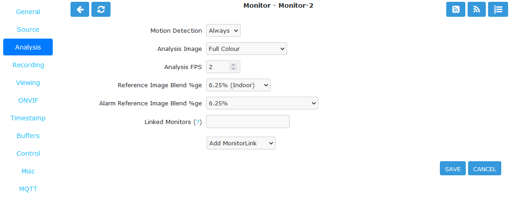

Analysis Tab
------------

    The Analysis tab contains settings relating to motion detection.

    Monitor Analysis Tab

- **Motion Detection**

    - None: Do not perform motion detection. Recording can still be triggered manually.
    - Always: Perform motion detection.

- **Analysis Image**

    - Full Colour: Perform the detection using the full RGB image
    - Y-Channel: If the capture process results in an image in YUV format, the Y channel is a grey scale image. Performing motion detection on just Y channel uses 1/4 of processing compared to the full colour image.

- **Analysis FPS**: Motion detection is not required on every frame captured. For a stream captured at 30 FPS, motion detection can be adequate at 5 FPS for most cases. Motion detection is very CPU intensive so reducing the Analysis FPS as low as possible allows more cameras to be added to the system.
- **Reference Image Blend %ge**: Each analysed image in ZoneMinder is a composite of previous images and is formed by applying the current image as a certain percentage of the previous reference image. Thus, if we entered the value of 10% here, each image’s part in the reference image will diminish by a factor of 0.9 each time round. So a typical reference image will be 10% of the previous image, 9% the one before that and then 8.1%, 7.2%, 6.5% and so on of the rest of the way. An image will effectively vanish around 25 images later than when it was added. This blend value is what is specified here and if higher will make slower progressing events less detectable as the reference image would change more quickly. Similarly, events will be deemed to be over much sooner as the reference image adapts to the new images more quickly. In signal processing terms the higher this value the steeper the event attack and decay of the signal. Default value is 6.25% for Indoor cameras and 12.5% for Outdoor cameras.
- **Alarm Reference Image Blend %ge**: This is defined similar to Reference Image Blend but only applies during alarm states. This allows the alarm blend to be different than the reference blend.
- **Linked Monitors**: This field allows you to select other monitors or zones on your system that act as triggers for this monitor. So if you have a camera covering one aspect of your property you can force all cameras to record when that camera detects motion or other events. You can either directly enter a comma separated list of monitor IDs or click on :guilabel:`Add Monitor Link` pulldown menu. Be careful not to create circular dependencies with this feature as it may cause infinitely persisting alarms. To unlink monitors you can ctrl-click. You can also enter logical operators here to create more complex logic ( | = OR, & = AND).  So A | B means record if either A or B is alarmed. A & B means trigger if both A and B are alarmed.
