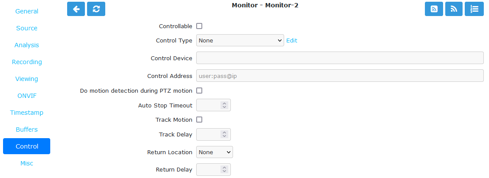

Control Tab
-----------

    The Control tab defines the parameters required for camera control. This tab and its options will only appear if you have selected the :guilabel:`Options` -> :guilabel:`System` -> :guilabel:`OPT_CONTROL` option to indicate that your system contains cameras which are able to be controlled via Pan/Tilt/Zoom or other mechanisms. See the :doc:`/userguide/cameracontrol` section for further details on camera control protocols and methods.

    Monitor Control Tab

- **Controllable**: Check this box to indicate your camera can be controlled.
- **Control Type**: Select the control type that is appropriate for your camera. ZoneMinder ships with a small number of predefined control protocols which will work with some cameras without modification but which may have to amended to function with others. Choose the :guilabel:`Edit` link to create new control types or to edit the existing ones.
- **Control Device**: This is the device that is used to control your camera. This will normally be a serial or similar port. If your camera is a IP network camera, you will generally not need to specify a control device.
- **Control Address**: This is the camera address. Some control protocols require that each camera is identified by a particular, usually numeric, ID. If the camera uses addressing then enter the ID of your camera here. For IP network cameras enter the hostname or IP address here. This is ordinarily the same as that given for the camera itself.
- **Auto Stop Timeout**: Some cameras only support a continuous mode of movement. For instance you tell the camera to pan right and then when it is aligned correctly you tell it to stop. In some cases it is difficult to time this precisely over a web interface so this option allows you to specify an automatic timeout where the command will be automatically stopped. A value of 0.25 here tells the script to stop moving a quarter of a second after starting. This allows a more precise method of control. If this value is left blank or at zero it will be ignored. If this is set then it will be used as the timeout, however it will only be applied for the lower 25% of possible speed ranges. In other words if the camera has a pan speed range of 1 to 100 then selecting movement at 26 or over will be assumed to imply that you want a larger movement that you can control yourself and no timeout will be applied. Selecting motion at lower speeds will be interpreted as requiring finer control and the automatic timeout will be invoked.
- **Track Motion**: Check this box to enable motion tracking. This and the following three options are used with the experimental motion function. This will only work if the camera supports mapped movement modes where a point on an image can be mapped to a control command. This is generally most common on IP network cameras but can be replicated to some degree on other cameras that support relative movement modes. See the :doc:`/userguide/cameracontrol` section for more details.
- **Track Delay**: This is the number of seconds to suspend motion detection for following any movement that the camera may make to track motion.
- **Return Location**: If the camera supports a ‘home’ position or presets this selects which preset the camera should return to after tracking motion.
- **Return Delay**: This is the delay, in seconds, once motion has stopped being detected, before the camera returns to any defined return location.
