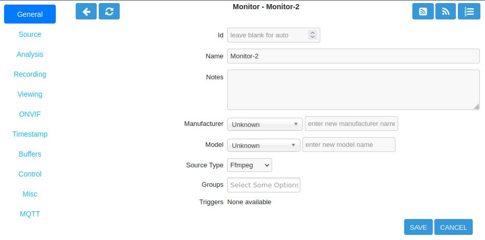

General Tab
-----------

The General tab contains basic information about the Monitor to help distinguish it to ZoneMinder and the user. One very important parameter to note is the **Source Type** which must match the specific Monitor one wants to add. The selection of source type determines the information required for entry in the Source tab.

    Monitor General Tab

- **Id**: ZoneMinder will automatically assign an Id number to each monitor. Leave blank to allow auto assignment. Manual assignment is allowed and can be specified here.
- **Name**: The name for your monitor. Anything can be entered here but a description of location, area or purpose is generally useful. Monitor names may only be comprised of alphanumeric characters (a-z,A-Z,0-9), special characters ()_-.: and whitespace.
- **Notes**: Enter any additional information related to this Monitor. This is a purely informational field.
- **Manufacturer**: The manufacturer of the camera. You can enter your own or select from the existing entries in the dropdown list. This is a purely informational field.
- **Model**: The model of the camera. You can enter your own or select from the existing entries in the dropdown list. This is a purely informational field.
- **Source Type**: The type of video stream to capture. Depending on the Source type chosen, different parameter options will be available on the Source tab.

    - **FFmpeg**: For modern network IP cameras the Source type is FFmpeg.
    - **Remote**: For older cameras that stream HTTP choose Remote.
    - **Local**: Locally attached USB cameras or capture cards use Local.
    - **File**: Streaming from a file is possible using the File Source type.
    - **Web Site**: Choose Web Site to use a video stream from the internet.
    - **VNC**: To stream from a VNC server choose VNC.

- **Groups**: Monitors can be combined into groups. This allows a smaller set of Monitors to be viewed at one time in the web interface. This is useful for medium to large ZoneMinder installations. A Monitor can be members of multiple groups.
- **Triggers**: ZoneMinder can trigger actions based on X10 protocol. X10 support must first be enabled with :guilabel:`OPT_X10` in the Options menu. An alternative to Triggers is to use ``cron`` jobs or other mechanisms to control the camera and keep them completely outside of the ZoneMinder settings. The ``zmtrigger.pl`` script is also available to implement custom external triggering.
