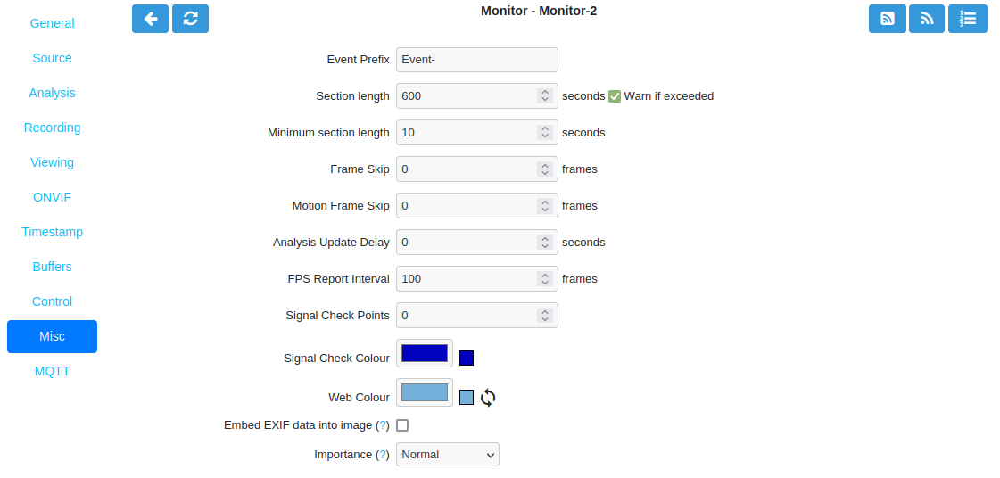

Misc Tab
--------

    The Misc tab contains settings related to saving events such as section lengths, frame skipping, FPS logging, and handling EXIF data.

    Monitor Misc Tab

- **Event Prefix**: By default events are named ‘Event-<event id>’, where 'Event-' is the prefix. This option lets you modify the event prefix to be a value of your choice so that events are named differently when they are generated. This allows you to name events according to which monitor generated them.
- **Section Length**: This specifies the length (in seconds) of any fixed length events produced when the Monitor Recording is set to 'Always' or 'On Motion / Trigger / etc'. Otherwise it is ignored. This should not be so long that events are difficult to navigate nor so short that too many events are generated. A length of between 300 and 900 seconds is recommended but should be set appropriately for each server.
- **Minimum Section Length**: This specifies the minimum length (in seconds) of events which will be recorded. 
- **Frame Skip**: This setting also applies only to the 'Always' Monitor record functions and specifies how many frames should be skipped in the recorded events. The default setting of zero results in every captured frame being saved. Using a value of one would mean that one frame is skipped between each saved, two means that two frames are skipped between each saved frame etc. An alternate way of thinking is that one in every ‘Frame Skip + 1’ frames is saved. The point of this is to ensure that saved events do not take up too much space unnecessarily whilst still allowing the camera to capture at a fairly high frame rate. The alternate approach is to limit the capture frame rate which will obviously affect the rate at which frames are saved.
- **Motion Frame Skip**: This has similar behavior as Frame Skip but is only used for 'On Motion / Trigger / etc' Monitor record function.
- **Analysis Update Delay**: Undocumented parameter
- **FPS Report Interval**: How often the current performance in terms of Frames Per Second is output to the system log and updated in the Monitor Status table. A lower value can cause excess logging and has a slight database performance penalty. The default value of 100 is likely fine for most systems during setup. At 10fps this will cause an update every 10 seconds. Once the system is configured and stable a higher number can be used to reduce logfile clutter. 
- **Signal Check Points**: Undocumented parameter
- **Signal Check Colour**: Undocumented parameter
- **Web Colour**: Some elements of ZoneMinder now use colours to identify monitors on certain views. You can select which colour is used for each monitor here. Any specification that is valid for HTML colours is valid here, e.g. ‘red’ or ‘#ff0000’. A small swatch next to the input box displays the colour you have chosen.
- **Embed EXIF data into image**: Select this to embed EXIF data into each JPEG frame.
- **Importance**: Available options are Normal, Less Important and Not Important.
