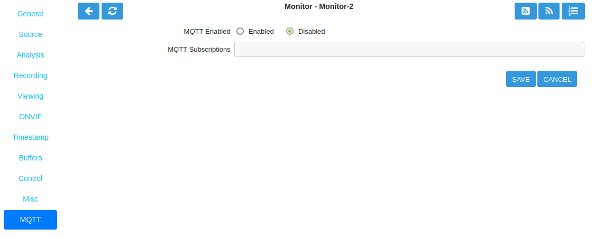

MQTT Tab
--------

.. admonition:: New Feature in ZoneMinder 1.37

    MQTT is a newly added feature in ZoneMinder version 1.37 and as such has not been fully implemented.

MQTT can be used to publish the creation/ending of an event or to subscribe to a message broker. Note that this feature is not yet fully implemented in ZoneMinder and additional development is needed to bring this to a mature state.

    Monitor MQTT Tab

- **MQTT Enabled**: Enable or disable MQTT service.
- **MQTT Subscriptions**: Enter MQTT subscription details.
