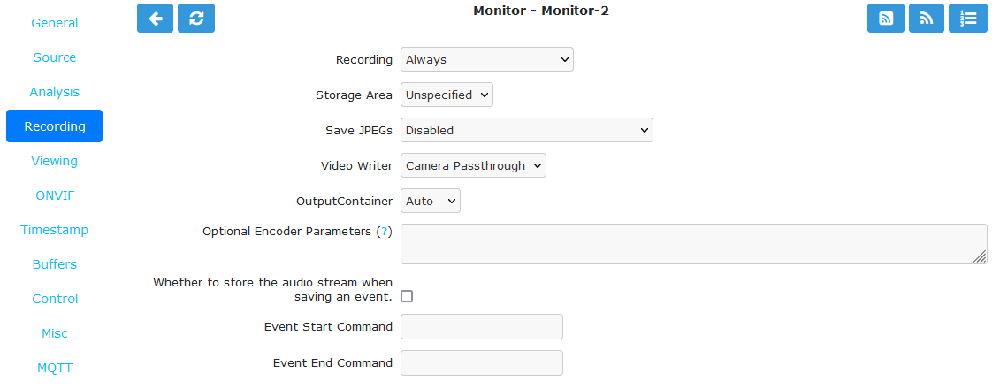

Recording Tab
-------------

    The Recording tab contains settings for recording the video and audio streams. The video stream can be saved as JPEG, re-encoded to different standards or allowed to passthrough and save in the original form as created by the camera.

    Monitor Recording Tab

- **Recording**

    - Always: Always record regardless of motion detection.
    - On Motion/Trigger/etc: Record only when motion is detected or otherwise triggered.
    - None: Do not record.

- **Storage Area**: Where to store the recordings. If writing to this area fails, others will be tried.
- **Save JPEGs**: Records video in individual JPEG frames. Storing JPEG frames requires more storage space than h.264 but it allows one to view an event anytime while it is being recorded.

    - Disabled: Video is not recorded as JPEG frames. If this setting is selected, then 'Video Writer' should be enabled otherwise no recording will take place.
    - Frames only: Video is recorded in individual JPEG frames.
    - Analysis images only (if available): Video is recorded in individual JPEG frames with an overlay of the motion detection analysis information. Note that this overlay remains permanently visible in the frames.
    - Frames + Analysis images (if available): Video is recorded twice, once as normal individual JPEG frames and once in individual JPEG frames with an overlay of motion detection analysis information.

- **Video Writer**: Records video in real video format. It provides much better compression results than saving JPEGs, thus longer video history can be stored.

    - Disabled: Video is not recorded in video format. If this setting is selected, then 'Save JPEGs' should be enabled otherwise there is no video recording at all.
    - Encode: The video or picture frames received from the camera are transcoded into the selected codec and stored as a video. This option is useful if the camera cannot natively stream h.264.
    - Camera Passthrough: This option assumes that the camera is already sending an h.264 stream. Video will be recorded as is without any post-processing in ZoneMinder. Video characteristics such as bitrate, encoding mode, etc. should be set directly in the camera. The resulting video will not include the ZoneMinder timestamp overlay so it is important to have the camera include the date/time in the video.

- **Output Codec**: This option is available when Video Writer is set to 'Encode'. If encoding, you can choose between h.264, h.265/hevc, vp9 or av1.
- **Encoder**: This option is available when Video Writer is set to 'Encode'. If encoding you can choose which encoder will be used. This is where you can select a hardware accelerated encoder.
- **Output Container**: Leaving at Auto allows ZoneMinder to use mp4. Other choices are mkv and webm.
- **Optional Encoding Parameters**: Mostly useful when encoding as each encoder takes different parameters. Consult the `FFmpeg documentation <https://ffmpeg.org/ffmpeg-formats.html>`__ for available parameters for each encoder.
- **Recording Audio**: Check the box in order to save audio (if available) when events are recorded.
- **Event Start Command**: When a recording event starts, you can run a system command. The parameters to the command will be the event id and the monitor id.
- **Event End Command**: When a recording event ends, you can run a system command. The parameters to the command will be the event id and the monitor id.
