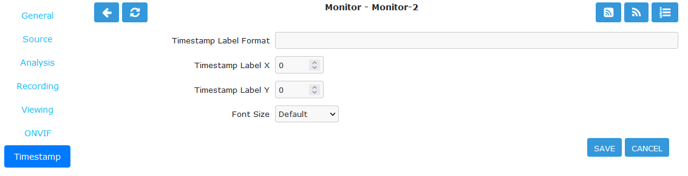

Timestamp Tab
-------------

    Timestamp tab defines the formatting and location of the timestamp in the captured images.

    Monitor Timestamp Tab

- **Timestamp Label Format**: Allows one to define the format of the timestamp applied to each frame. It is a ``strftime`` style string with a few extra tokens. You can add ``%f`` to add hundredths of a second to the frame timestamp. ``%H:%M:%S.%f`` will output time formatted as ``10:45:37.45``. You can also use ``%N`` for the name of the monitor and ``%Q`` which will be filled by any of the ‘show text’ detailed in the ``zmtriggers.pl`` section.
- **Timestamp Label X/Y**: The X and Y values determine location of timestamp in the image. A value of 0 for the X value will put it on the left side of the image and a Y value of 0 will place it at the top of the image. Be careful not to place the timestamp outside the image border.
- **Font Size**: There are 4 fonts sizes to choose from. Small is good for resolutions like 640x480. Default is good for 720p. Large is good for 1080p. Extra Large is good for higher resolutions.
