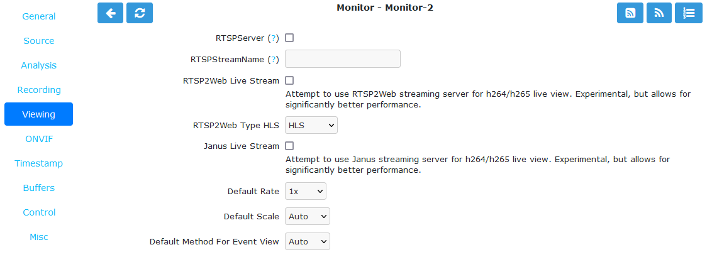

Viewing Tab
-----------

    ZoneMinder supplies its own RTSP server that can re-stream RTSP or attempt to convert the Monitor stream into RTSP. This is useful if you want to use the ZoneMinder Host machine resources instead of having multiple clients pulling from a single camera.

    Monitor Viewing Tab

- **RTSP Server**: Makes the Monitor video stream available to the ZoneMinder RTSP Server.
- **RTSPStreamName**: The path part of the RTSP URL used for this Monitor. Must be unique. For example, if this is Monitor ID 6, **MIN_RTSP_PORT** =20000 and RTSPStreamName is set to 'my_camera', the stream can be accessed at ``rtsp://ZM_HOST:20006/my_camera``.
- **RTSP2Web Live Stream**: Attempt to use RTSP2Web streaming server for h.264/h.265 live view. Experimental, but allows for significantly better performance.
- **RTSP2Web Type**: Select video streaming protocol. Available choices are HLS (HTTP Live Streaming), MSE (Media Source Extensions) and WebRTC (Web Real Time Communications).
- **Janus Live Stream**: Enables Janus re-streaming of the video content. This uses WebRTC to view the stream in h.264 instead of a stream of JPEG images. It also enables audio in the live feed.
- **Default Rate**: When live viewing, you can watch at FPS slower than ZoneMinder is capturing at. This can be changed during viewing, but this sets the default.
- **Default Scale**: If your Monitor has been defined with a particularly large or small image size then you can choose a default scale here with which to view the monitor so it is easier or more visible from the web interface. A value of Auto will attempt to optimally fill the browser window.
- **Default Method For Event View**
    - MP4: If the video is h.264 encoded MP4 file you can use the browser's built in video player. 
    - MJPEG: If the video is h.265 encoded and can't play the video natively, we can use ZMS to convert it to MJPEG and view that.
