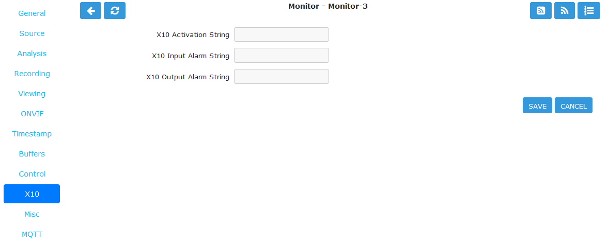

X10 Tab
-------

    The X10 tab configures options for X10 Home Automation. This tab and its options will only appear if you have enabled X10 support in :guilabel:`Options` -> :guilabel:`X10` -> **OPT_X10**.

    X10 Tab

- **X10 Activation String**: The contents of this field determine when a monitor starts and/or stops being active when running in ‘Triggered' mode and with X10 triggers. The format of this string is as follows:

    - **n**: If you simply enter a number then the monitor will be activated when an X10 ON signal for that unit code is detected and will be deactivated when an OFF signal is detected.
    - **!n**: This inverts the previous mode, e.g. !5 means that the monitor is activated when an OFF signal for unit code 5 is detected and deactivated by an ON.
    - **n+**: Entering a unit code followed by + means that the monitor is activated on receipt of a ON signal for that unit code but will ignore the OFF signal and as such will not be deactivated by this instruction. If you prepend a '!' as per the previous definition it similarly inverts the mode, i.e. the ON signal deactivates the monitor.
    - **n+<seconds>**: As per the previous mode except that the monitor will deactivate itself after the given number of seconds.
    - **n-**: Entering a unit code followed by - means that the monitor is deactivated on receipt of a OFF signal for that unit code but will ignore the ON signal and as such will not be activated by this instruction. If you prepend a '!' as per the previous definition it similarly inverts the mode, i.e. the OFF signal activates the monitor.
    - **n-<seconds>**: As per the previous mode except that the monitor will activate itself after the given number of seconds.
    - You can also combine several of these expressions to by separating them with a comma to create multiple circumstances of activation. However for now leave this blank.

- **X10 Input Alarm String**: This has the same format as the previous field but instead of activating the monitor this will cause a forced alarm to be generated and an event recorded if the monitor is Active. The same definition as above applies except that for activated read alarmed and for deactivated read unalarmed(!). Again leave this blank for now.
- **X10 Output Alarm String**: This X10 string also has the same format as the two above options. However it works in a slightly different way. Instead of ZoneMinder reacting to X10 events this option controls how ZoneMinder emits X10 signals when the current monitor goes into or comes out of the alarm state. Thus just entering a number will cause the ON signal for that unit code to be sent when going into alarm state and the OFF signal when coming out of alarm state. Similarly 7+30 will send the unit code 7 ON signal when going into alarm state and the OFF signal 30 seconds later regardless of state. The combination of the X10 instruction allows ZoneMinder to react intelligently to, and also assume control of, other devices when necessary. However the indiscriminate use of the Input Alarm and Output Alarm signals can cause some horrendous race conditions such as a light going on in response to an alarm which then causes an alarm itself and so on. Thus some circumspection is required here. Leave this blank for now.
