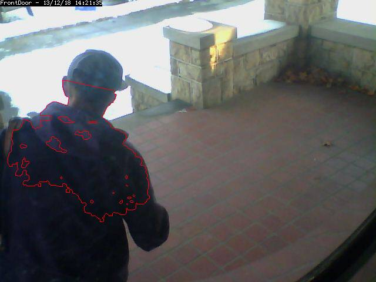

Defining Zones
==============

The next important thing to do with a new monitor is set up Zones for it to use. By default you'll already have one generated for you when you created your monitor (the default zone is the full area captured by the monitor) but you might want to modify it or add others. 

Click on the Zones column for your monitor and you should see a small popup window appear which contains an image from your camera overlain with a stippled pattern representing your zone. In the default case this will cover the whole image. The colour of the zones appearing here is determined by what type they are. The default zone is Active and so will be red, Inclusive zones are orange, exclusive zones are purple, preclusive zones are blue and inactive zones are white.

Beneath the zones image will be a table containing a listing of your zones. Clicking on either the relevant bit of the image or on the Id or Name in the table will bring up another window where you can edit the particulars for your Zones. For more information on defining or editing a zone, see Defining Zones.

Zone configuration and tuning are important when running in the motion detection modes to avoid storing, sorting through, or being alerted on uninteresting video data.  Configuring a zone involves setting some basic parameters, as well as choosing an alarm check method and tuning their associated detection parameters.

The Zone view is split into two main areas, on the left is the options are area and on the right is the zone drawing area. A default or new zone will cover the whole drawing area and will overlay any other zones you already have on there. Unlike the previous zones image, the current zone is coloured green, other zones will be orange regardless of type. The smaller the zone, the less processing time it takes to examine it.

Basic parameters
^^^^^^^^^^^^^^^^
Name
  Each Zone can be named for reference purposes.  It is used for logging and debugging.  Choose a name that helps you identify your zones.

Type
  This is one of the more important concepts in ZoneMinder and there are six to choose from.

  * Active 
    Triggers an alarm when motion is detected within it.  This is the zone type you'll use most often, and which will be set for your default zone.  Only Active and Exclusive zones can trigger an alarm.

  * Inclusive 
    This zone type can be used for any zones that you want to trigger an alarm only if at least one other Active zone has already triggered one. This might be for example to cover an area of the image like a plant or tree which moves a lot and which would trigger lots of alarms. Perhaps this is behind an area you'd like to monitor though, in this case you'd create an active zone covering the non-moving parts and an inclusive zone covering the tree perhaps with less sensitive detection settings also. If something triggered an alarm in the Active zone and also in the Inclusive zone they would both be registered and the resulting alarm would be that much bigger than if you had blanked it out altogether.

  * Exclusive
    Triggers an alarm when motion is detected within it, as long as no alarms have already been triggered in an Active zone.  This is the most specialized of the zone types. For instance in the camera covering my garden I keep watch for a hedgehog that visits most nights and scoffs the food out of my cats bowls. By creating a sensitive Exclusive zone in that area I can ensure that a hedgehog alarm will only trigger if there is activity in that small area. If something much bigger occurs, like someone walking by it will trigger a regular alarm and not one from the Exclusive zone. Thus I can ensure I get alarms for big events and also special small events but not the noise in between.

  * Preclusive 
    This zone type is relatively recent. It is called a Preclusive zone because if it is triggered it actually precludes an alarm being generated for that image frame. So motion or other changes that occur in a Preclusive zone will have the effect of ensuring that no alarm occurs at all. The application for this zone type is primarily as a shortcut for detecting general large-scale lighting or other changes. Generally this may be achieved by limiting the maximum number of alarm pixels or other measure in an Active zone. However in some cases that zone may cover an area where the area of variable illumination occurs in different places as the sun and/or shadows move and it thus may be difficult to come up with general values. Additionally, if the sun comes out rapidly then although the initial change may be ignored in this way as the reference image catches up an alarm may ultimately be triggered as the image becomes less different. Using one or more Preclusive zones offers a different approach. Preclusive zones are designed to be fairly small, even just a few pixels across, with quite low alarm thresholds. They should be situated in areas of the image that are less likely to have motion occur such as high on a wall or in a corner. Should a general illumination change occur they would be triggered at least as early as any Active zones and prevent any other zones from generating an alarm. Obviously careful placement is required to ensure that they do not cancel any genuine alarms or that they are not so close together that any motion just hops from one Preclusive zone to another.  Preclusive zones may also be used to reduce processing time by situating one over an Active zone.  The Preclusive zone is processed first; if it is small, and is triggered, the rest of the zone/image will not be processed. See Extend Alarm Frame Count below for a way to hold the preclusive zone active for an extended period.

  * Inactive
    Suppresses the detection of motion within it.  This can be layered on top of any other zone type, preventing motion within the Inactive zone from being effective for any other zone type.  Use inactive zones to cover areas in which nothing notable will ever happen or where you get false alarms that don't relate to what you are trying to monitor.  Inactive zones may be overlaid on other zones to blank out areas, and are processed first (with the exception of Privacy zones, see below).  As a general practice, you should try and make zones abut each other instead of overlapping to avoid repeated duplicate processing of the same area.  

  * Privacy
    Blackens the pixels within it. This can be used if you want to hide some regions in the image if the situation does not allow another solution. This zone type is different to all the others in that it gets processed as soon as possible during capture (even before the timestamp gets into the image) and not in the analyzing process. So if you add, change or delete a Privacy zone, you don't see the changes in the image until the capture process gets restarted. This will be done automatically, but needs a few seconds.

Preset
  The preset chooser sets sensible default values based on computational needs (fast v. best) and sensitivity (low, medium, high.)  It is not required that you select a preset, and you can alter any of the parameters after choosing a preset.  For a small number of monitors with ZoneMinder running on modern equipment, Best, high sensitivity can be chosen as a good starting point.

  It is important to understand that the available presets are intended merely as a starting point. Since every camera's view is unique, they are not guaranteed to work properly in every case. Presets tend to work acceptably for indoor cameras, where the objects of interest are relatively close and there typically are few or no unwanted objects moving within the cameras view. Presets, on the other hand, tend to not work acceptably for outdoor cameras, where the field of view is typically much wider, objects of interest are farther away, and changing weather patterns can cause false triggers. For outdoor cameras in particular, you will almost certainly have to tune your motion detection zone to get desired results. Please refer to `this guide <https://wiki.zoneminder.com/index.php/Understanding_ZoneMinder%27s_Zoning_system_for_Dummies>`__ to learn how to do this.

Units
  * Pixels - Selecting this option will allow many of the following values to be entered (or viewed) in units of pixels.
  * Percentage -  Selecting this option will allow may of the following values to be entered (or viewed) as a percentage.  The sense of the percentage values refers to the area of the zone and not the image as a whole. This makes trying to work out necessary sizes rather easier.

Region points

.. image:: images/define-zone-region-sample.jpg

The sample region shown to the right shows a region defined by 6 control points.  The shape of the region causes the check methods to ignore the sidewalk and areas of the porch wall that receive changing sunlight; two conditions that are not of interest in this zone.

  A region is a part of the captured image that is of interest for this zone.  By default, a region is configured to cover the whole captured image.  Depending on the selected type of this zone, the shape of the region can be adjusted to accommodate multiple effects.  This can be done by dragging the control points in the reference image around, or by altering the coordinates found in the controls below the reference image.  Clicking on a control point in the reference image highlights the coordinates in the table below.  Clicking the + button in a point row adds a control point between this point and the next; clicking the - button removes this control point.  It is possible to accidentally place a control point outside of the valid coordinates of the image.  This will prevent the monitor from working properly.  You can make zones almost any shape you like; except that zones may not self-intersect (i.e. edges crossing over each other).

Alarm Colour
  These parameters can be used to individually colorize the zone overlay pattern.  Alarms in this zone will be highlighted in the alarm colour.  This option is irrelevant for Preclusive and Inactive zones and will be disabled.

Alarm Check Methods
  There are 3 Alarm Check Methods.  They are sequential, and are layered:  In AlarmedPixels mode, only the AlarmedPixel analysis is performed.  In FilteredPixels mode, the AlarmedPixel analysis is performed first, followed by the FilteredPixel analysis.  In the Blobs mode, all 3 analysis methods are performed in order.  An alarm is only triggered if *all* of the enabled analysis modes are triggered.  For performance reasons, as soon as the criteria for one of the analysis modes is not met, the alarm checking for the frame is complete.  Since the subsequent modes each require progressively more computations, it is a good idea to tune the parameters in each of the activated layers.

  For reference purposes, the Zone Area box shows the area of the entire region of interest.  In percent mode, this is 100.  In Pixels mode, this is the pixel count of the region.  All 3 Min/Max Area parameter groups are based on the Zone Area as the maximum sensible value, and all 3 are interpreted in the units specified in the Units input.

AlarmedPixels
  Alarmed pixels is the first layer of analysis, and is always enabled.  Its recommended that you start with this method and move on to the subsequent methods once the effects of the basic parameters are understood.  In the AlarmedPixels mode, 2 parameter categories are available for tuning: Min/Max Pixel Threshold, and Min/Max Alarmed Area.

Min/Max Pixel Threshold (0-255)
  In the AlarmedPixel layer of analysis, each individual pixel of the image is compared to the current reference image.  Pixels that are different from the reference image are considered alarmed pixels.  However, small aberrations in lighting or auto exposure camera adjustments may cause the explicit value of a pixel to vary by small amounts from image to image.  This parameter allows you to set the limits of what will be considered a changed pixel.  For example, if your camera points to a blank white wall, and you raise a black colored item into view, then the change in any one pixel will be great, indeed, extreme.  If however, you raise a white piece of paper, then the change in an individual pixel will be less.

  The minimum pixel threshold setting should be high enough to cause minor lighting, imaging, or compression changes to be ignored.  Setting the minimum value too high, may allow a white cat to walk undetected across the view of the white wall.  A good starting point for the minimum pixel threshold is 40, meaning that the difference in pixel value from must be greater than 40.  A good default for the maximum pixel threshold is 0 (indicating that all differences above the minimum threshold are considered a change.)

Min/Max Alarmed Area
  The count of alarmed pixels (or percentage of alarmed pixels relative to the pixel area of the region if in percent mode) is used in this first layer of analysis to determine if an alarm is triggered.  If the count or percentage is above the minimum alarmed area, but less than the maximum alarmed area, an alarm is triggered.  These settings depend on the size of the object you are trying to capture: a value too low may cause false alarms, while a value too high might not detect small objects.  A good starting point for both the minimum and maximum are 0 and 0, indicating that any number of alarmed pixels (or any percentage) greater than 0 will trigger an alarm.  The frame scores from logged events can then be used to bring the minimum up to a reasonable value.  An alternative starting point for the minimum alarmed area (in percent) is 25% of the area that an object of interest takes up in the region.  For example, if you approximate that a subject moving through the frame takes up 30% of the frame, then a good starting minimum area is about 7.5%.

FilteredPixels
  Selecting the FilteredPixels Alarm Check Method adds an additional layer of analysis to the AlarmedPixels check along with 2 additional parameter categories for tuning.  This layer works by analyzing the alarmed pixels identified in the first layer.  Alarmed pixels are disregarded, in this and future layers if enabled, if they are not in groups of a minimum small square size.  Primarily, this filtering removes isolated alarmed pixels that may be artifacts of the camera, lens, or compression.

Filter Width/Height (pixels)
  This parameter is always specified in Pixels, even when Percentages are the selected units.  It specifies the size of the group of pixels surrounding a given pixel that must be in alarmed pixels for the pixel itself to be considered an alarmed pixel.  The width and height should always be an odd number.  3 x 3 is the default value, and 5 x 5 is also suggested as a sensible alternative.  Avoid using large numbers for the width and height of the filter area.  When using the Blobs Alarm Check Method, FilteredPixels can be effectively disabled by setting either the width or height to a value less than 1.
Min/Max Filtered Area
  Applying the filtering analysis results in an area that is less than or equal to the alarmed area.  Thus the minimum and maximum filtered area parameters for alarm should be equal to or less than the corresponding alarm area parameters, or the FilteredPixels analysis will never trigger an alarm.  In particular, it is useful to raise the minimum alarmed area parameter until false events from image artifacts disappear, and setting a minimum filtered area parameter less the minimum alarmed area parameter by enough to capture small events of interest.

Blobs

This image shows an image with 1 identified blob.  The blob is outlined in the Alarm Colour specified above.

When two or more Filtered areas touch or share a boundary, it is sensible to evaluate the regions as one contiguous area instead of separate entities.  A Blob is a contiguous area made up of multiple filtered areas.  Whereas FilteredPixes is useful for excluding parts of the image that are not part of the actual scene, Blob filtering is better suited to disregarding areas of the actual scene that are not of interest. 

  Selecting the Blobs Alarm Check Method opens up all of the available parameters.  Enabling Blobs adds one more layer of analysis to the AlarmedPixel and FilteredPixel checks in the determination of a valid alarm along along with 2 additional parameter categories for tuning: the size of the blobs, and the number of blobs.  A Blob is not necessarily the whole object that may be of interest.  In the example image, the subject is moving, but only a portion of him is marked as a blob.  This is because as the subject moves, many pixels of the image do not change in value beyond the set threshold.  A pixel that is representing the subject's shoulder in one frame may be representing his back in the next, however, the value of the pixel remains nearly the same. 

Min/Max Blob Area
  The blob area parameters control the smallest and largest contiguous areas that are to be considered a blob.  A good value for the maximum area is the default of 0. (There is no upper bound for the size of a contiguous area that will still be considered a blob.)

Min/Max Blobs
  Normally, you would want any positive number of blobs to trigger an event, so the default value of 1 should suffice.  In some circumstances, it may benefit to have only one blob NOT trigger an event, in which case, setting this value to 2 or higher may serve some special purpose.  A good value for the maximum blobs is the default of 0. (There is no upper bound for the number of blobs that will trigger an event.  Use the maximum blobs parameter can be used to tune out events that show a high number of blobs.

Overload Frame Ignore Count
  This setting specifies the number of frames to NOT raise an alarm after an overload. In this context, overload is defined as a detected change too big to raise an alarm. Depending on the alarm check method that could be 
  * Number of alarmed pixels > Max Alarmed Area or
  * Number of filtered pixels > Max Filtered Area or
  * Number of Blobs > Max Blobs
  The idea is that after a change like a light going on that is considered too big to count as an alarm, it could take a couple of frames for things to settle down again.

Extend Alarm Frame Count
  This field applies to Preclusive Zones only. Placing a value in this field holds the Preclusive zone active for the specified number of frames after the initial triggering event. This is useful in cases where a sudden change in light level triggers the Preclusive zone, but the zone needs to be held active for a few frames as the camera itself adjusts to that change in light level.
  
Other information
-----------------
Refer to `this <https://wiki.zoneminder.com/index.php/Understanding_ZoneMinder%27s_Zoning_system_for_Dummies>`__ user contributed Zone guide for additional information will illustrations if you are new to zones and need more help.

