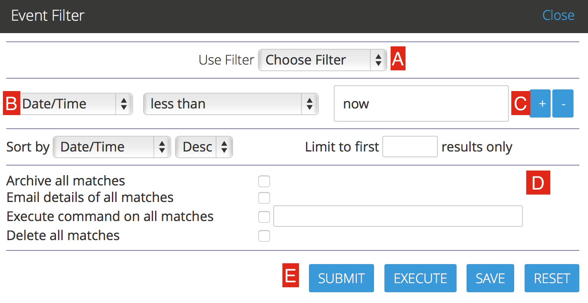

Filtering Events
================

Filters allow you to define complex conditions with associated actions in ZoneMinder. Examples could include:

* Send an email each time a new event occurs for a specific monitor
* Delete events  that are more than 10 days old

And many more.

The filter window can be accessed by tapping on the top level filter menu

You can use the filter window to create your own filters or to modify existing ones. You can even save your favourite filters to re-use at a future date. Filtering itself is fairly simple; you first choose how many expressions you'd like your filter to contain. Changing this value will cause the window to redraw with a corresponding row for each expression. You then select what you want to filter on and how the expressions relate by choosing whether they are 'and' or 'or' relationships. For filters comprised of many expressions you will also get the option to bracket parts of the filter to ensure you can express it as desired. Then if you like choose how you want your results sorted and whether you want to limit the amount of events displayed.

Here is what the filter window looks like

* *A*: This is a dropdown list where you can select pre-defined filters. You will notice that ZoneMinder comes with a PurgeWhenFull filter that is configured to delete events if you reach 95% of disk space. 
* *B*: If you are creating a new filter, you can type in a name for your filter here
* *C*: This is where you specify conditions that need to match before the filter is executed. You use the "+" and "-" buttons to add/delete conditions
* *D*: This allows you to perform sorting and limiting operations on the output before you take an action
* *E*: This is where you specify what needs to happen when the conditions match:

	* Archive all matches: sets the archive field to 1 in the Database for the matched events. 
	  Think of 'archiving' as grouping them under a special category - you can view archived 
	  events later and also make sure archived events don't get deleted, for example
  
    .. todo ::
      fill in what update used disk space, copy all matches, move all matches do. For the "create video" filter, put in more details on how it works, any dependencies etc.

  * Update used disk space:
  * Create video for all matches: creates a video file of all the events that match 
  * Execute command on all matches: Allows you to execute any arbitrary command on the matched events. You can use replacement tokens as subsequent arguents to the command, the last argument will be the absolute path to the event, preceeded by replacement arguents. eg: /usr/bin/script.sh %MN% will excecute as /usr/bin/script.sh MonitorName /path/to/event.
	* Delete all matches: Deletes all the matched events.
  * Copy all matches:
  * Move all matches:
  * Run filter in background:  When checked, ZoneMinder will make sure the filter is checked regularly. For example, if you want to be notified of new events by email, you should make sure this is checked. Filters that are configured to run in the background have a “*” next to it.
  * Run filter concurrently: Allows this filter to run in its own thread thereby letting other filters run in parallel.

* *F*: Use 'List Matches' to 'test' your matching conditions. This will just match and show you what filters match. Use 'Execute' to actually execute the action after matching your conditions. Use 'Save' to save the filter for future use and 'Reset' to clear your settings

.. note:: More details on filter conditions:

	There are several different elements to an event that you can filter on, some of which require further explanation. These are as follows, 
	* 'Date/Time' which must evaluate to a date and a time together, 
	* 'Date' and 'Time' which are variants which may only contain the relevant subsets of this, 
	* 'Weekday' which as expected is a day of the week.

	All of the preceding elements take a very flexible free format of dates and time based on the PHP strtotime function (https://www.php.net/manual/en/function.strtotime.php). This allows values such as 'last Wednesday' etc to be entered. We recommend acquainting yourself with this function to see what the allowed formats are. However automated filters are run in perl and so are parsed by the Date::Manip package. Not all date formats are available in both so if you are saved your filter to do automatic deletions or other tasks you should make sure that the date and time format you use is compatible with both methods. The safest type of format to use is ‘-3 day’ or similar with easily parseable numbers and units are in English.

	The other things you can filter on are all fairly self explanatory, except perhaps for 'Archived' which you can use to include or exclude Archived events. In general you'll probably do most filtering on un-archived events. There are also two elements, Disk Blocks and Disk Percent which don’t directly relate to the events themselves but to the disk partition on which the events are stored. These allow you to specify an amount of disk usage either in blocks or in percentage as returned by the ‘df’ command. They relate to the amount of disk space used and not the amount left free. Once your filter is specified, clicking 'submit' will filter the events according to your specification. As the disk based elements are not event related directly if you create a filter and include the term ‘DiskPercent > 95’ then if your current disk usage is over that amount when you submit the filter then all events will be listed whereas if it is less then none at all will. As such the disk related terms will tend to be used mostly for automatic filters (see below). If you have created a filter you want to keep, you can name it and save it by clicking 'Save'.

	If you do this then the subsequent dialog will also allow you specify whether you want this filter automatically applied in order to delete events or upload events via ftp to another server and mail notifications of events to one or more email accounts. Emails and messages (essentially small emails intended for mobile phones or pagers) have a format defined in the Options screen, and may include a variety of tokens that can be substituted for various details of the event that caused them. This includes links to the event view or the filter as well as the option of attaching images or videos to the email itself. Be aware that tokens that represent links may require you to log in to access the actual page, and sometimes may function differently when viewed outside of the general ZoneMinder context. The tokens you can use are as follows.

    *    %EI%       Id of the event
    *    %EN%       Name of the event
    *    %EC%       Cause of the event
    *    %ED%       Event description
    *    %ET%       Time of the event
    *    %EL%       Length of the event
    *    %EF%       Number of frames in the event
    *    %EFA%      Number of alarm frames in the event
    *    %EST%      Total score of the event
    *    %ESA%      Average score of the event
    *    %ESM%      Maximum score of the event
    *    %EP%       Path to the event
    *    %EPS%      Path to the event stream
    *    %EPF1%     Path to the frame view for the first alarmed event image
    *    %EPFM%     Path to the frame view for the (first) event image with the highest score
    *    %EFMOD%    Path to image containing object detection, in frame view
    *    %EPI%      Path to the event images
    *    %EPI1%     Path to the first alarmed event image, suitable for use in img tags
    *    %EPIM%     Path to the (first) event image with the highest score, suitable for use in img tags
    *    %EIMOD%    Path to image containing object detection, suitable for use in img tags
    *    %EI1%      Attach first alarmed event image
    *    %EIM%      Attach (first) event image with the highest score
    *    %EV%       Attach event mpeg video
    *    %MN%       Name of the monitor
    *    %MET%      Total number of events for the monitor
    *    %MEH%      Number of events for the monitor in the last hour
    *    %MED%      Number of events for the monitor in the last day
    *    %MEW%      Number of events for the monitor in the last week
    *    %MEM%      Number of events for the monitor in the last month
    *    %MEA%      Number of archived events for the monitor
    *    %MP%       Path to the monitor window
    *    %MPS%      Path to the monitor stream
    *    %MPI%      Path to the monitor recent image
    *    %FN%       Name of the current filter that matched
    *    %FP%       Path to the current filter that matched
    *    %ZP%       Path to your ZoneMinder console

	Finally you can also specify a script which is run on each matched event. This script should be readable and executable by your web server user. It will get run once per event and the relative path to the directory containing the event in question. Normally this will be of the form <MonitorName>/<EventId> so from this path you can derive both the monitor name and event id and perform any action you wish. Note that arbitrary commands are not allowed to be specified in the filter, for security the only thing it may contain is the full path to an executable. What that contains is entirely up to you however.

	Filtering is a powerful mechanism you can use to eliminate events that fit a certain pattern however in many cases modifying the zone settings will better address this. Where it really comes into its own is generally in applying time filters, so for instance events that happen during weekdays or at certain times of the day are highlighted, uploaded or deleted. Additionally using disk related terms in your filters means you can automatically create filters that delete the oldest events when your disk gets full. Be warned however that if you use this strategy then you should limit the returned results to the amount of events you want deleted in each pass until the disk usage is at an acceptable level. If you do not do this then the first pass when the disk usage is high will match, and then delete, all events unless you have used other criteria inside of limits. ZoneMinder ships with a sample filter already installed, though disabled. The PurgeWhenFull filter can be used to delete the oldest events when your disk starts filling up. To use it you should select and load it in the filter interface, modify it to your requirements, and then save it making you sure you check the ‘Delete all matches’ option. This will then run in the background and ensure that your disk does not fill up with events.

Saving filters
-----------------

When saving filters, if you want the filter to run in the background make sure you select the "Run filter in background" option. When checked, ZoneMinder will make sure the filter is checked regularly. For example, if you want to be notified of new events by email, you should make sure this is checked. Filters that are configured to run in the background have a "*" next to it.

How filters actually work
--------------------------
It is useful to know how filters actually work behind the scenes in ZoneMinder, in the event you find your filter not functioning as intended:

* the primary filter processing process in ZoneMinder is a perl file called ``zmfilter.pl`` which retrieves filters from the Filters database table
* zmfilter.pl runs every FILTER_EXECUTE_INTERVAL seconds (default is 20s, can be changed in Options->System)
* in each run, it goes through all the filters which are marked as "Run in Background" and if the conditions match performs the specified action
* zmfilter.pl also reloads all the filters every FILTER_RELOAD_DELAY seconds (default is 300s/5mins, can be changed in Options->System)
	* So if you have just created a new filter, zmfilter will not see it till the next FILTER_RELOAD_DELAY cycle
	* This is also important if you are using "relative times" like 'now' - see :ref:`relative_caveat`

Relative items in date strings
------------------------------

Relative items adjust a date (or the current date if none) forward or backward. The effects of relative items accumulate. Here are some examples:
 	
::

* 1 year
* 1 year ago
* 3 years
* 2 days

The unit of time displacement may be selected by the string ‘year’ or ‘month’ for moving by whole years or months. These are fuzzy units, as years and months are not all of equal duration. More precise units are ‘fortnight’ which is worth 14 days, ‘week’ worth 7 days, ‘day’ worth 24 hours, ‘hour’ worth 60 minutes, ‘minute’ or ‘min’ worth 60 seconds, and ‘second’ or ‘sec’ worth one second. An ‘s’ suffix on these units is accepted and ignored.

The unit of time may be preceded by a multiplier, given as an optionally signed number. Unsigned numbers are taken as positively signed. No number at all implies 1 for a multiplier. Following a relative item by the string ‘ago’ is equivalent to preceding the unit by a multiplier with value -1.

The string ‘tomorrow’ is worth one day in the future (equivalent to ‘day’), the string ‘yesterday’ is worth one day in the past (equivalent to ‘day ago’).

The strings ‘now’ or ‘today’ are relative items corresponding to zero-valued time displacement, these strings come from the fact a zero-valued time displacement represents the current time when not otherwise changed by previous items. They may be used to stress other items, like in ‘12:00 today’. The string ‘this’ also has the meaning of a zero-valued time displacement, but is preferred in date strings like ‘this thursday’.

When a relative item causes the resulting date to cross a boundary where the clocks were adjusted, typically for daylight saving time, the resulting date and time are adjusted accordingly.

The fuzz in units can cause problems with relative items. For example, ‘2003-07-31 -1 month’ might evaluate to 2003-07-01, because 2003-06-31 is an invalid date. To determine the previous month more reliably, you can ask for the month before the 15th of the current month. For example:
 	

::

 $ date -R
 
 Thu, 31 Jul 2003 13:02:39 -0700
 
 $ date --date='-1 month' +'Last month was %B?'
 
 Last month was July?
 
 $ date --date="$(date +%Y-%m-15) -1 month" +'Last month was %B!'
 
 Last month was June!

As this applies to ZoneMinder filters, you might want to search  for events in a period of time, or maybe for example create a purge filter that removes events older than 30 days.
For the later you would want at least two lines in your filter. The first line should be:

 [<Archive Status> <equal to> <Unarchived Only>] 

as you don't want to delete your archived events. 

Your second line to find events older than 30 days would be:

 [and <Date><less than> -30 days] 

You use "less than" to indicate that you want to match events before the specified date, and you specify "-30 days" to indicate a date 30 days before the time the filter is run. Of course you could use 30 days ago as well(?).

You should always test your filters before enabling any actions based on them to make sure they consistently return the results you want. You can use the submit button to see what events are returned by your query.

.. _relative_caveat:

Caveat with Relative items
--------------------------

One thing to remember if you specify relative dates like "now" or "1 minute ago", etc, they are converted to a specific date and time by Zoneminder's filtering process (zmfilter.pl) when the filters are loaded. They are _NOT_ recomputed each time the filter runs. Filters are re-loaded depending on the value specified by FILTER_RELOAD_DELAY variable in  the Zoneminder Web Console->Options->System

This may cause confusion in the following cases, for example:
Let's say a user specifies that he wants to be notified of events via email the moment the event "DateTime" is "less than" "now" as a filter criteria. When the filter first gets loaded by zmfilter.pl, this will translate to "Match events where Start Time < " + localtime() where local time is the time that is resolved when this filter gets loaded. Now till the time the filter gets reloaded after FILTER_RELOAD_DELAY seconds (which is usually set to 300 seconds, or 5 minutes), that time does not get recomputed, so the filter will not process any new events that occur after that computed date till another 5 minutes, which is probably not what you want.

Troubleshooting tips
--------------------

If your filter is not working, here are some useful tips:

* Look at Info and Debug logs in Zoneminder 
* Run ``sudo zmfilter.pl -f <yourfiltername>`` from command line and see the log output
* Check how long your action is taking - zmfilter.pl will wait for the action to complete before it checks again
* If you are using relative times like 'now' or '1 year ago' etc. remember that zmfilter converts that relative time to an absolute date only when it reloads filters, which is dictated by the FILTER_RELOAD_DELAY duration. So, for example, if you are wondering why your events are not being detected before intervals of 5 minutes and you have used such a relative condition, this is why
* In the event that you see your new filter is working great when you try it out from the Web Console (using the Submit or Execute button) but does not seem to work when its running in background mode, you might have just chanced upon a compatibility issue between how Perl and PHP translate free form text to dates/times. When you test it via the "Submit" or "Execute" button, you are invoking a PHP function for time conversion. When the filter runs in background mode, zmfilter.pl calls a perl equivalent function. In some cases, depending on the version of Perl and PHP you have, the results may vary. If you face this situation, the best thing to do is to run ``sudo zmfilter.pl -f <yourfiltername>`` from a terminal to make sure the filter actually works in Perl as well.
