Getting Started
===============

Having followed the :doc:`/installationguide/index` for your distribution you should now be able to load the ZoneMinder web frontend. By default this will be with the Classic skin, below is an example of the page you should now see.

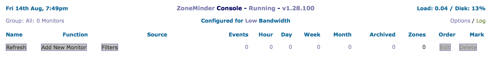

.. _timezone_config:

Setting Timezone
^^^^^^^^^^^^^^^^^
Previous versions of ZoneMinder required the user to set up Timezone correctly in ``php.ini``. This is no longer the case. Starting 1.34, ZoneMinder allows you to specify the TimeZone in the UI. Please make sure it is set up correctly. The Timezone can be changed by selecting ``Options->System->Timezone``

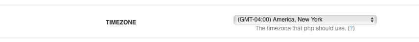

Enabling Authentication
^^^^^^^^^^^^^^^^^^^^^^^
We strongly recommend enabling authentication right away. There are some situations where certain users don't enable authentication, such as instances where the server is in a LAN not directly exposed to the Internet, and is only accessible via VPN etc., but in most cases, authentication should be enabled. So let's do that right away.

* Click on the Options link on the top bar of the web interface
* You will now be presented with a sidebar full of options. Click on the "System" link
	
.. image:: images/getting-started-enable-auth.png

* The relevant portions to change are marked in red above
* Enable OPT_USE_AUTH - this automatically switches to authentication mode with a default user (more on that later)
* Select a random string for AUTH_HASH_SECRET - this is used to make the authentication logic more secure, so 
  please generate your own string and make sure it is sufficiently randomized and long. Note that if you plan to use APIs with ZoneMinder (needed by zmNinja/other apps), it is mandatory that you have this field populated
* The other options highlighed above should already be set, but if not, please make sure they are
* Note that if you are planning to use zmNinja and plan to use ZM authentication, you must also:

  * set ``AUTH_RELAY`` to hashed
  * Enable ``AUTH_HASH_LOGINS``
  

* Click on Save at the bottom and that's it! The next time you refresh that page, you will now be presented with a login screen. Job well done!

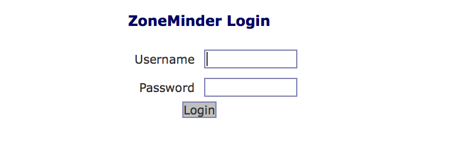

.. note:: The default login/password is "admin/admin"

Understanding the Web Console
^^^^^^^^^^^^^^^^^^^^^^^^^^^^^^
Before we proceed, lets spend a few minutes understanding the key functions of the web console. 
For the sake of illustration, we are going to use a populated zoneminder configuration with several monitors and events.

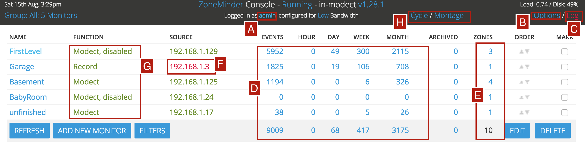

This screen is called the "console" screen in ZoneMinder and shows a summary of your monitors, associated events and more information.

* **A**: The options menu lets you configure many aspects of ZoneMinder. Refer to :doc:`options`.
* **B**: This brings up a color coded log window that shows various system and component level logs. This window is useful if you are trying to diagnose issues. Refer to :doc:`logging`.
* **C**: ZoneMinder allows you to group monitors gor logical separation. This option lets you create new groups, associate monitors to them and edit/delete existing groups.
* **D**: Filters are a powerful mechanism to perform actions when certain conditions are met. ZoneMinder comes with some preset filters that keep a tab of disk space and others. Many users create their own filters for more advanced actions like sending emails when certain events occur and more. Refer to :doc:`filterevents`.
* **E**: The Cycle option allows you to rotate between live views of each cofigured monitor.
* **F**: The Montage option shows a collage of your monitors. You can customize them including moving them around.
* **G**: Montage Review allows you to simultaneously view past events for different monitors. Note that this is a very resource intensive page and its performance will vary based on your system capabilities.
* **H**: Audit Events Report is more of a power user feature. This option looks for recording gaps in events and recording issues in mp4 files.
* **I**: This is the user you are currently logged in as. 
* **J**: ZoneMinder allows you to maintain "run states". If you click on the "Running" text, ZoneMinder brings up a popup that allows you to define additional "states" (referred to as runstates). A runstate is essentially a snapshot that records the state of each monitor and you can switch between states easily. For example, you might have a run state defined that switches all monitors to "monitor" mode in which they are not recording anything while another state that sets some of the monitors to "modect". Why would you want this? A great example is to disable recording when you are at home and enable when you are away, based on time of day or other triggers. You can switch states by selecting an appropriate state manually, or do it automatically via cron jobs, for example. An example of using cron to automatically  switch is provided in the :ref:`FAQ <runstate_cron_example>`.  More esoteric examples of switching run states based on phone location can be found `here <https://forums.zoneminder.com/viewtopic.php?f=9&t=23026>`__.

Here is an example of multiple run states that I've defined. Each one of these runstates changes the mode of specific monitors depending on time of day and other conditions. Use your imagination to decide which conditions require state changes.

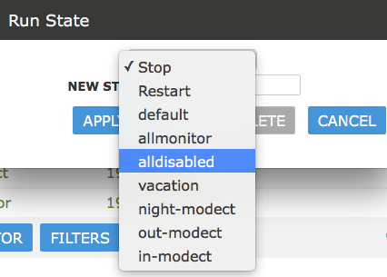

* **K**: This line shows you system health information
* **L**: This defines how Zoneminder will record events. There are various modes. In brief Modect == record if a motion is detected,Record = always record 24x7, Mocord = always record PLUS detect motion,  Monitor = just provide a live view but don't record anytime, Nodect = Don't record till an external entity via zmtrigger tells Zoneminder to (this is advanced usage).
* **M**: This is the "source" column that tells you the type of the camera - if its an IP camera, a USB camera or more. In this example, they are all IP cameras. Green means the monitor is running. Red  means there is something wrong with that camera. 
* **N**: This is the core of ZoneMinder - recording events. It gives you a count of how many events were recorded over the hour, day, week, month.
* **O**: These are the "Zones". Zones are areas within the camera that you mark as 'hotspots' for motion detection. Simply put, when you first configure your monitors (cameras), by default Zoneminder uses the entire field of view of the camera to detect motion. You may not want this. You may want to create "zones" specifically for detecting motion and ignore others. For example, lets consider a room with a fan that spins. You surely don't want to consider the fan moving continuously a reason for triggering a record? Probably not - in that case, you'd leave the fan out while making your zones.
* **P**: This is a "visual filter" which lets you 'filter' the console display based on text you enter. While this may not be particularly useful for small systems, ZoneMinder is also used in mega-installations will well over 200+ cameras and this visual filter helps reduce the monitors you are seeing at one time.

Adding Monitors
^^^^^^^^^^^^^^^
Now that we have a basic understanding of the web console, lets go about adding a new camera (monitor). For this example, lets assume we have an IP camera that streams RTSP at LAN IP address 192.168.1.33. 

.. sidebar:: Note
  
  This is meant to be a simple example. For a more detailed explanation of other options available when creating a monitor, please see :doc:`/userguide/definemonitor`

The first thing we will need to know is how to access that camera's video feed. You will need to consult your camera's manual or check their forum. Zoneminder community users also have a frequently updated list right `here <https://wiki.zoneminder.com/index.php/Hardware_Compatibility_List>`__ that lists information about many cameras. If you don't find your list there and can't seem to find it elsewhere, feel free to register and ask in the `user forums <https://forums.zoneminder.com/>`__.

The camera we are using as an example here is a Foscam 9831W which is a 1280x960 RTSP camera, and the URL to access it's feed is *username:password@IPADDRESS:PORT/videoMain*

Let's get started:

Click on the "Add" button below:

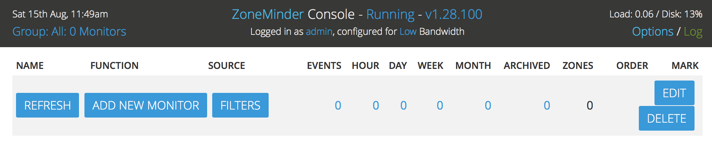

This brings up the new monitor window:

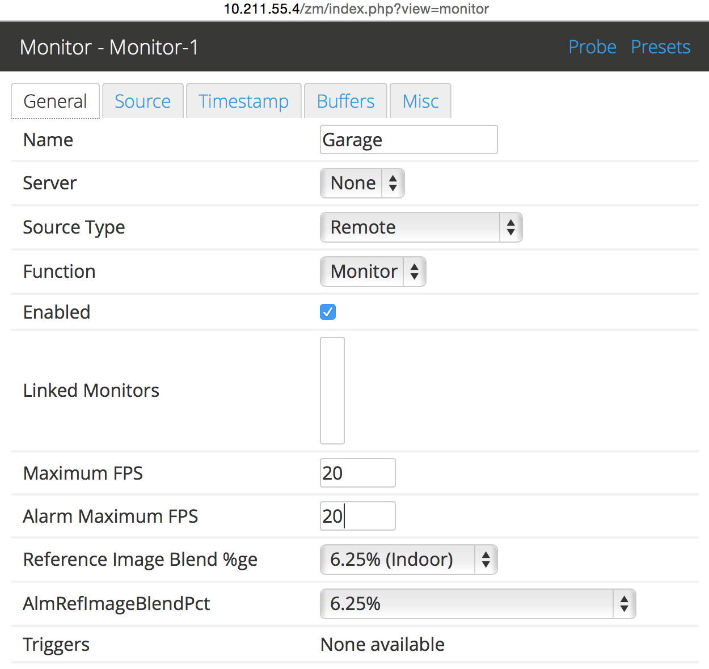

* We've given it a name of 'Garage', because, well, its better than Monitor-1 and this is my Garage camera.

* There are various source types. As a brief introduction you'd want to use 'Local' if your camera is physically attached to your ZM server (like a USB camera, for example), and one of 'Remote', 'FFMpeg', 'Libvlc' or 'cURL' for a remote camera (not necessarily, but usually). For this example, let's go with 'FFMpeg'. 

.. note::
	As a  thumb rule, if you have a camera accessible via IP and it does HTTP or RTSP, 
	start with FFMpeg first and libvlc if it doesn't work (:doc:`/userguide/definemonitor` 
	covers other modes in more details). If you are wondering what 'File' does, well, ZoneMinder was 
	built with compatibility in mind. Take a look at `this post 
	<https://wiki.zoneminder.com/index.php/How_to_use_ZoneMinder_with_cameras_it_may_not_directly_support>`__  to see how file can be used for leisure reading.

* In this example, the Function is 'Modect', which means it will start recording if motion is detected on that camera feed. The parameters for what constitutes motion detected is specific in :doc:`definezone`

* In Analysis FPS, we've put in 5FPS here. Note that you should not put an FPS that is greater than the camera FPS. In my case, 5FPS is sufficient for my needs

.. note::
  Leave Maximum FPS and Alarm Maximum FPS **empty** if you are configuring an IP camera. In older versions of ZoneMinder, you were encouraged to put a value here, but that is no longer recommended. Infact, if you see your feed going much slower than the feed is supposed to go, or you get a lot of buffering/display issues, make sure this is empty. If you need to control camera FPS, please do it directly on the camera (via its own web interface, for example)

* We are done for the General tab. Let's move to the next tab

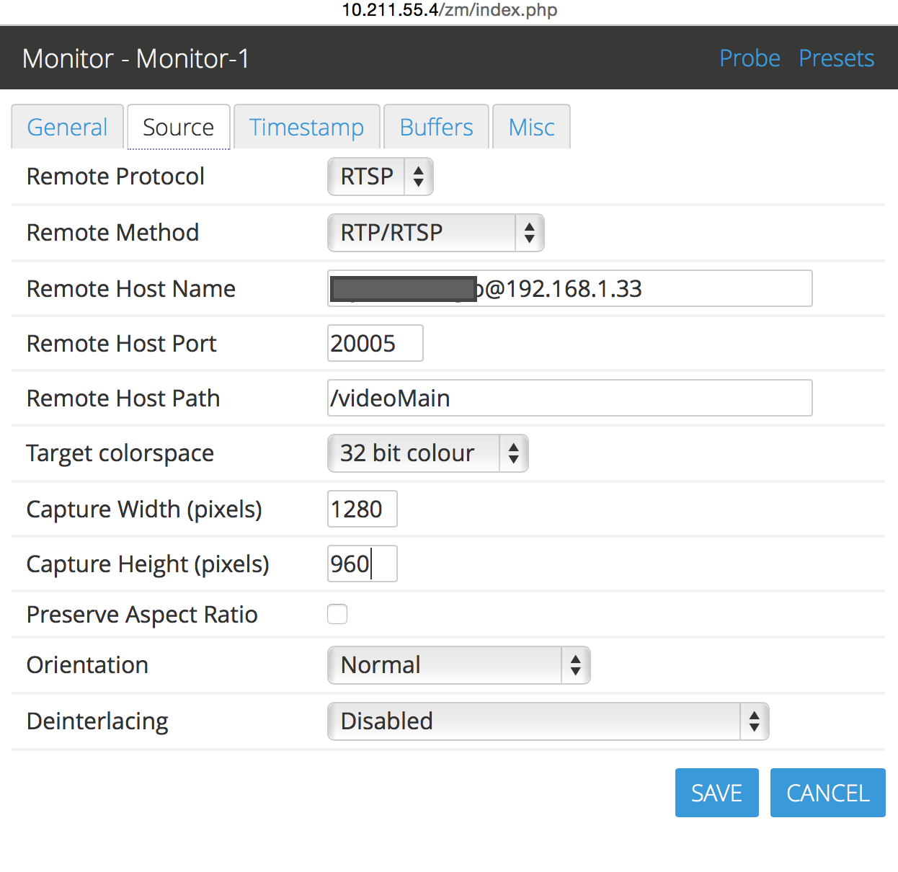

* Let's select a protocol of RTSP and a remote method of RTP/RTSP (this is an RTSP camera)
* Note that starting ZM 1.34, GPUs are supported. In my case, I have an NVIDIA GeForce GTX1050i. These ``cuda`` and ``cuvid`` parameters are what my system supports to use the NVIDIA hardware decoder and GPU resources. If you don't have a GPU, or don't know how to configure your ffmpeg to support it, leave it empty for now. In future, we will add a section on how to set up a GPU

**NOTE**: It is entirely possible that ``cuda`` and ``cuvid`` don't work for you and you need different values. Isaac uses ``cuda`` in ``DecoderHWAccelName`` and leaves ``DecoderHWAccelDevice`` empty. Try that too.

.. todo::
  add GPU docs

That's pretty much it. Click on Save. We are not going to explore the other tabs in this simple guide.

You now have a configured monitor:

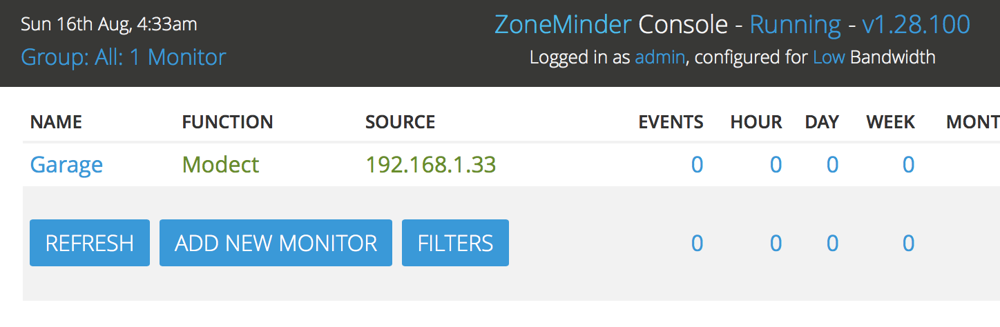

And then, finally, to see if everything works, if you click on the garage monitor you just added, you should be able to see its live feed. If you don't, inspect your webserver logs and your ZoneMinder logs to see what is going on.

Switching to another theme
^^^^^^^^^^^^^^^^^^^^^^^^^^^

.. todo::
  Fix theme text after I clearly understand that System->CSS is doing

When you first install ZoneMinder, you see is what is called a "classic" skin. Zoneminder has a host of configuration options that you can customize over time. This guide is meant to get you started the easiest possible way, so we will not go into all the details. However, it is worthwhile to note that Zoneminder also has a 'flat' theme that depending on your preferences may look more modern. So let's use that as an example of introducing you to the Options menu

* Click on the Options link on the top right of the web interface in the image above
* This will bring you to the options window as shown below. Click on the "System" tab and then select the 
  "flat" option for CSS_DEFAULT as shown below

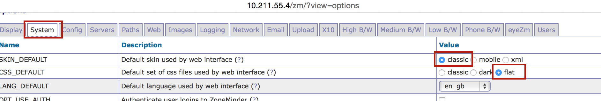

* Click Save at the bottom

Now, switch to the "Display" tab and also select "Flat" there like so:

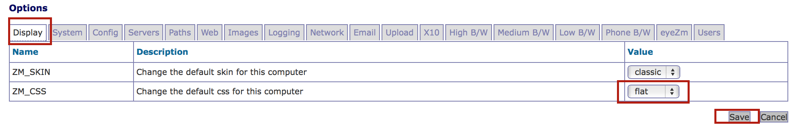

Your screen will now look like this:

Congratulations! You now have a modern looking interface.

Conclusion
^^^^^^^^^^
This was a quick 'Getting Started' guide where you were introduced to the very basics of how to add a monitor (camera). We've skipped many details to keep this concise. Please refer to :doc:`/userguide/definemonitor` for many other customization details.
