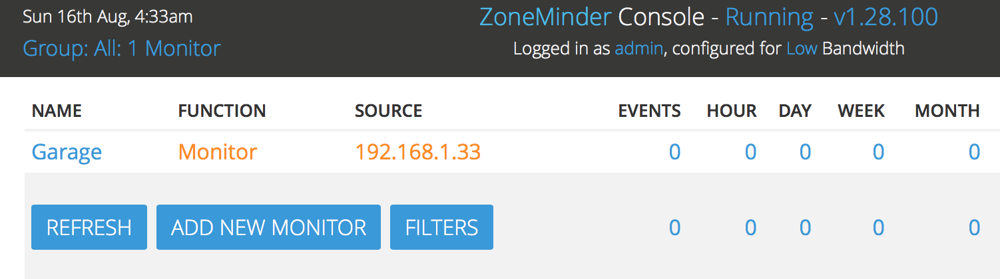
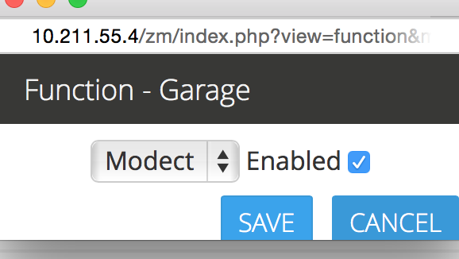
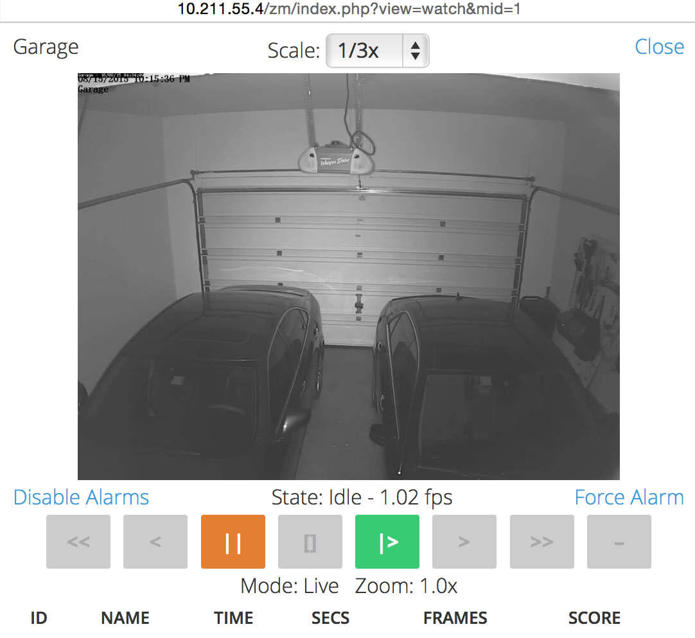

Getting Started
===============

Having followed the :doc:`/installationguide/index` for your distribution you should now be able to load the ZoneMinder web frontend. By default this will be with the Classic skin, below is an example of the page you should now see.

.. image::  ../installationguide/images/zm_first_screen_post_install.png

Enabling Authentication
^^^^^^^^^^^^^^^^^^^^^^^
We strongly recommend enabling authentication right away. There are some situations where certain users don't enable authentication, such as instances where the server is in a LAN not directly exposed to the Internet, and is only accessible via VPN etc., but in most cases, authentication should be enabled. So let's do that right away.

* Click on the Options link on the top right corner of the web interface
* You will now be presented with a screen full of options. Click on the "System" tab
	
.. image:: images/getting-started-enable-auth.png

* The relevant portions to change are marked in red above
* Enable OPT_USE_AUTH - this automatically switches to authentication mode with a default user (more on that later)
* Select a random string for AUTH_HASH_SECRET - this is used to make the authentication logic more secure, so 
  please generate your own string and please don't use the same value in the example.
* The other options highlighed above should already be set, but if not, please make sure they are

* Click on Save at the bottom and that's it! The next time you refresh that page, you will now be presented with a login screen. Job well done!

.. image:: images/getting-started-login.png

.. NOTE:: The default login/password is "admin/admin"

Switching to flat theme
^^^^^^^^^^^^^^^^^^^^^^^
What you see is what is called a "classic" skin. Zoneminder has a host of configuration options that you can customize over time. This guide is meant to get you started the easiest possible way, so we will not go into all the details. However, it is worthwhile to note that Zoneminder also has a 'flat' theme that depending on your preferences may look more modern. So let's use that as an example of introducing you to the Options menu

* Click on the Options link on the top right of the web interface in the image above
* This will bring you to the options window as shown below. Click on the "System" tab and then select the 
  "flat" option for CSS_DEFAULT as shown below

.. image:: images/getting-started-flat-css.png  

* Click Save at the bottom

Now, switch to the "Display" tab and also select "Flat" there like so:

.. image:: images/getting-started-flat-css-2.png

Your screen will now look like this:

Congratulations! You now have a modern looking interface.

.. image:: images/getting-started-modern-look.png

Understanding the Web Console
^^^^^^^^^^^^^^^^^^^^^^^^^^^^^^
Before we proceed, lets spend a few minutes understanding the key functions of the web console. 
For the sake of illustration, we are going to use a populated zoneminder configuration with several monitors and events.
Obviously, this does not reflect your current web console - which is essentially void of any useful information till now,
as we are yet to add things. Let's take a small break and understand what the various functions are before we configure our
own empty screen.

.. image:: images/getting-started-understand-console.png

* **A**: This is the username that is logged in. You are logged in as 'admin' here
* **B**: Click here to explore the various options of ZoneMinder and how to configure them. You already used this to enable authentication and change style above. Over time, you will find this to have many other things you will want to customize.
* **C**: This link, when clicked, opens up a color coded log window of what is going on in Zoneminder and often gives you good insight into what is going wrong or right. Note that the color here is red - that is an indication that some error occurred in ZoneMinder. You should click it and investigate.
* **D**: This is the core of ZoneMinder - recording events. It gives you a count of how many events were recorded over the hour, day, week, month.
* **E**: These are the "Zones". Zones are areas within the camera that you mark as 'hotspots' for motion detection. Simply put, when you first configure your monitors (cameras), by default Zoneminder uses the entire field of view of the camera to detect motion. You may not want this. You may want to create "zones" specifically for detecting motion and ignore others. For example, lets consider a room with a fan that spins. You surely don't want to consider the fan moving continuously a reason for triggering a record? Probably not - in that case, you'd leave the fan out while making your zones.
* **F**: This is the "source" column that tells you the type of the camera - if its an IP camera, a USB camera or more. In this example, they are all IP cameras. Note the color red on item F ? Well that means there is something wrong with that camera. No wonder the log also shows red. Good indication for you to tap on logs and investigate
* **G**: This defines how Zoneminder will record events. There are various modes. In brief Modect == record if a motion is detected,Record = always record 24x7, Mocord = always record PLUS detect motion,  Monitor = just provide a live view but don't record anytime, Nodect = Don't record till an external entity via zmtrigger tells Zoneminder to (this is advanced usage).
* **H**: If you click on these links you can view a "Montage" of all your configured monitors or cycle through each one
* **I**: One of the most often missed features is the ability of ZoneMinder to maintain "run states". If you click on the "Running" text, ZoneMinder brings up a popup that allows you to define additional "states" (referred to as runstates). A runstate is essentially a snapshot that records the state of each monitor and you can switch between states easily. For example, you might have a run state defined that switches all monitors to "monitor" mode in which they are not recording anything while another state that sets some of the monitors to "modect". Why would you want this? A great example is to disable recording when you are at home and enable when you are away, based on time of day or other triggers. You can switch states by selecting an appropriate state manually, or do it automatically via cron jobs, for example. An example of using cron to automatically  switch is provided in the :ref:`FAQ <runstate_cron_example>`.  More esoteric examples of switching run states based on phone location can be found `here <https://forums.zoneminder.com/viewtopic.php?f=9&t=23026>`__.

Here is an example of multiple run states that I've defined. Each one of these runstates changes the mode of specific monitors depending on time of day and other conditions. Use your imagination to decide which conditions require state changes.

.. image:: images/runstates.png

Adding Monitors
^^^^^^^^^^^^^^^
Now that we have a basic understanding of the web console, lets go about adding a new camera (monitor). For this example, lets assume we have an IP camera that streams RTSP at LAN IP address 192.168.1.33. 

The first thing we will need to know is how to access that camera's video feed. You will need to consult your camera's manual or check their forum. Zoneminder community users also have a frequently updated list right `here <https://wiki.zoneminder.com/index.php/Hardware_Compatibility_List>`__ that lists information about many cameras. If you don't find your list there and can't seem to find it elsewhere, feel free to register and ask in the `user forums <https://forums.zoneminder.com/>`__.

The camera we are using as an example here is a Foscam 9831W which is a 1280x960 RTSP camera, and the URL to access it's feed is *username:password@IPADDRESS:PORT/videoMain*

Let's get started:

Click on the "Add new monitor" button below:

.. image:: images/getting-started-modern-look.png

This brings up the new monitor window:

.. image:: images/getting-started-add-monitor-general.png
	:width: 800px

* We've given it a name of 'Garage', because, well, its better than Monitor-1 and this is my Garage camera.

* There are various source types. As a brief introduction you'd want to use 'Local' if your camera is physically attached to your ZM server (like a USB camera, for example), and one of 'Remote', 'FFMpeg', 'Libvlc' or 'cURL' for a remote camera (not necessarily, but usually). For this example, let's go with 'Remote'. 

.. NOTE::
	As a  thumb rule, if you have a camera accessible via IP and it does HTTP or RTSP, 
	start with Remote, then try FFMpeg and libvlc if it doesn't work (:doc:`/userguide/definemonitor` 
	covers other modes in more details). If you are wondering what 'File' does, well, ZoneMinder was 
	built with compatibility in mind. Take a look at `this post 
	<https://wiki.zoneminder.com/index.php/How_to_use_ZoneMinder_with_cameras_it_may_not_directly_support>`__  to see how file can be used for leisure reading.

* Let's leave the Function as 'Monitor' just so we can use this as an example to change it later another way. Practically, feel free to select your mode right now - Modect, Record etc depending on what you want ZoneMinder to do with this camera

* We've put in MaxFPS and AlarmFPS as 20 here. **You can leave this empty too**. Whatever you do here, *it's important to make sure these values are higher than the FPS of the camera*. The reason we've added a value here is that as of Aug 2015, if a camera goes offline, ZoneMinder eats up a lot of CPU  trying to reach it and putting a larger value here than the actual FPS helps in that specific situation. 

.. NOTE::
	We strongly recommend not putting in a lower FPS here that the one configured inside your camera.
	Zoneminder should not be used to manage camera frame rate. That always causes many problems. It's
	much better you set the value directly in-camera and either leave this blank or specify a higher FPS
	here. In this case, our actual camera FPS is 3 and we've set this value here to 10.

* We are done for the General tab. Let's move to the next tab

.. image:: images/getting-started-add-monitor-source.png
	:width: 800px

* Let's select a protocol of RTSP and a remote method of RTP/RTSP (this is an RTSP camera)
* The other boxes are mostly self-explanatory

That's pretty much it. Click on Save. We are not going to explore the other tabs in this simple guide.

You now have a configured monitor:

If you want to change its mode from Monitor to say, Modect (Motion Detect), later all you need to do is click on the Function column that says 'Monitor' and change it to 'Modect' like so:

and we now have:

.. image:: images/getting-started-add-monitor-modect-ready.png

And then, finally, to see if everything works, lets click on the monitor name ('Garage' in this example) and that should bring up a live feed just like this:

Conclusion
^^^^^^^^^^
This was a quick 'Getting Started' guide where you were introduced to the very basics of how to add a monitor (camera). We've skipped many details to keep this concise. Please refer to :doc:`/userguide/definemonitor` for many other customization details.
