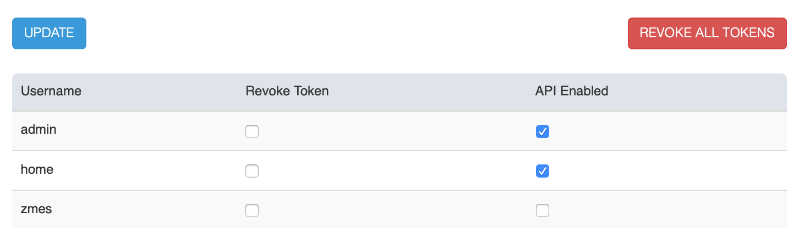

Options - API
---------------

.. note::
  The ZoneMinder web interface does not use APIs and therefore, the tokens discussed here don't apply to the ZoneMinder UI. These only appy to apps that use the ZoneMinder API, like zmNinja.

The API option screen allows you enable/disable APIs on a per user basis. Furthermore, it also allows you to "revoke" tokens allotted to users. Starting ZoneMinder 1.34, the API ecosystem was overhauled and we now support JWT tokens with a concept of refresh tokens and access tokens. This allows for authentication without the need for sending passwords with each authentication request. For a more detailed understanding of how this works, please refer to :doc:`/api`. Over time, more control will be added to this screen.

The "Revoke All Tokens" button can be used to globally invalidate access tokens for all users. If tokens are revoked, the user(s) will need to re-authenticate with login and password.
As of today, refresh tokens last for 24 hours and access tokens for 1 hour. 
