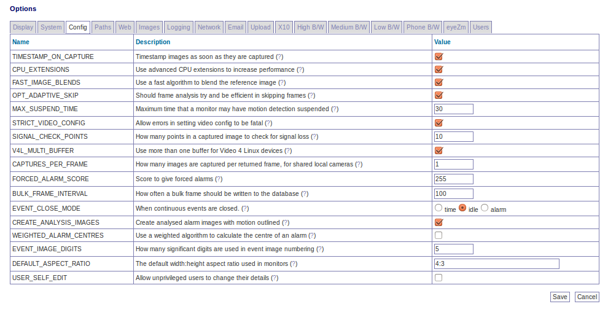

Options - Config
----------------
The config screen allows the admin to change various configuration parameters related to image capturing and storage.

A partial screenshot is shown below:

TIMESTAMP_ON_CAPTURE - ZoneMinder can add a timestamp to images in two ways. The default method, when this option is set, is that each image is timestamped immediately when captured and so the image held in memory is marked right away. The second method does not timestamp the images until they are either saved as part of an event or accessed over the web. The timestamp used in both methods will contain the same time as this is preserved along with the image. The first method ensures that an image is timestamped regardless of any other circumstances but will result in all images being timestamped even those never saved or viewed. The second method necessitates that saved images are copied before being saved otherwise two timestamps perhaps at different scales may be applied. This has the (perhaps) desirable side effect that the timestamp is always applied at the same resolution so an image that has scaling applied will still have a legible and correctly scaled timestamp.

TIMESTAMP_CODE_CHAR - There are a few codes one can use to tell ZoneMinder to insert data into the timestamp of each image. Traditionally, the percent (%) character has been used to identify these codes since the current character codes do not conflict with the strftime codes, which can also be used in the timestamp. While this works well for Linux, this does not work well for BSD operating systems. Changing the default character to something else, such as an exclamation point (!), resolves the issue. Note this only affects the timestamp codes built into ZoneMinder. It has no effect on the family of strftime codes one can use.

CPU_EXTENSIONS - When advanced processor extensions such as SSE2 or SSSE3 are available, ZoneMinder can use them, which should increase performance and reduce system load. Enabling this option on processors that do not support the advanced processors extensions used by ZoneMinder is harmless and will have no effect.

FAST_IMAGE_BLENDS - To detect alarms ZoneMinder needs to blend the captured image with the stored reference image to update it for comparison with the next image. The reference blend percentage specified for the monitor controls how much the new image affects the reference image. There are two methods that are available for this. If this option is set then fast calculation which does not use any multiplication or division is used. This calculation is extremely fast, however it limits the possible blend percentages to 50%, 25%, 12.5%, 6.25%, 3.25% and 1.5%. Any other blend percentage will be rounded to the nearest possible one. The alternative is to switch this option off and use standard blending instead, which is slower.

OPT_ADAPTIVE_SKIP - In previous versions of ZoneMinder the analysis daemon would attempt to keep up with the capture daemon by processing the last captured frame on each pass. This would sometimes have the undesirable side-effect of missing a chunk of the initial activity that caused the alarm because the pre-alarm frames would all have to be written to disk and the database before processing the next frame, leading to some delay between the first and second event frames. Setting this option enables a newer adaptive algorithm where the analysis daemon attempts to process as many captured frames as possible, only skipping frames when in danger of the capture daemon overwriting yet to be processed frames. This skip is variable depending on the size of the ring buffer and the amount of space left in it. Enabling this option will give you much better coverage of the beginning of alarms whilst biasing out any skipped frames towards the middle or end of the event. However you should be aware that this will have the effect of making the analysis daemon run somewhat behind the capture daemon during events and for particularly fast rates of capture it is possible for the adaptive algorithm to be overwhelmed and not have time to react to a rapid build up of pending frames and thus for a buffer overrun condition to occur.

MAX_SUSPEND_TIME - ZoneMinder allows monitors to have motion detection to be suspended, for instance while panning a camera. Ordinarily this relies on the operator resuming motion detection afterwards as failure to do so can leave a monitor in a permanently suspended state. This setting allows you to set a maximum time which a camera may be suspended for before it automatically resumes motion detection. This time can be extended by subsequent suspend indications after the first so continuous camera movement will also occur while the monitor is suspended.

STRICT_VIDEO_CONFIG - With some video devices errors can be reported in setting the various video attributes when in fact the operation was successful. Switching this option off will still allow these errors to be reported but will not cause them to kill the video capture daemon. Note however that doing this will cause all errors to be ignored including those which are genuine and which may cause the video capture to not function correctly. Use this option with caution.

LD_PRELOAD - Some older cameras require the use of the v4l1 compat library. This setting allows the setting of the path to the library, so that it can be loaded by zmdc.pl before launching zmc.

V4L_MULTI_BUFFER - Performance when using Video 4 Linux devices is usually best if multiple buffers are used allowing the next image to be captured while the previous one is being processed. If you have multiple devices on a card sharing one input that requires switching then this approach can sometimes cause frames from one source to be mixed up with frames from another. Switching this option off prevents multi buffering resulting in slower but more stable image capture. This option is ignored for non-local cameras or if only one input is present on a capture chip. This option addresses a similar problem to the ZM_CAPTURES_PER_FRAME option and you should normally change the value of only one of the options at a time.  If you have different capture cards that need different values you can ovveride them in each individual monitor on the source page.

CAPTURES_PER_FRAME - If you are using cameras attached to a video capture card which forces multiple inputs to share one capture chip, it can sometimes produce images with interlaced frames reversed resulting in poor image quality and a distinctive comb edge appearance. Increasing this setting allows you to force additional image captures before one is selected as the captured frame. This allows the capture hardware to 'settle down' and produce better quality images at the price of lesser capture rates. This option has no effect on (a) network cameras, or (b) where multiple inputs do not share a capture chip. This option addresses a similar problem to the ZM_V4L_MULTI_BUFFER option and you should normally change the value of only one of the options at a time.  If you have different capture cards that need different values you can ovveride them in each individual monitor on the source page.

FORCED_ALARM_SCORE - The 'zmu' utility can be used to force an alarm on a monitor rather than rely on the motion detection algorithms. This option determines what score to give these alarms to distinguish them from regular ones. It must be 255 or less.

BULK_FRAME_INTERVAL - Traditionally ZoneMinder writes an entry into the Frames database table for each frame that is captured and saved. This works well in motion detection scenarios but when in a DVR situation ('Record' or 'Mocord' mode) this results in a huge number of frame writes and a lot of database and disk bandwidth for very little additional information. Setting this to a non-zero value will enabled ZoneMinder to group these non-alarm frames into one 'bulk' frame entry which saves a lot of bandwidth and space. The only disadvantage of this is that timing information for individual frames is lost but in constant frame rate situations this is usually not significant. This setting is ignored in Modect mode and individual frames are still written if an alarm occurs in Mocord mode also.

EVENT_CLOSE_MODE - When a monitor is running in a continuous recording mode (Record or Mocord) events are usually closed after a fixed period of time (the section length). However in Mocord mode it is possible that motion detection may occur near the end of a section. This option controls what happens when an alarm occurs in Mocord mode. The 'time' setting means that the event will be closed at the end of the section regardless of alarm activity. The 'idle' setting means that the event will be closed at the end of the section if there is no alarm activity occurring at the time otherwise it will be closed once the alarm is over meaning the event may end up being longer than the normal section length. The 'alarm' setting means that if an alarm occurs during the event, the event will be closed once the alarm is over regardless of when this occurs. This has the effect of limiting the number of alarms to one per event and the events will be shorter than the section length if an alarm has occurred.

CREATE_ANALYSIS_IMAGES - By default during an alarm ZoneMinder records both the raw captured image and one that has been analysed and had areas where motion was detected outlined. This can be very useful during zone configuration or in analysing why events occurred. However it also incurs some overhead and in a stable system may no longer be necessary. This parameter allows you to switch the generation of these images off.

WEIGHTED_ALARM_CENTRES - ZoneMinder will always calculate the centre point of an alarm in a zone to give some indication of where on the screen it is. This can be used by the experimental motion tracking feature or your own custom extensions. In the alarmed or filtered pixels mode this is a simple midpoint between the extents of the detected pxiesl. However in the blob method this can instead be calculated using weighted pixel locations to give more accurate positioning for irregularly shaped blobs. This method, while more precise is also slower and so is turned off by default.

EVENT_IMAGE_DIGITS - As event images are captured they are stored to the filesystem with a numerical index. By default this index has three digits so the numbers start 001, 002 etc. This works works for most scenarios as events with more than 999 frames are rarely captured. However if you have extremely long events and use external applications then you may wish to increase this to ensure correct sorting of images in listings etc. Warning, increasing this value on a live system may render existing events unviewable as the event will have been saved with the previous scheme. Decreasing this value should have no ill effects.

DEFAULT_ASPECT_RATIO - When specifying the dimensions of monitors you can click a checkbox to ensure that the width stays in the correct ratio to the height, or vice versa. This setting allows you to indicate what the ratio of these settings should be. This should be specified in the format <width value>:<height value> and the default of 4:3 normally be acceptable but 11:9 is another common setting. If the checkbox is not clicked when specifying monitor dimensions this setting has no effect.

USER_SELF_EDIT - Ordinarily only users with system edit privilege are able to change users details. Switching this option on allows ordinary users to change their passwords and their language settings