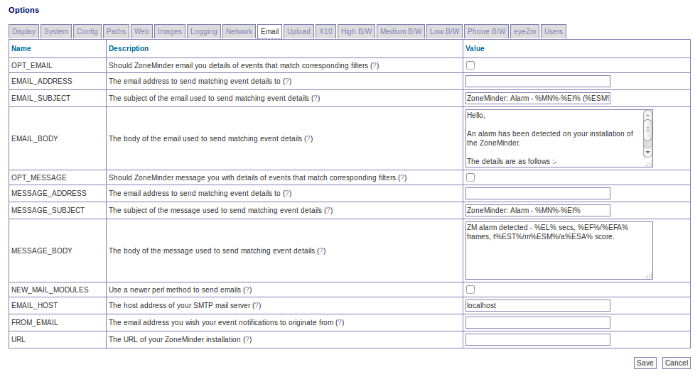

Options - Email
---------------

OPT_EMAIL - In ZoneMinder you can create event filters that specify whether events that match certain criteria should have their details emailed to you at a designated email address. This will allow you to be notified of events as soon as they occur and also to quickly view the events directly. This option specifies whether this functionality should be available. The email created with this option can be any size and is intended to be sent to a regular email reader rather than a mobile device.

EMAIL_ADDRESS - This option is used to define the email address that any events that match the appropriate filters will be sent to.

EMAIL_SUBJECT - This option is used to define the subject of the email that is sent for any events that match the appropriate filters.

EMAIL_BODY - This option is used to define the content of the email that is sent for any events that match the appropriate filters.

.. todo:: 
  check if any other tags have been added

+--------+--------------------------------------------------------+
| Token  | Description                                            |
+========+========================================================+
| %EI%   | Id of the event                                        |
+--------+--------------------------------------------------------+
| %EN%   | Name of the event                                      |
+--------+--------------------------------------------------------+
| %EC%   | Cause of the event                                     |
+--------+--------------------------------------------------------+
| %ED%   | Event description                                      |
+--------+--------------------------------------------------------+
| %ET%   | Time of the event                                      |
+--------+--------------------------------------------------------+
| %EL%   | Length of the event                                    |
+--------+--------------------------------------------------------+
| %EF%   | Number of frames in the event                          |
+--------+--------------------------------------------------------+
| %EFA%  | Number of alarm frames in the event                    |
+--------+--------------------------------------------------------+
| %EST%  | Total score of the event                               |
+--------+--------------------------------------------------------+
| %ESA%  | Average score of the event                             |
+--------+--------------------------------------------------------+
| %ESM%  | Maximum score of the event                             |
+--------+--------------------------------------------------------+
| %EP%   | Path to the event                                      |
+--------+--------------------------------------------------------+
| %EPS%  | Path to the event stream                               |
+--------+--------------------------------------------------------+
| %EPI%  | Path to the event images                               |
+--------+--------------------------------------------------------+
| %EPI1% | Path to the first alarmed event image                  |
+--------+--------------------------------------------------------+
| %EPIM% | Path to the (first) event image with the highest score |
+--------+--------------------------------------------------------+
| %EI1%  | Attach first alarmed event image                       |
+--------+--------------------------------------------------------+
| %EIM%  | Attach (first) event image with the highest score      |
+--------+--------------------------------------------------------+
| %EIMOD%| Attach image of object detected. Requires event notfn. |
|        | server setup and machine learning hooks                |
+--------+--------------------------------------------------------+
| %EV%   | Attach event mpeg video                                |
+--------+--------------------------------------------------------+
| %MN%   | Name of the monitor                                    |
+--------+--------------------------------------------------------+
| %MET%  | Total number of events for the monitor                 |
+--------+--------------------------------------------------------+
| %MEH%  | Number of events for the monitor in the last hour      |
+--------+--------------------------------------------------------+
| %MED%  | Number of events for the monitor in the last day       |
+--------+--------------------------------------------------------+
| %MEW%  | Number of events for the monitor in the last week      |
+--------+--------------------------------------------------------+
| %MEM%  | Number of events for the monitor in the last month     |
+--------+--------------------------------------------------------+
| %MEA%  | Number of archived events for the monitor              |
+--------+--------------------------------------------------------+
| %MP%   | Path to the monitor window                             |
+--------+--------------------------------------------------------+
| %MPS%  | Path to the monitor stream                             |
+--------+--------------------------------------------------------+
| %MPI%  | Path to the monitor recent image                       |
+--------+--------------------------------------------------------+
| %FN%   | Name of the current filter that matched                |
+--------+--------------------------------------------------------+
| %FP%   | Path to the current filter that matched                |
+--------+--------------------------------------------------------+
| %ZP%   | Path to your ZoneMinder console                        |
+--------+--------------------------------------------------------+

OPT_MESSAGE - In ZoneMinder you can create event filters that specify whether events that match certain criteria should have their details sent to you at a designated short message email address. This will allow you to be notified of events as soon as they occur. This option specifies whether this functionality should be available. The email created by this option will be brief and is intended to be sent to an SMS gateway or a minimal mail reader such as a mobile device or phone rather than a regular email reader.

MESSAGE_ADDRESS - This option is used to define the short message email address that any events that match the appropriate filters will be sent to.

MESSAGE_SUBJECT - This option is used to define the subject of the message that is sent for any events that match the appropriate filters.

MESSAGE_BODY - This option is used to define the content of the message that is sent for any events that match the appropriate filters.

NEW_MAIL_MODULES - Traditionally ZoneMinder has used the MIME::Entity perl module to construct and send notification emails and messages. Some people have reported problems with this module not being present at all or flexible enough for their needs. If you are one of those people this option allows you to select a new mailing method using MIME::Lite and Net::SMTP instead. This method was contributed by Ross Melin and should work for everyone but has not been extensively tested so currently is not selected by default.

EMAIL_HOST - If you have chosen SMTP as the method by which to send notification emails or messages then this option allows you to choose which SMTP server to use to send them. The default of localhost may work if you have the sendmail, exim or a similar daemon running however you may wish to enter your ISP's SMTP mail server here.

FROM_EMAIL - The emails or messages that will be sent to you informing you of events can appear to come from a designated email address to help you with mail filtering etc. An address of something like ZoneMinder\@your.domain is recommended.

URL - The emails or messages that will be sent to you informing you of events can include a link to the events themselves for easy viewing. If you intend to use this feature then set this option to the url of your installation as it would appear from where you read your email, e.g. ``http://host.your.domain/zm/index.php``.

SSMTP_MAIL - SSMTP is a lightweight and efficient method to send email. The SSMTP application is not installed by default. NEW_MAIL_MODULES must also be enabled. Please visit the ZoneMinder `SSMTP Wiki page <http://www.zoneminder.com/wiki/index.php/How_to_get_ssmtp_working_with_Zoneminder>`__ for setup and configuration help. 

SSMTP_PATH - The path to the SSMTP application. If path is not defined. Zoneminder will try to determine the path via shell command. Example path: /usr/sbin/ssmtp.