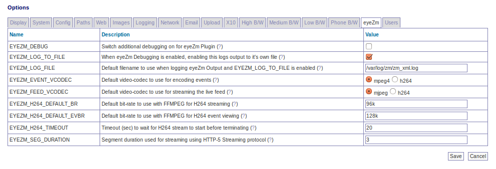

Options - eyeZM
<<<<<<< HEAD
===============

=======
---------------

EYEZM_DEBUG - Enable or Disable extra debugging from the eyeZm Plugin. Extra debugging information will be displayed in it's own file (EYEZM_LOG_TO_FILE is set), or your Apache error log

EYEZM_LOG_TO_FILE - When EYEZM_DEBUG is on and EYEZM_LOG_TO_FILE is on, output generated from the eyeZm Plugin will go to it's own file. Otherwise it will go to the apache error log.

EYEZM_LOG_FILE - Default filename to use when logging eyeZm Output and EYEZM_LOG_TO_FILE is enabled. This file will contain it's own output from the eyeZm Plugin when EYEZM_LOG_TO_FILE and EYEZM_DEBUG are both enabled.

EYEZM_EVENT_VCODEC - The eyeZm Plugin calls FFMPEG externally to encode the captured images. If your FFMPEG is not built with support for H264, change this to MPEG-4. If using H264, please check http://www.eyezm.com for H264 requirements and that your eyeZm version supports H264 (v1.2+).

EYEZM_FEED_VCODEC - Determines whether the live stream is generated using native MJPEG streaming with ZoneMinder, or H264 using FFMPEG and HTML-5 streaming. If using H264, please check http://www.eyezm.com for H264 requirements and that your eyeZm version supports H264 (v1.2+). This is just a default parameter, and can be overridden with eyeZm.

EYEZM_H264_DEFAULT_BR - Default bit-rate to use with FFMPEG for H264 streaming. When using the eyeZm Plugin to stream H264 data, FFMPEG requires a bitrate to control the quality and bandwidth of the video. This should be specified in a format acceptable to FFMPEG. The default value is sufficient for most installations. This is just a default parameter, and can be overridden with eyeZm.

EYEZM_H264_DEFAULT_EVBR - Default bit-rate to use with FFMPEG for H264 event viewing. When using the eyeZm Plugin to view events in H264, FFMPEG requires a bitrate to control the quality and bandwidth of the video. This should be specified in a format acceptable to FFMPEG. The default value is sufficient for most installations. This is just a default parameter, and can be overridden with eyeZm.

EYEZM_H264_TIMEOUT - Timeout (sec) to wait for H264 stream to start before terminating. The eyeZm Plugin will attempt to spawn an H264 stream when requested, and require that it complete within the timeout specified. If you have a slow system or find through the logs that the H264 stream is not starting because the timeout is expiring, even though FFMPEG is running, try increasing this value. If you have a fast system, decreasing this value can improve the responsiveness when there are issues starting H264 streams.

EYEZM_SEG_DURATION - Segment duration used for streaming using HTTP-5 Streaming protocol. The HTTP-5 Live Streaming Protocol segments the input video stream into small chunks of a duration specified by this parameter. Increasing the segment duration will help with choppy connections on the other end, but will increase the latency in starting a stream.
>>>>>>> fb436fb... Merge pull request #591 from SteveGilvarry/docs-updates
