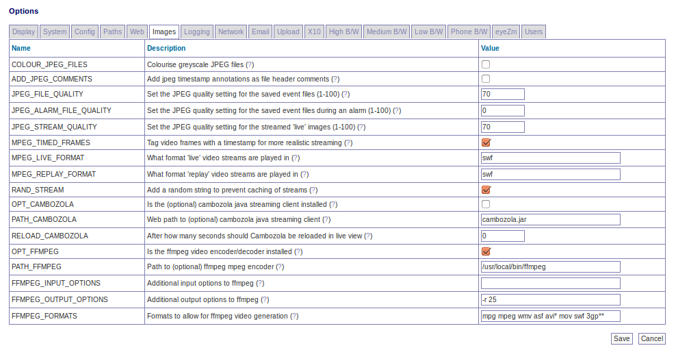

Options - Images
----------------

This screen lets you control various image quality settings for live and recorded events. A partial screenshot is shown below:

COLOUR_JPEG_FILES - Cameras that capture in greyscale can write their captured images to jpeg files with a corresponding greyscale colour space. This saves a small amount of disk space over colour ones. However some tools such as ffmpeg either fail to work with this colour space or have to convert it beforehand. Setting this option to yes uses up a little more space but makes creation of MPEG files much faster.

ADD_JPEG_COMMENTS - JPEG files may have a number of extra fields added to the file header. The comment field may have any kind of text added. This options allows you to have the same text that is used to annotate the image additionally included as a file header comment. If you archive event images to other locations this may help you locate images for particular events or times if you use software that can read comment headers.

JPEG_FILE_QUALITY - When ZoneMinder detects an event it will save the images associated with that event to files. These files are in the JPEG format and can be viewed or streamed later. This option specifies what image quality should be used to save these files. A higher number means better quality but less compression so will take up more disk space and take longer to view over a slow connection. By contrast a low number means smaller, quicker to view, files but at the price of lower quality images. This setting applies to all images written except if the capture image has caused an alarm and the alarm file quality option is set at a higher value when that is used instead.

JPEG_ALARM_FILE_QUALITY - This value is equivalent to the regular jpeg file quality setting above except that it only applies to images saved while in an alarm state and then only if this value is set to a higher quality setting than the ordinary file setting. If set to a lower value then it is ignored. Thus leaving it at the default of 0 effectively means to use the regular file quality setting for all saved images. This is to prevent accidentally saving important images at a worse quality setting.

JPEG_STREAM_QUALITY - When viewing a 'live' stream for a monitor ZoneMinder will grab an image from the buffer and encode it into JPEG format before sending it. This option specifies what image quality should be used to encode these images. A higher number means better quality but less compression so will take longer to view over a slow connection. By contrast a low number means quicker to view images but at the price of lower quality images. This option does not apply when viewing events or still images as these are usually just read from disk and so will be encoded at the quality specified by the previous options.

MPEG_TIMED_FRAMES - When using streamed MPEG based video, either for live monitor streams or events, ZoneMinder can send the streams in two ways. If this option is selected then the timestamp for each frame, taken from it's capture time, is included in the stream. This means that where the frame rate varies, for instance around an alarm, the stream will still maintain it's 'real' timing. If this option is not selected then an approximate frame rate is calculated and that is used to schedule frames instead. This option should be selected unless you encounter problems with your preferred streaming method.

MPEG_LIVE_FORMAT - When using MPEG mode ZoneMinder can output live video. However what formats are handled by the browser varies greatly between machines. This option allows you to specify a video format using a file extension format, so you would just enter the extension of the file type you would like and the rest is determined from that. The default of 'asf' works well under Windows with Windows Media Player but I'm currently not sure what, if anything, works on a Linux platform. If you find out please let me know! If this option is left blank then live streams will revert to being in motion jpeg format.

MPEG_REPLAY_FORMAT - When using MPEG mode ZoneMinder can replay events in encoded video format. However what formats are handled by the browser varies greatly between machines. This option allows you to specify a video format using a file extension format, so you would just enter the extension of the file type you would like and the rest is determined from that. The default of 'asf' works well under Windows with Windows Media Player and 'mpg', or 'avi' etc should work under Linux. If you know any more then please let me know! If this option is left blank then live streams will revert to being in motion jpeg format.

RAND_STREAM - Some browsers can cache the streams used by ZoneMinder. In order to prevent this a harmless random string can be appended to the url to make each invocation of the stream appear unique.

OPT_CAMBOZOLA - Cambozola is a handy low fat cheese flavoured Java applet that ZoneMinder uses to view image streams on browsers such as Internet Explorer that don't natively support this format. If you use this browser it is highly recommended to install this from `this link <http://www.charliemouse.com/code/cambozola/>`__  however if it is not installed still images at a lower refresh rate can still be viewed. Note that practically, if you are not using an old version of IE, you will likely not need this.

PATH_CAMBOZOLA - Leave this as 'cambozola.jar' if cambozola is installed in the same directory as the ZoneMinder web client files.

RELOAD_CAMBOZOLA - Cambozola allows for the viewing of streaming MJPEG however it caches the entire stream into cache space on the computer, setting this to a number > 0 will cause it to automatically reload after that many seconds to avoid filling up a hard drive.

OPT_FFMPEG - ZoneMinder can optionally encode a series of video images into an MPEG encoded movie file for viewing, downloading or storage. This option allows you to specify whether you have the ffmpeg tools installed. Note that creating MPEG files can be fairly CPU and disk intensive and is not a required option as events can still be reviewed as video streams without it.

PATH_FFMPEG - This path should point to where ffmpeg has been installed.

FFMPEG_INPUT_OPTIONS - Ffmpeg can take many options on the command line to control the quality of video produced. This option allows you to specify your own set that apply to the input to ffmpeg (options that are given before the -i option). Check the ffmpeg documentation for a full list of options which may be used here.

FFMPEG_OUTPUT_OPTIONS - Ffmpeg can take many options on the command line to control the quality of video produced. This option allows you to specify your own set that apply to the output from ffmpeg (options that are given after the -i option). Check the ffmpeg documentation for a full list of options which may be used here. The most common one will often be to force an output frame rate supported by the video encoder.

FFMPEG_FORMATS - Ffmpeg can generate video in many different formats. This option allows you to list the ones you want to be able to select. As new formats are supported by ffmpeg you can add them here and be able to use them immediately. Adding a '*' after a format indicates that this will be the default format used for web video, adding '**' defines the default format for phone video.

FFMPEG_OPEN_TIMEOUT - When Ffmpeg is opening a stream, it can take a long time before failing; certain circumstances even seem to be able to lock indefinitely. This option allows you to set a maximum time in seconds to pass before closing the stream and trying to reopen it again.

