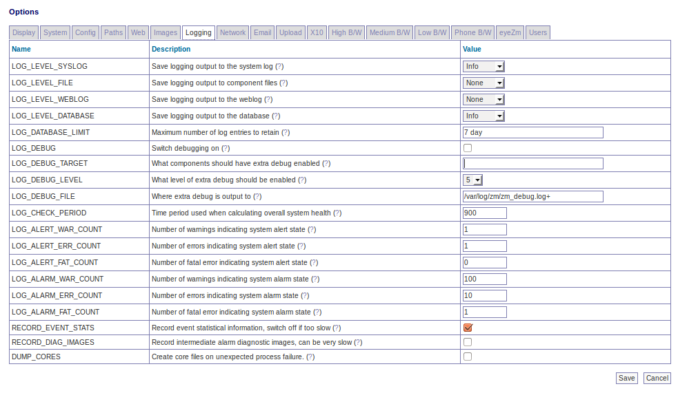

Options - Logging
<<<<<<< HEAD
=================

=======
-----------------

LOG_LEVEL_SYSLOG - ZoneMinder logging is now more more integrated between components and allows you to specify the destination for logging output and the individual levels for each. This option lets you control the level of logging output that goes to the system log. ZoneMinder binaries have always logged to the system log but now scripts and web logging is also included. To preserve the previous behaviour you should ensure this value is set to Info or Warning. This option controls the maximum level of logging that will be written, so Info includes Warnings and Errors etc. To disable entirely, set this option to None. You should use caution when setting this option to Debug as it can affect severely affect system performance. If you want debug you will also need to set a level and component below

LOG_LEVEL_FILE - ZoneMinder logging is now more more integrated between components and allows you to specify the destination for logging output and the individual levels for each. This option lets you control the level of logging output that goes to individual log files written by specific components. This is how logging worked previously and although useful for tracking down issues in specific components it also resulted in many disparate log files. To preserve this behaviour you should ensure this value is set to Info or Warning. This option controls the maximum level of logging that will be written, so Info includes Warnings and Errors etc. To disable entirely, set this option to None. You should use caution when setting this option to Debug as it can affect severely affect system performance though file output has less impact than the other options. If you want debug you will also need to set a level and component below

LOG_LEVEL_WEBLOG - ZoneMinder logging is now more more integrated between components and allows you to specify the destination for logging output and the individual levels for each. This option lets you control the level of logging output from the web interface that goes to the httpd error log. Note that only web logging from PHP and JavaScript files is included and so this option is really only useful for investigating specific issues with those components. This option controls the maximum level of logging that will be written, so Info includes Warnings and Errors etc. To disable entirely, set this option to None. You should use caution when setting this option to Debug as it can affect severely affect system performance. If you want debug you will also need to set a level and component below

LOG_LEVEL_DATABASE - ZoneMinder logging is now more more integrated between components and allows you to specify the destination for logging output and the individual levels for each. This option lets you control the level of logging output that is written to the database. This is a new option which can make viewing logging output easier and more intuitive and also makes it easier to get an overall impression of how the system is performing. If you have a large or very busy system then it is possible that use of this option may slow your system down if the table becomes very large. Ensure you use the LOG_DATABASE_LIMIT option to keep the table to a manageable size. This option controls the maximum level of logging that will be written, so Info includes Warnings and Errors etc. To disable entirely, set this option to None. You should use caution when setting this option to Debug as it can affect severely affect system performance. If you want debug you will also need to set a level and component below

LOG_DATABASE_LIMIT - If you are using database logging then it is possible to quickly build up a large number of entries in the Logs table. This option allows you to specify how many of these entries are kept. If you set this option to a number greater than zero then that number is used to determine the maximum number of rows, less than or equal to zero indicates no limit and is not recommended. You can also set this value to time values such as '<n> day' which will limit the log entries to those newer than that time. You can specify 'hour', 'day', 'week', 'month' and 'year', note that the values should be singular (no 's' at the end). The Logs table is pruned periodically so it is possible for more than the expected number of rows to be present briefly in the meantime.

LOG_DEBUG" - ZoneMinder components usually support debug logging available to help with diagnosing problems. Binary components have several levels of debug whereas more other components have only one. Normally this is disabled to minimise performance penalties and avoid filling logs too quickly. This option lets you switch on other options that allow you to configure additional debug information to be output. Components will pick up this instruction when they are restarted.

LOG_DEBUG_TARGET - There are three scopes of debug available. Leaving this option blank means that all components will use extra debug (not recommended). Setting this option to '_<component>', e.g. _zmc, will limit extra debug to that component only. Setting this option to '_<component>_<identity>', e.g. '_zmc_m1' will limit extra debug to that instance of the component only. This is ordinarily what you probably want to do. To debug scripts use their names without the .pl extension, e.g. '_zmvideo' and to debug issues with the web interface use '_web'. You can specify multiple targets by separating them with '|' characters.

LOG_DEBUG_LEVEL - There are 9 levels of debug available, with higher numbers being more debug and level 0 being no debug. However not all levels are used by all components. Also if there is debug at a high level it is usually likely to be output at such a volume that it may obstruct normal operation. For this reason you should set the level carefully and cautiously until the degree of debug you wish to see is present. Scripts and the web interface only have one level so this is an on/off type option for them.

LOG_DEBUG_FILE - This option allows you to specify a different target for debug output. All components have a default log file which will norally be in /tmp or /var/log and this is where debug will be written to if this value is empty. Adding a path here will temporarily redirect debug, and other logging output, to this file. This option is a simple filename and you are debugging several components then they will all try and write to the same file with undesirable consequences. Appending a '+' to the filename will cause the file to be created with a '.<pid>' suffix containing your process id. In this way debug from each run of a component is kept separate. This is the recommended setting as it will also prevent subsequent runs from overwriting the same log. You should ensure that permissions are set up to allow writing to the file and directory specified here.

LOG_CHECK_PERIOD - When ZoneMinder is logging events to the database it can retrospectively examine the number of warnings and errors that have occurred to calculate an overall state of system health. This option allows you to indicate what period of historical events are used in this calculation. This value is expressed in seconds and is ignored if LOG_LEVEL_DATABASE is set to None.

LOG_ALERT_WAR_COUNT - When ZoneMinder is logging events to the database it can retrospectively examine the number of warnings and errors that have occurred to calculate an overall state of system health. This option allows you to specify how many warnings must have occurred within the defined time period to generate an overall system alert state. A value of zero means warnings are not considered. This value is ignored if LOG_LEVEL_DATABASE is set to None.

LOG_ALERT_ERR_COUNT - When ZoneMinder is logging events to the database it can retrospectively examine the number of warnings and errors that have occurred to calculate an overall state of system health. This option allows you to specify how many errors must have occurred within the defined time period to generate an overall system alert state. A value of zero means errors are not considered. This value is ignored if LOG_LEVEL_DATABASE is set to None.

LOG_ALERT_FAT_COUNT - When ZoneMinder is logging events to the database it can retrospectively examine the number of warnings and errors that have occurred to calculate an overall state of system health. This option allows you to specify how many fatal errors (including panics) must have occurred within the defined time period to generate an overall system alert state. A value of zero means fatal errors are not considered. This value is ignored if LOG_LEVEL_DATABASE is set to None.

LOG_ALARM_WAR_COUNT - When ZoneMinder is logging events to the database it can retrospectively examine the number of warnings and errors that have occurred to calculate an overall state of system health. This option allows you to specify how many warnings must have occurred within the defined time period to generate an overall system alarm state. A value of zero means warnings are not considered. This value is ignored if LOG_LEVEL_DATABASE is set to None.

LOG_ALARM_ERR_COUNT - When ZoneMinder is logging events to the database it can retrospectively examine the number of warnings and errors that have occurred to calculate an overall state of system health. This option allows you to specify how many errors must have occurred within the defined time period to generate an overall system alarm state. A value of zero means errors are not considered. This value is ignored if LOG_LEVEL_DATABASE is set to None.

LOG_ALARM_FAT_COUNT - When ZoneMinder is logging events to the database it can retrospectively examine the number of warnings and errors that have occurred to calculate an overall state of system health. This option allows you to specify how many fatal errors (including panics) must have occurred within the defined time period to generate an overall system alarm state. A value of zero means fatal errors are not considered. This value is ignored if LOG_LEVEL_DATABASE is set to None.

RECORD_EVENT_STATS - This version of ZoneMinder records detailed information about events in the Stats table. This can help in profiling what the optimum settings are for Zones though this is tricky at present. However in future releases this will be done more easily and intuitively, especially with a large sample of events. The default option of 'yes' allows this information to be collected now in readiness for this but if you are concerned about performance you can switch this off in which case no Stats information will be saved.

RECORD_DIAG_IMAGES - In addition to recording event statistics you can also record the intermediate diagnostic images that display the results of the various checks and processing that occur when trying to determine if an alarm event has taken place. There are several of these images generated for each frame and zone for each alarm or alert frame so this can have a massive impact on performance. Only switch this setting on for debug or analysis purposes and remember to switch it off again once no longer required.

DUMP_CORES - When an unrecoverable error occurs in a ZoneMinder binary process is has traditionally been trapped and the details written to logs to aid in remote analysis. However in some cases it is easier to diagnose the error if a core file, which is a memory dump of the process at the time of the error, is created. This can be interactively analysed in the debugger and may reveal more or better information than that available from the logs. This option is recommended for advanced users only otherwise leave at the default. Note using this option to trigger core files will mean that there will be no indication in the binary logs that a process has died, they will just stop, however the zmdc log will still contain an entry. Also note that you may have to explicitly enable core file creation on your system via the 'ulimit -c' command or other means otherwise no file will be created regardless of the value of this option.
>>>>>>> fb436fb... Merge pull request #591 from SteveGilvarry/docs-updates
