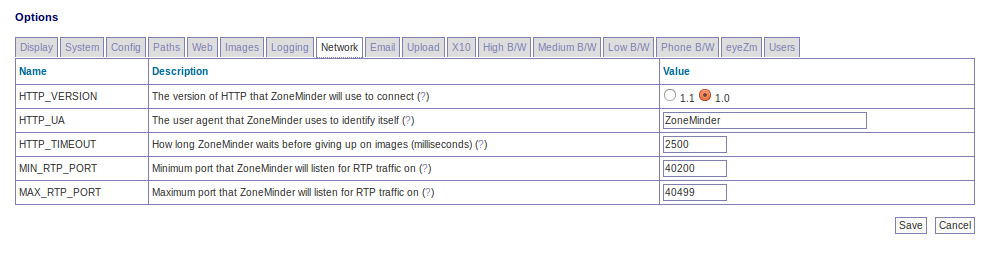

Options - Network
-----------------

HTTP_VERSION - ZoneMinder can communicate with network cameras using either of the HTTP/1.1 or HTTP/1.0 standard. A server will normally fall back to the version it supports with no problem so this should usually by left at the default. However it can be changed to HTTP/1.0 if necessary to resolve particular issues.

HTTP_UA - When ZoneMinder communicates with remote cameras it will identify itself using this string and it's version number. This is normally sufficient, however if a particular cameras expects only to communicate with certain browsers then this can be changed to a different string identifying ZoneMinder as Internet Explorer or Netscape etc.

HTTP_TIMEOUT - When retrieving remote images ZoneMinder will wait for this length of time before deciding that an image is not going to arrive and taking steps to retry. This timeout is in milliseconds (1000 per second) and will apply to each part of an image if it is not sent in one whole chunk.

MIN_STREAMING_PORT - ZoneMinder supports a concept called multi-port streaming. The core concept is that modern browsers like Chrome limit the number of simultaneous connections allowed from a specific domain (host name+port). In the case of Chrome this value is 6, which means you can't see more than 6 simultaneous streams from your server at one time. However, if the streams originated from different ports (or sub domains), this limitation would not apply. When you enable this option with a value (in this case, ``30000``), the streams from the monitors will originate from ``30000`` plus the monitor ID, effectively overcoming this limitation. **Note that this also needs additional setup your webserver configuration before this can start to work**. Please refer to `this article <https://medium.com/zmninja/multi-port-storage-areas-and-more-d5836a336c93>`__ on how to setup multi port streaming on Apache. 

MIN_RTP_PORT - When ZoneMinder communicates with MPEG4 capable cameras using RTP with the unicast method it must open ports for the camera to connect back to for control and streaming purposes. This setting specifies the minimum port number that ZoneMinder will use. Ordinarily two adjacent ports are used for each camera, one for control packets and one for data packets. This port should be set to an even number, you may also need to open up a hole in your firewall to allow cameras to connect back if you wish to use unicasting.

MAX_RTP_PORT - When ZoneMinder communicates with MPEG4 capable cameras using RTP with the unicast method it must open ports for the camera to connect back to for control and streaming purposes. This setting specifies the maximum port number that ZoneMinder will use. Ordinarily two adjacent ports are used for each camera, one for control packets and one for data packets. This port should be set to an even number, you may also need to open up a hole in your firewall to allow cameras to connect back if you wish to use unicasting. You should also ensure that you have opened up at least two ports for each monitor that will be connecting to unicasting network cameras.