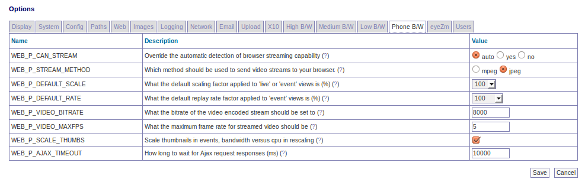

Options - Phone Bandwidth
<<<<<<< HEAD
=========================

=======
-------------------------

WEB_P_CAN_STREAM - Override the automatic detection of browser streaming capability. If you know that your browser can handle image streams of the type 'multipart/x-mixed-replace' but ZoneMinder does not detect this correctly you can set this option to ensure that the stream is delivered with or without the use of the Cambozola plugin. Selecting 'yes' will tell ZoneMinder that your browser can handle the streams natively, 'no' means that it can't and so the plugin will be used while 'auto' lets ZoneMinder decide.

WEB_P_STREAM_METHOD - ZoneMinder can be configured to use either mpeg encoded video or a series or still jpeg images when sending video streams. This option defines which is used. If you choose mpeg you should ensure that you have the appropriate plugins available on your browser whereas choosing jpeg will work natively on Mozilla and related browsers and with a Java applet on Internet Explorer"

WEB_P_DEFAULT_SCALE - Normally ZoneMinder will display 'live' or 'event' streams in their native size. However if you have monitors with large dimensions or a slow link you may prefer to reduce this size, alternatively for small monitors you can enlarge it. This options lets you specify what the default scaling factor will be. It is expressed as a percentage so 100 is normal size, 200 is double size etc.

WEB_P_DEFAULT_RATE - Normally ZoneMinder will display 'event' streams at their native rate, i.e. as close to real-time as possible. However if you have long events it is often convenient to replay them at a faster rate for review. This option lets you specify what the default replay rate will be. It is expressed as a percentage so 100 is normal rate, 200 is double speed etc.

WEB_P_VIDEO_BITRATE - When encoding real video via the ffmpeg library a bit rate can be specified which roughly corresponds to the available bandwidth used for the stream. This setting effectively corresponds to a 'quality' setting for the video. A low value will result in a blocky image whereas a high value will produce a clearer view. Note that this setting does not control the frame rate of the video however the quality of the video produced is affected both by this setting and the frame rate that the video is produced at. A higher frame rate at a particular bit rate result in individual frames being at a lower quality.

WEB_P_VIDEO_MAXFPS - When using streamed video the main control is the bitrate which determines how much data can be transmitted. However a lower bitrate at high frame rates results in a lower quality image. This option allows you to limit the maximum frame rate to ensure that video quality is maintained. An additional advantage is that encoding video at high frame rates is a processor intensive task when for the most part a very high frame rate offers little perceptible improvement over one that has a more manageable resource requirement. Note, this option is implemented as a cap beyond which binary reduction takes place. So if you have a device capturing at 15fps and set this option to 10fps then the video is not produced at 10fps, but rather at 7.5fps (15 divided by 2) as the final frame rate must be the original divided by a power of 2.

WEB_P_SCALE_THUMBS - If unset, this option sends the whole image to the browser which resizes it in the window. If set the image is scaled down on the server before sending a reduced size image to the browser to conserve bandwidth at the cost of cpu on the server. Note that ZM can only perform the resizing if the appropriate PHP graphics functionality is installed. This is usually available in the php-gd package.

WEB_P_AJAX_TIMEOUT - The newer versions of the live feed and event views use Ajax to request information from the server and populate the views dynamically. This option allows you to specify a timeout if required after which requests are abandoned. A timeout may be necessary if requests would overwise hang such as on a slow connection. This would tend to consume a lot of browser memory and make the interface unresponsive. Ordinarily no requests should timeout so this setting should be set to a value greater than the slowest expected response. This value is in milliseconds but if set to zero then no timeout will be used.
>>>>>>> fb436fb... Merge pull request #591 from SteveGilvarry/docs-updates
