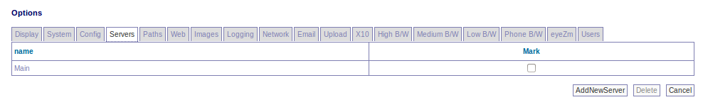

Options - Servers
-----------------

.. todo:: needs to be refreshed

Servers tab is used for setting up multiple ZoneMinder servers sharing the same database and using a shared file share for all event data. To add a new server use the Add Server button. All that is required is a Name for the Server and Hostname.

To delete a server mark that server and click the Delete button.

Please note that all servers must have a functional web UI as the live view must come from the monitor's host server.

On each server, you will have to edit /etc/zm/zm.conf and set either ZM_SERVER_NAME=
