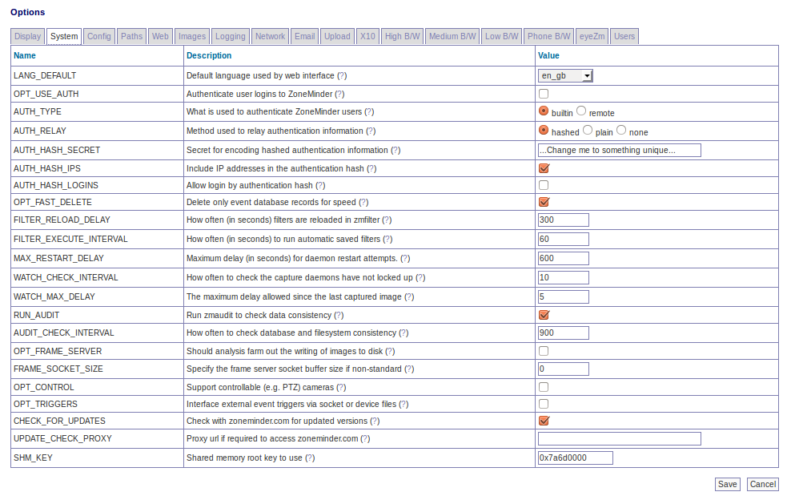

Options - System
----------------
This screen allows the admin to configure various core operations of the system. 

A partial screenshot is shown below:

SKIN_DEFAULT - ZoneMinder allows the use of many different web interfaces. This option allows you to set the default skin used by the website. Users can change their skin later, this merely sets the default.

CSS_DEFAULT - ZoneMinder allows the use of many different web interfaces, and some skins allow the use of different set of CSS files to control the appearance. This option allows you to set the default set of css files used by the website. Users can change their css later, this merely sets the default.

LANG_DEFAULT - ZoneMinder allows the web interface to use languages other than English if the appropriate language file has been created and is present. This option allows you to change the default language that is used from the shipped language, British English, to another language.

OPT_USE_AUTH - ZoneMinder can run in two modes. The simplest is an entirely unauthenticated mode where anyone can access ZoneMinder and perform all tasks. This is most suitable for installations where the web server access is limited in other ways. The other mode enables user accounts with varying sets of permissions. Users must login or authenticate to access ZoneMinder and are limited by their defined permissions. Authenticated mode alone should not be relied up for securing Internet connected ZoneMinder.

AUTH_TYPE - ZoneMinder can use two methods to authenticate users when running in authenticated mode. The first is a builtin method where ZoneMinder provides facilities for users to log in and maintains track of their identity. The second method allows interworking with other methods such as http basic authentication which passes an independently authenticated 'remote' user via http. In this case ZoneMinder would use the supplied user without additional authentication provided such a user is configured in ZoneMinder.

AUTH_RELAY - When ZoneMinder is running in authenticated mode it can pass user details between the web pages and the back end processes. There are two methods for doing this. This first is to use a time limited hashed string which contains no direct username or password details, the second method is to pass the username and passwords around in plaintext. This method is not recommend except where you do not have the md5 libraries available on your system or you have a completely isolated system with no external access. You can also switch off authentication relaying if your system is isolated in other ways.

AUTH_HASH_SECRET - When ZoneMinder is running in hashed authenticated mode it is necessary to generate hashed strings containing encrypted sensitive information such as usernames and passwords. Although these strings are reasonably secure the addition of a random secret increases security substantially. Note that if you are using the new token based APIs, then this field is mandatory with ZM 1.34 and above.

AUTH_HASH_IPS - When ZoneMinder is running in hashed authenticated mode it can optionally include the requesting IP address in the resultant hash. This adds an extra level of security as only requests from that address may use that authentication key. However in some circumstances, such as access over mobile networks, the requesting address can change for each request which will cause most requests to fail. This option allows you to control whether IP addresses are included in the authentication hash on your system. If you experience intermitent problems with authentication, switching this option off may help. It is recommended you keep this off if you use mobile apps like zmNinja over mobile carrier networks - several APNs change the IP very frequently which may result in authentication failures.

AUTH_HASH_TTL - Time before ZM auth will expire (does not apply to API tokens). The default has traditionally been 2 hours. A new hash will automatically be regenerated at half this value.

AUTH_HASH_LOGINS - The normal process for logging into ZoneMinder is via the login screen with username and password. In some circumstances it may be desirable to allow access directly to one or more pages, for instance from a third party application. If this option is enabled then adding an 'auth' parameter to any request will include a shortcut login bypassing the login screen, if not already logged in. As authentication hashes are time and, optionally, IP limited, this can allow short-term access to ZoneMinder screens from other web pages etc. In order to use this, the calling application will have to generate the authentication hash itself and ensure it is valid. If you use this option you should ensure that you have modified the ZM_AUTH_HASH_SECRET to something unique to your system.

ENABLE_CSRF_MAGIC - CSRF stands for Cross-Site Request Forgery which, under specific circumstances, can allow an attacker to perform any task your ZoneMinder user account has permission to perform. To accomplish this, the attacker must write a very specific web page and get you to navigate to it, while you are logged into the ZoneMinder web console at the same time. Enabling ZM_ENABLE_CSRF_MAGIC will help mitigate these kinds of attacks. If you are using zmNinja and face access issues, you might try turning this off.

OPT_USE_API - A global setting to enable/disable ZoneMinder APIs. If you are using mobile apps like zmNinja, this needs to be enabled

.. note:: If you are using zmNinja along with authentication, please make sure ``AUTH_HASH_LOGINS`` is enabled, ``OPT_USE_API`` is elabled, ``AUTH_RELAY`` is set to hashed, ``AUTH_HASH_IPS`` is off and a valid ``AUTH_HASHED_SECRET`` is specified.

OPT_USE_LEGACY_AUTH - Starting version 1.34.0, ZoneMinder uses a more secure Authentication mechanism using JWT tokens. Older versions used a less secure MD5 based auth hash. It is recommended you turn this off after you are sure you don't need it. If you are using a 3rd party app that relies on the older API auth mechanisms, you will have to update that app if you turn this off. Note that zmNinja 1.3.057 onwards supports the new token system.

OPT_USE_EVENT_NOTIFICATION - zmeventnotification is a 3rd party event notification server that is used to get notifications for alarms detected by ZoneMinder in real time. zmNinja requires this server for push notifications to mobile phones. This option only enables the server if it is already installed. Please visit the `Event Notification Server project site <https://github.com/pliablepixels/zmeventserver>`__ for installation instructions.

OPT_USE_GOOG_RECAPTCHA - This option allows you to include a google reCaptcha validation at login. This means in addition to providing a valid username and password, you will also have to pass the reCaptcha test. Please note that enabling this option results in the zoneminder login page reaching out to google servers for captcha validation. Also please note that enabling this option may break 3rd party clients if they rely on web based logins (Note that zmNinja now uses the API based token method and will not be affected if reCAPTCHA is enabled). If you enable this, you also need to specify your site and secret key (please refer to context help in the ZoneMinder system screen).

SYSTEM_SHUTDOWN - this option puts a poweroff icon in the header of the ZM UI for users with System privilege accessi. This icon will allow the user to shutdown the full system via the ZM UI. The system will need to have sudo installed and the following added to /etc/sudoers:

:: 
  
  www-data ALL=NOPASSWD: /sbin/shutdown

to perform the shutdown or reboot

OPT_FAST_DELETE - Normally an event created as the result of an alarm consists of entries in one or more database tables plus the various files associated with it. When deleting events in the browser it can take a long time to remove all of this if youxr are trying to do a lot of events at once. **NOTE**: It is recommended that you keep this option OFF, unless you are running on an old or low-powered system.

FILTER_RELOAD_DELAY - ZoneMinder allows you to save filters to the database which allow events that match certain criteria to be emailed, deleted or uploaded to a remote machine etc. The zmfilter daemon loads these and does the actual operation. This option determines how often in seconds the filters are reloaded from the database to get the latest versions or new filters. If you don't change filters very often this value can be set to a large value. As of 1.34.0 filters should be automatically reloaded when saving a filter so this setting should have little effect.

FILTER_EXECUTE_INTERVAL - ZoneMinder allows you to save filters to the database which allow events that match certain criteria to be emailed, deleted or uploaded to a remote machine etc. The zmfilter daemon loads these and does the actual operation. This option determines how often the filters are executed on the saved event in the database. If you want a rapid response to new events this should be a smaller value, however this may increase the overall load on the system and affect performance of other elements.

MAX_RESTART_DELAY - The zmdc (zm daemon control) process controls when processeses are started or stopped and will attempt to restart any that fail. If a daemon fails frequently then a delay is introduced between each restart attempt. If the daemon stills fails then this delay is increased to prevent extra load being placed on the system by continual restarts. This option controls what this maximum delay is.

STATUS_UPDATE_INTERVAL - The zmstats daemon performs various db queries related to collecting system statistics that may take a long time in the background. This option decides how often this update is scheduled.

WATCH_CHECK_INTERVAL - The zmwatch daemon checks the image capture performance of the capture daemons to ensure that they have not locked up (rarely a sync error may occur which blocks indefinitely). This option determines how often the daemons are checked.

WATCH_MAX_DELAY - The zmwatch daemon checks the image capture performance of the capture daemons to ensure that they have not locked up (rarely a sync error may occur which blocks indefinitely). This option determines the maximum delay to allow since the last captured frame. The daemon will be restarted if it has not captured any images after this period though the actual restart may take slightly longer in conjunction with the check interval value above.  Please note that some cameras can take up to 30 seconds to get a valid image, so this setting should be larger than that.

RUN_AUDIT - The zmaudit daemon exists to check that the saved information in the database and on the filesystem match and are consistent with each other. If an error occurs or if you are using 'fast deletes' it may be that database records are deleted but files remain. In this case, and similar, zmaudit will remove redundant information to synchronise the two data stores. This option controls whether zmaudit is run in the background and performs these checks and fixes continuously. It is recommended you keep this **OFF** in most systems and run it manually if needed after a system crash.

AUDIT_CHECK_INTERVAL - The zmaudit daemon exists to check that the saved information in the database and on the filesystem match and are consistent with each other. If an error occurs or if you are using 'fast deletes' it may be that database records are deleted but files remain. In this case, and similar, zmaudit will remove redundant information to synchronise the two data stores. The default check interval of 900 seconds (15 minutes) is fine for most systems however if you have a very large number of events the process of scanning the database and filesystem may take a long time and impact performance. In this case you may prefer to make this interval much larger to reduce the impact on your system. This option determines how often these checks are performed.

AUDIT_MIN_AGE - The zmaudit daemon exists to check that the saved information in the database and on the filesystem match and are consistent with each other. Event files or db records that are younger than this setting will not be deleted and a warning will be given

OPT_CONTROL - ZoneMinder includes limited support for controllable cameras. A number of sample protocols are included and others can easily be added. If you wish to control your cameras via ZoneMinder then select this option otherwise if you only have static cameras or use other control methods then leave this option off.

OPT_TRIGGERS - ZoneMinder can interact with external systems which prompt or cancel alarms. This is done via the zmtrigger.pl script. This option indicates whether you want to use these external triggers. Most people will say no here.

CHECK_FOR_UPDATES - To save checking manually for each new version ZoneMinder can check with the zoneminder.com website to determine the most recent release. These checks are infrequent, about once per week, and no personal or system information is transmitted other than your current version number. If you do not wish these checks to take place or your ZoneMinder system has no internet access you can switch these check off with this configuration variable.

TELEMETRY_DATA - Enable collection of usage information of the local system and send it to the ZoneMinder development team. This data will be used to determine things like who and where our customers are, how big their systems are, the underlying hardware and operating system, etc. This is being done for the sole purpose of creating a better product for our target audience. This script is intended to be completely transparent to the end user, and can be disabled from the web console under Options. For more details on what information we collect, please refer to Zoneminder's privacy statement (available in the contextual help of TELEMETRY_DATA on your installation).

UPDATE_CHECK_PROXY - If you use a proxy to access the internet then ZoneMinder needs to know so it can access zoneminder.com to check for updates. If you do use a proxy enter the full proxy url here in the form of ``http://<proxy host>:<proxy port>/``.

SHM_KEY - ZoneMinder uses shared memory to speed up communication between modules. To identify the right area to use shared memory keys are used. This option controls what the base key is, each monitor will have it's Id or'ed with this to get the actual key used. You will not normally need to change this value unless it clashes with another instance of ZoneMinder on the same machine. Only the first four hex digits are used, the lower four will be masked out and ignored.

COOKIE_LIFETIME - This will affect how long a session will be valid for since the last request. Keeping this short helps prevent session hijacking. Keeping it long allows you to stay logged in longer without refreshing the view. We recommend you keep this to the default of ``3600`` if you are not sure.

