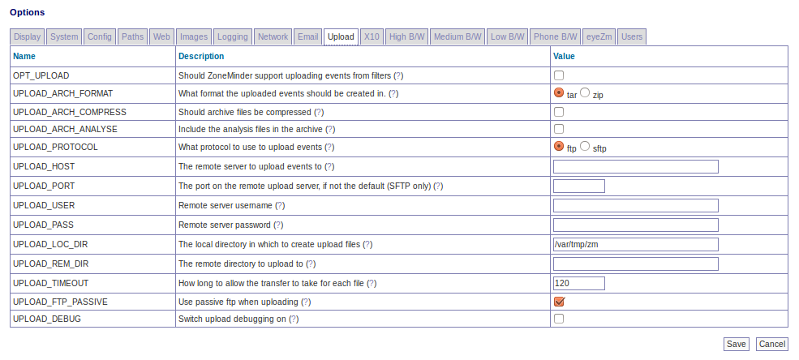

Options - Upload
----------------

A partial screenshot of the upload options is shown below:

OPT_UPLOAD - In ZoneMinder you can create event filters that specify whether events that match certain criteria should be uploaded to a remote server for archiving. This option specifies whether this functionality should be available.

UPLOAD_ARCH_FORMAT - Uploaded events may be stored in either .tar or .zip format, this option specifies which. Note that to use this you will need to have the Archive::Tar and/or Archive::Zip perl modules installed.

UPLOAD_ARCH_COMPRESS - When the archive files are created they can be compressed. However in general since the images are compressed already this saves only a minimal amount of space versus utilising more CPU in their creation. Only enable if you have CPU to waste and are limited in disk space on your remote server or bandwidth.

UPLOAD_ARCH_ANALYSE - When the archive files are created they can contain either just the captured frames or both the captured frames and, for frames that caused an alarm, the analysed image with the changed area highlighted. This option controls files are included. Only include analysed frames if you have a high bandwidth connection to the remote server or if you need help in figuring out what caused an alarm in the first place as archives with these files in can be considerably larger.

UPLOAD_PROTOCOL - ZoneMinder can upload events to a remote server using either FTP or SFTP. Regular FTP is widely supported but not necessarily very secure whereas SFTP (Secure FTP) runs over an ssh connection and so is encrypted and uses regular ssh ports. Note that to use this you will need to have the appropriate perl module, either Net::FTP or Net::SFTP installed depending on your choice.

UPLOAD_HOST - You can use filters to instruct ZoneMinder to upload events to a remote server. This option indicates the name, or ip address, of the server to use.

UPLOAD_PORT - You can use filters to instruct ZoneMinder to upload events to a remote server. If you are using the SFTP protocol then this option allows you to specify a particular port to use for connection. If this option is left blank then the default, port 22, is used. This option is ignored for FTP uploads.

UPLOAD_USER - You can use filters to instruct ZoneMinder to upload events to a remote server. This option indicates the username that ZoneMinder should use to log in for transfer.

UPLOAD_PASS - You can use filters to instruct ZoneMinder to upload events to a remote server. This option indicates the password that ZoneMinder should use to log in for transfer. If you are using certificate based logins for SFTP servers you can leave this option blank.

UPLOAD_LOC_DIR - You can use filters to instruct ZoneMinder to upload events to a remote server. This option indicates the local directory that ZoneMinder should use for temporary upload files. These are files that are created from events, uploaded and then deleted.

UPLOAD_REM_DIR - You can use filters to instruct ZoneMinder to upload events to a remote server. This option indicates the remote directory that ZoneMinder should use to upload event files to.

UPLOAD_TIMEOUT - You can use filters to instruct ZoneMinder to upload events to a remote server. This option indicates the maximum inactivity timeout (in seconds) that should be tolerated before ZoneMinder determines that the transfer has failed and closes down the connection.

UPLOAD_STRICT - You can require SFTP uploads to verify the host key of the remote server for protection against man-in-the-middle attacks. You will need to add the server's key to the known_hosts file. On most systems, this will be ``~/.ssh/known_hosts``, where ``~`` is the home directory of the web server running ZoneMinder.

UPLOAD_FTP_PASSIVE - You can use filters to instruct ZoneMinder to upload events to a remote ftp server. This option indicates that ftp transfers should be done in passive mode. This uses a single connection for all ftp activity and, whilst slower than active transfers, is more robust and likely to work from behind filewalls. This option is ignored for SFTP transfers.

UPLOAD_DEBUG - You can use filters to instruct ZoneMinder to upload events to a remote server. If you are having (or expecting) troubles with uploading events then setting this to 'yes' permits additional information to be generated by the underlying transfer modules and included in the logs.