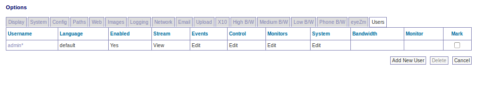
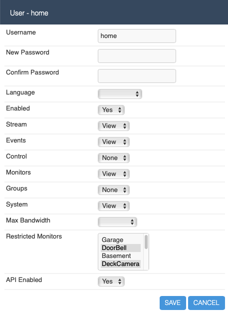

Options - Users
---------------

In this section you will see a list of the current users defined on the system. You can also add or delete users from here. It is recommended you do not delete the admin user unless you have created another fully privileged user to take over the same role. Each user is defined with a name and password (which is hidden) as well as an enabled setting which you can use to temporarily enable or disable users, for example a guest user for limited time access. As well as that there is a language setting that allows you to define user specific languages. Setting a language here that is different than the system language will mean that when that user logs in they will have the web interface presented in their own language rather than the system default, if it is available.

This screen allows you to configure various permissions on a per user basis. The permissions as of today are defined as follows:

- Streams
  - None: the user has no access to view live streams from the defined monitors 
  - View: the user has access to only view live streams from the defined monitors
  - Edit: the user has access to edit live streams from the defined monitors

- Events
  - These permissions relate to the ability to view events from the defined monitors. The permission levels are the same as the Streams permissions, except that they apply to recorded events

- Control
  - These permissions relate to the ability to control Pan/Tilt/Zoom (PTZ) of the defined monitors. The permission levels are the same as the Streams permissions, except that they apply to PTZ

- Monitors
  - specifies whether a user can see the current monitor settings and change them. The permissions levels are the same as the Streams permissions, except that they apply to monitor settings

- Groups
  - specifies whether a user can see monitor groups and change them. The permissions levels are the same as the Streams permissions, except that they apply to groups

- System
  - Determines whether a user can view or modify the system settings as a whole, such as options and users or controlling the running of the system as a whole. The permissions levels are the same as the Streams permissions, except that they apply to groups.

  .. note:: if you are using zmNinja, users are required to have 'View' access to system because multi-server information is only available as part of this permission

- Bandwidth
  - Specifies the maximum bandwith that this user can configure (Low, Medium or High)

- API enabled 
  - Specifies if the ZoneMinder API is enabled for this user (needs to be on, if you are using a mobile app such as zmNinja)

Finally, you can specify a list of monitors this user is allowed to access using the 'Restriced Monitors' list. You can select multiple monitors by shift+click(or command+click) on multiple monitors. If a user with ‘Monitors’ edit privileges is limited to specific monitors here they will not be able to add or delete monitors but only change the details of those they have access to. If a user has ‘System’ privileges then the ‘Monitors Ids’ setting is ignored and has no effect.

Here is an example of a restricted user, for example:

This user "home" is enabled, can view live streams and events, but only from "DoorBell" and "DeckCamera". This user also cannot control PTZ. 