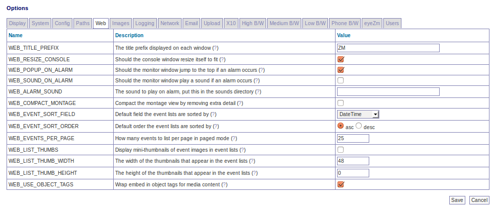

Options - Web
-------------
This screen lets you customize several aspects of the web interface of ZoneMinder. A partial screenshot is shown below:

WEB_TITLE - 

.. todo ::
  not quite sure what this does. Seems to change the "target" name - not sure what effect it is supposed to have.

WEB_TITLE_PREFIX - If you have more than one installation of ZoneMinder it can be helpful to display different titles for each one. Changing this option allows you to customise the window titles to include further information to aid identification.

HOME_URL - the link to navigate to, when a user clicks on the top left title.

HOME_CONTENT - The actual text that is shown on the top left corner. You can choose to leave it empty and put in a logo in a custom CSS as well.

WEB_CONSOLE_BANNER - Allows the administrator to place an arbitrary text message near the top of the web console. This is useful for the developers to display a message which indicates the running instance of ZoneMinder is a development snapshot, but it can also be used for any other purpose as well.

WEB_EVENT_DISK_SPACE - Adds another column to the listing of events showing the disk space used by the event. This will impart a small overhead as it will call du on the event directory. In practice this overhead is fairly small but may be noticeable on IO-constrained systems.

WEB_RESIZE_CONSOLE - Traditionally the main ZoneMinder web console window has resized itself to shrink to a size small enough to list only the monitors that are actually present. This is intended to make the window more unobtrusize but may not be to everyones tastes, especially if opened in a tab in browsers which support this kind if layout. Switch this option off to have the console window size left to the users preference.

WEB_ID_ON_CONSOLE - Some find it useful to have the monitor id always visible on the console. This option will add a column listing it. Note that if it is disabled, you can always hover over the monitor to see the id as well.

WEB_POPUP_ON_ALARM - When viewing a live monitor stream you can specify whether you want the window to pop to the front if an alarm occurs when the window is minimised or behind another window. This is most useful if your monitors are over doors for example when they can pop up if someone comes to the doorway.

WEB_SOUND_ON_ALARM - When viewing a live monitor stream you can specify whether you want the window to play a sound to alert you if an alarm occurs.

WEB_ALARM_SOUND - You can specify a sound file to play if an alarm occurs whilst you are watching a live monitor stream. So long as your browser understands the format it does not need to be any particular type. This file should be placed in the sounds directory defined earlier.

WEB_COMPACT_MONTAGE - The montage view shows the output of all of your active monitors in one window. This include a small menu and status information for each one. This can increase the web traffic and make the window larger than may be desired. Setting this option on removes all this extraneous information and just displays the images.

WEB_EVENT_SORT_FIELD - Events in lists can be initially ordered in any way you want. This option controls what field is used to sort them. You can modify this ordering from filters or by clicking on headings in the lists themselves. Bear in mind however that the 'Prev' and 'Next' links, when scrolling through events, relate to the ordering in the lists and so not always to time based ordering.

WEB_EVENT_SORT_ORDER - Events in lists can be initially ordered in any way you want. This option controls what order (ascending or descending) is used to sort them. You can modify this ordering from filters or by clicking on headings in the lists themselves. Bear in mind however that the 'Prev' and 'Next' links, when scrolling through events, relate to the ordering in the lists and so not always to time based ordering.

WEB_EVENTS_PER_PAGE - In the event list view you can either list all events or just a page at a time. This option controls how many events are listed per page in paged mode and how often to repeat the column headers in non-paged mode.

WEB_LIST_THUMBS - Ordinarily the event lists just display text details of the events to save space and time. By switching this option on you can also display small thumbnails to help you identify events of interest. The size of these thumbnails is controlled by the following two options.

WEB_LIST_THUMB_WIDTH - This options controls the width of the thumbnail images that appear in the event lists. It should be fairly small to fit in with the rest of the table. If you prefer you can specify a height instead in the next option but you should only use one of the width or height and the other option should be set to zero. If both width and height are specified then width will be used and height ignored.

WEB_LIST_THUMB_HEIGHT - This options controls the height of the thumbnail images that appear in the event lists. It should be fairly small to fit in with the rest of the table. If you prefer you can specify a width instead in the previous option but you should only use one of the width or height and the other option should be set to zero. If both width and height are specified then width will be used and height ignored.

WEB_USE_OBJECT_TAGS - There are two methods of including media content in web pages. The most common way is use the EMBED tag which is able to give some indication of the type of content. However this is not a standard part of HTML. The official method is to use OBJECT tags which are able to give more information allowing the correct media viewers etc to be loaded. However these are less widely supported and content may be specifically tailored to a particular platform or player. This option controls whether media content is enclosed in EMBED tags only or whether, where appropriate, it is additionally wrapped in OBJECT tags. Currently OBJECT tags are only used in a limited number of circumstances but they may become more widespread in the future. It is suggested that you leave this option on unless you encounter problems playing some content.

WEB_XFRAME_WARN - When creating a Web Site monitor, if the target web site has X-Frame-Options set to sameorigin in the header, the site will not display in ZoneMinder. This is a design feature in most modern browsers. When this condition occurs, ZoneMinder will write a warning to the log file. To get around this, one can install a browser plugin or extension to ignore X-Frame headers, and then the page will display properly. Once the plugin or extension has ben installed, the end user may choose to turn this warning off

WEB_FILTER_SOURCE - This option only affects monitors with a source type of Ffmpeg, Libvlc, or WebSite. This setting controls what information is displayed in the Source column on the console. Selecting 'None' will not filter anything. The entire source string will be displayed, which may contain sensitive information. Selecting 'NoCredentials' will strip out usernames and passwords from the string. If there are any port numbers in the string and they are common (80, 554, etc) then those will be removed as well. Selecting 'Hostname' will filter out all information except for the hostname or ip address. When in doubt, stay with the default 'Hostname'. This feature uses the php function 'url_parts' to identify the various pieces of the url. If the url in question is unusual or not standard in some way, then filtering may not produce the desired results.