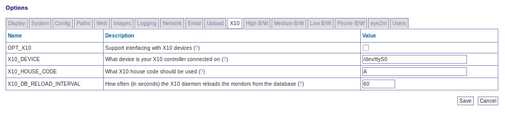

Options - X10
-------------

OPT_X10 - If you have an X10 Home Automation setup in your home you can use ZoneMinder to initiate or react to X10 signals if your computer has the appropriate interface controller. This option indicates whether X10 options will be available in the browser client.

X10_DEVICE - If you have an X10 controller device (e.g. XM10U) connected to your computer this option details which port it is connected on, the default of /dev/ttyS0 maps to serial or com port 1.

X10_HOUSE_CODE - X10 devices are grouped together by identifying them as all belonging to one House Code. This option details what that is. It should be a single letter between A and P.

X10_DB_RELOAD_INTERVAL - The zmx10 daemon periodically checks the database to find out what X10 events trigger, or result from, alarms. This option determines how frequently this check occurs, unless you change this area frequently this can be a fairly large value.