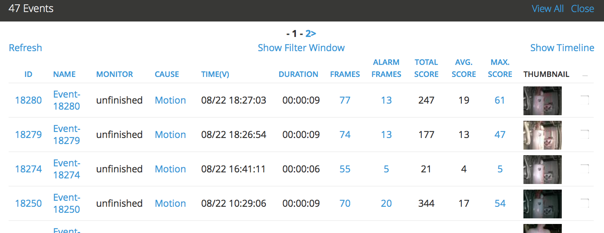
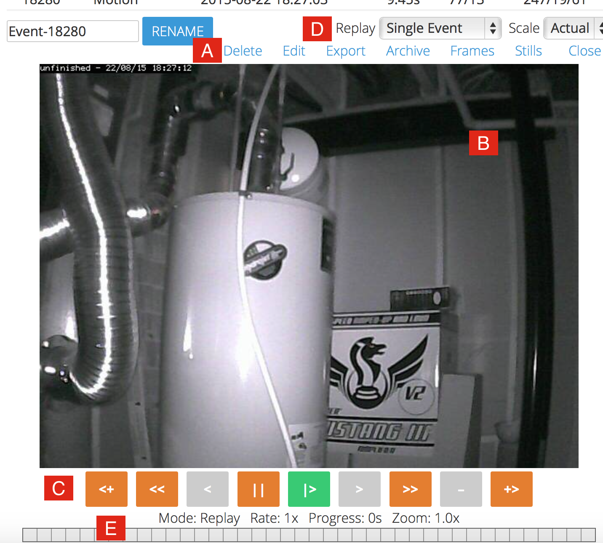

Viewing Events
==============

From the monitor or filtered events listing you can now click on an event to view it in more detail. 

This is an example view that shows events for a specific monitor:

If you have streaming capability you will see a series of images that make up the event. Under that you should also see a progress bar. Depending on your configuration this will either be static or will be filled in to indicate how far through the event you are. By default this functionality is turned off for low bandwidth settings as the image delivery tends to not be able to keep up with real-time and the progress bar cannot take this into account. Regardless of whether the progress bar updates, you can click on it to navigate to particular points in the events.

You will also see a link to allow you to view the still images themselves. If you don't have streaming then you will be taken directly to this page. The images themselves are thumbnail size and depending on the configuration and bandwidth you have chosen will either be the full images scaled in your browser of actual scaled images. If it is the latter, if you have low bandwidth for example, it may take a few seconds to generate the images. If thumbnail images are required to be generated, they will be kept and not re-generated in future. Once the images appear you can mouse over them to get the image sequence number and the image score.

Here is an example of viewing an event stream:

The image above shows a typical window for an event that was recorded as an MP4 video
