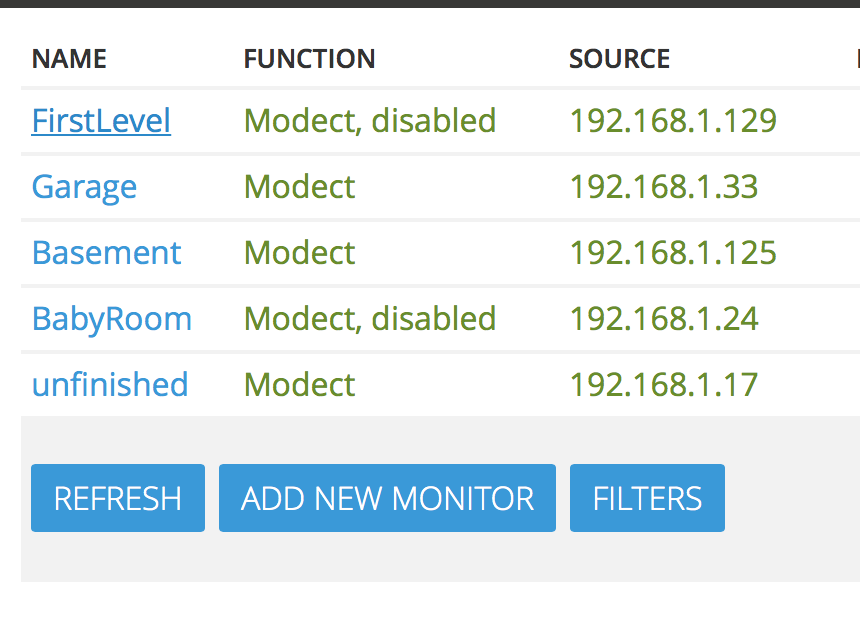
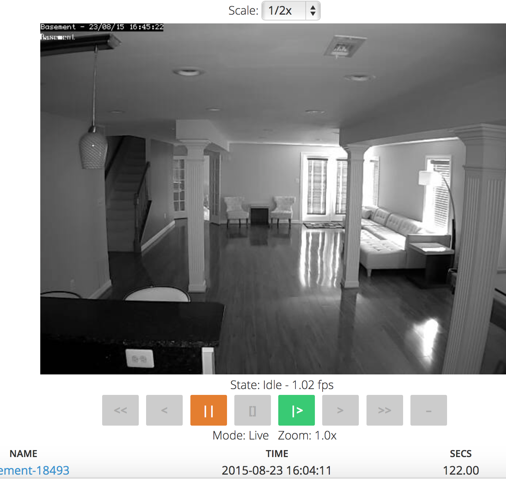

Viewing Monitors
================

ZoneMinder allows you to view a live feed of your configured monitors. One can access this view by clicking on the "Name" column of any of the monitors

Clicking on the name produces a view similar to this:

The image should be self-explanatory but if it looks like garbage it is possible that the video configuration is wrong so look in your system error log and check for or report anything unusual. The centre of the window will have a tiny frame that just contains a status; this will be 'Idle', 'Alarm' or 'Alert' depending on the function of the Monitor and what's going on in the field of view. Idle means nothing is happening, Alarm means there is an alarm in progress and Alert means that an alarm has happened and the monitor is ‘cooling down’, if another alarm is generated in this time it will just become part of the same event. These indicators are colour coded in green, red and amber.

By default if you have minimised this window or opened other windows in front it will pop up to the front if it goes to Alarm state. This behaviour can be turned off in ‘options’ if required. You can also specify a sound file in the configuration, which will be played when an alarm occurs to alert you to the fact if you are not in front of your computer. This should be a short sound of only a couple of seconds ideally. Note that as the status is refreshed every few seconds it is possible for this not to alert you to every event that takes place, so you shouldn't rely on it for this purpose if you expect very brief events. Alternatively you can decrease the refresh interval for this window in the configuration though having too frequent refreshing may impact on performance.

Below the status is a list of recent events that have occurred, by default this is a listing of just the last 10 but clicking on 'All' will give you a full list and 'Archive' will take you to the event archive for this monitor, more on this later. Clicking on any of the column headings will sort the events appropriately.

From here you can also delete events if you wish. The events themselves are listed with the event id, and event name (which you can change), the time that the event occurred, the length of the event including any preamble and postamble frames, the number of frames comprising the event with the number that actually contain an alarm in brackets and finally a score. This column lists the average score per alarm frame as well as the maximum score that any alarm frame had.

The score is an arbitrary value that essentially represents the percentage of pixels in the zone that are in blobs divided by the square root of the number of blobs and then divided by the size of the zone. This gives a nominal maximum of 100 for a zone and the totals for each zone are added together, Active zones scores are added unchanged, Inclusive zones are halved first and Exclusive zones are doubled. In reality values are likely to be much less than 100 but it does give a simple indication of how major the event was. 
