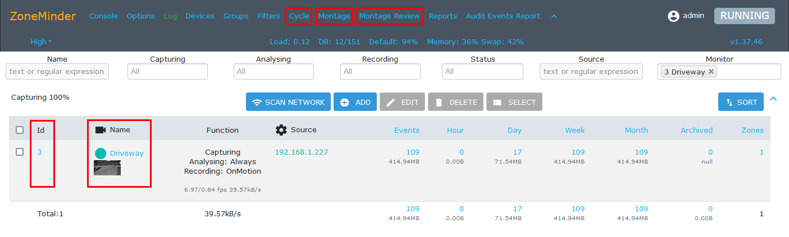
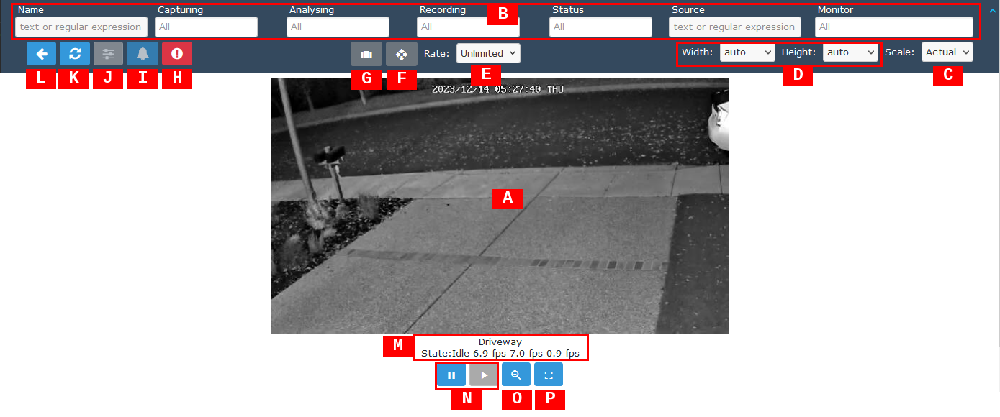
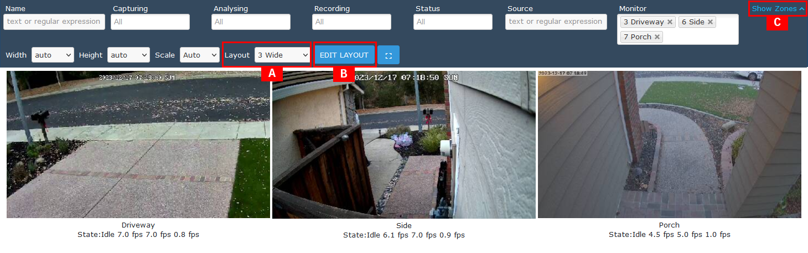
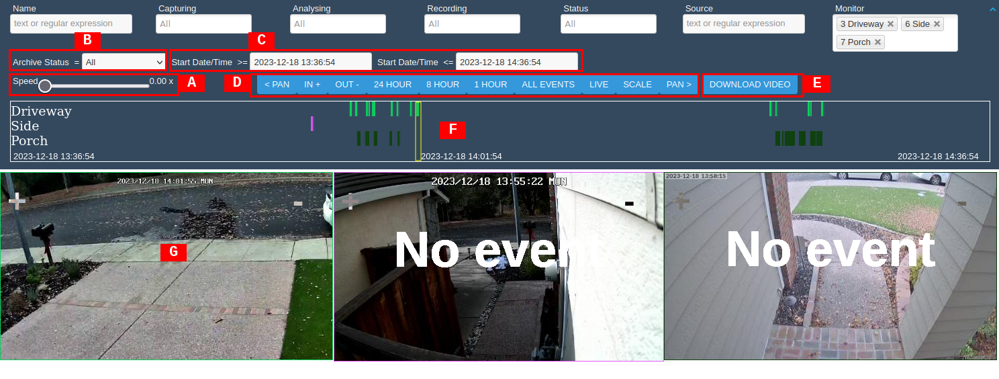
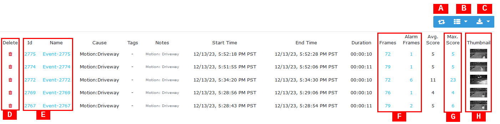

Viewing Monitors
================

Several methods for viewing live streams from monitors are available in ZoneMinder. The common entry points for viewing monitors are highlighted in the Console as shown below.

    Methods for Viewing Monitors

Monitor View
    The `Monitor View`_ displays a live feed for a single selected monitor. There are several ways to enter the Monitor View.

    - Monitor Id: Click on any available monitor Id such as :guilabel:`3` in the example above to display a live feed.
    - Name: Click on any available monitor Name such as :guilabel:`Driveway` to display a live feed.
    - Thumbnail: Click on any available monitor thumbnail image to display a live feed.

Cycle
    The `Cycle`_ monitor view displays a rotating view for each selected monitor. Click on :guilabel:`Cycle` to open the Cycle view.
Montage
    The `Montage`_ monitor view displays several monitors simultaneously. The Montage view is highly configurable and is useful for applications where a continuous monitor view is needed. Click on :guilabel:`Montage` to open the Montage view.
Montage Review
    The `Montage Review`_ monitor view is similar to Montage view but provides access to viewing the available events captured by each monitor. Click on :guilabel:`Montage Review` to open the Montage Review view.

Monitor View
------------

    Monitor View

The Monitor View is useful for continuous viewing of a single monitor live stream. The currently displayed monitor can be changed by selecting a new one in the Monitor input field of the Console Filter. By default, if the Monitor View window is minimized or other windows are in front, the Monitor View will move to the foreground if the monitor enters Alarm state. This behaviour can be disabled with the **WEB_POPUP_ON_ALARM** option. Additionally, a sound can be played when the monitor enters Alarm state. This can be enabled with the **WEB_SOUND_ON_ALARM** and **WEB_ALARM_SOUND** options. A list of events will be shown below the monitor live stream if the monitor has recording enabled. Please refer to the :doc:`viewevents` section for information about viewing events as this part of the Monitor View will not be discussed in this section.

[A] Monitor View
    Shows the selected monitor live view. The view can be adjusted using the mouse as follows. Use left mouse button :kbd:`LMB` to zoom in, use :kbd:`CTRL-LMB` to zoom out and use :kbd:`SHIFT-LMB` to pan.
[B] Console Filter
    The Console Filter is available in the Monitor view at the top of the display. However, the only relevant filter item while in Monitor View is Monitor which can be used to change the live view to another available monitor.
[C] Scale
    Sets the relative size of Monitor live view in the web interface. Scale factors from :guilabel:`1/8x` to :guilabel:`4x` are available. Note that the :guilabel:`Auto` scale will allow the Monitor live view to fill the screen when Fullscreen is activated.
[D] Width/Height
    Allows manual control of the individual width and height of Monitor live view. Various useful sizes based on pixel units are available. Note that this only applies for viewing and does not change the monitor setting.
[E] Rate
    Sets the rate at which monitor live view image is updated. This is useful for reducing the update frequency in order to reduce CPU resources. Rates from :guilabel:`1 fps` to :guilabel:`20 fps` are available. The default :guilabel:`Unlimited` sets the display rate to the monitor's defined frame rate. Note that this only applies for viewing. This does not change the frame rate of the monitor itself.
[F] PTZ Controls Sidebar
    Activates the PTZ Control Sidebar if the monitor is configured to use Controls. See :doc:`cameracontrol` for more information about Camera Control.
[G] Cycle View Sidebar
    Activates the Cycle View Sidebar. Essentially this changes viewing mode to `Cycle`_.
[H] Force Alarm
    Manually triggers an alarm for the monitor. Useful for setup and debug of monitors and events. Click once to trigger the alarm. Second click ends the alarm.
[I] Disable Alarms
    Manually disable alarms for the monitor. Note that this is only for viewing and does not change the monitor settings related to alarm triggering.
[J] Local Monitor Settings
    Access to local monitor settings. Only applies to Local (USB webcam) monitor types and is greyed out for all other monitor types.
[K] Refresh
    Refresh the Monitor View interface.
[L] Back
    Return to previous web interface page.
[M] Monitor Status
    Displays basic monitor status: alarm state, viewing FPS, capturing FPS and analysis FPS. The status has three states: ``Idle``, ``Alarm`` or ``Alert`` depending on the function of the Monitor and its defined zones. ``Idle`` is the default state when no activity is detected in the defined zones, ``Alarm`` means there is an alarm in progress and ``Alert`` means that an alarm has recently ended. If another alarm is generated during this time it will be appended to the event. The Monitor Status is colour coded in black for ``Idle``, red for ``Alarm`` and amber for ``Alert``.
[N] Pause/Play
    Pause live view of monitor by clicking pause icon. Note that this only for viewing and does not change the monitor setting. Play will restart live view streaming of monitor after Pause has been activated.
[O] Zoom Out
    Zoom Out the monitor live view. This is only useful if the view has previously been zoomed in. Zoom Out will stop when the full image size has been reached.
[P] Fullscreen
    Enter Fullscreen monitor display mode. Note that the monitor live stream will not utilize the entire screen as the Pause, Play, Zoom and Exit Fullscreen icons will always be placed at bottom of screen. The monitor event list may also be placed at bottom of screen if Scale or Width/Height is not set to :guilabel:`Auto`. Press :kbd:`ESC` or the Exit Fullscreen icon to exit Fullscreen mode.

Cycle
-----

.. figure:: viewmonitors/images/view-monitor-cycle.png

    Monitor Cycle View

The Cycle view is essentially the same as the `Monitor View`_ except that it sequences through a list of monitors. The example above has monitors ``3``, ``6`` and ``7`` selected for a Cycle view. The list of monitors to include in a Cycle view are selectable as well as the display time for each monitor. Please note that the functions and control icons remain the same as `Monitor View`_ except for the ones listed below.

[A] Display Time
    Selects length of display time for each monitor before changing to next monitor. Display time can be set between :guilabel:`5 seconds` and :guilabel:`5 minutes`.
[B] Pause/Play/Back/Forward
    Pause the Cycle at the currently displayed monitor. Play icon re-starts the rotation of monitor views. Back and forward icons will immediately move to the previous or next monitor live stream.
[C] Monitor
    Currently displayed monitor live stream is highlighted in blue.

Montage
-------

    Monitor Montage View

The Montage view is similar to the `Monitor View`_ except that it displays several monitors simultaneously. The Console Filter is fully available and can be used to filter and select the monitors to be included in the Montage view. The example above has monitors ``3``, ``6`` and ``7`` selected for a Montage view. Please note that the functions and control icons remain the same as `Monitor View`_ except for the ones listed below.

[A] Layout
    Select layout preset arrangement of monitor displays.
[B] Edit Layout
    Customized montage view settings can be edited and saved.
[C] Show/Hide Zones
    Enable or disable overlay of currently defined zone regions on each monitor live stream.

Montage Review
--------------

    Monitor Montage View

The Montage Review view builds upon the `Montage`_ view by adding access to saved events. The example above has monitors ``3``, ``6`` and ``7`` selected for a Montage Review view. The Montage Review provides flexible methods for reviewing saved events. The primary method to set the timeline for reviewing events is to use the timeline icons to set the scope of the timeline. The secondary method is to use the calendar pop-up function from the Start Date/Time entry box to set specific dates and times for the scope of the timeline.

[A] Speed
    Adjusts the playback speed for the monitor views using a slider. Playback speed can be adjusted between :guilabel:`0.10x` and :guilabel:`50.00x`. To pause the display, select :guilabel:`0.00x`.
[B] Archive Status
    Selection to display only :guilabel:`Archived` or :guilabel:`Unarchived` events using a pull-down menu. Default setting is :guilabel:`All` which will display both Archived and Unarchived events in the timeline.

.. figure:: viewmonitors/images/view-monitor-datetime.png
    :align: right
    :figwidth: 200px

    Calendar Input for Date/Time

[C] Start Date/Time >= and Start Date/Time <=
    Displays the timeline span in terms of date and time. Default setting for the timeline is a one-hour span that ends with the current time. The start and end times for the span can be manually selected by clicking on the entry form. A calendar window will pop up to define the desired date and time.
[D] Timeline Controls
    Control functions are available to set the timeline span (:guilabel:`24 HOUR`, :guilabel:`8 HOUR`, :guilabel:`1 HOUR`, and :guilabel:`ALL EVENTS`) as well as pan and zoom (:guilabel:`< PAN`, :guilabel:`PAN >`, :guilabel:`IN +`, :guilabel:`OUT -`). Switch to monitor live-streaming view using :guilabel:`LIVE`.
[D] Scale/Fit
    Changes the display size of the monitor views using a slider when :guilabel:`SCALE` is clicked. Scale values of :guilabel:`0.10x` to :guilabel:`1.00x` are available. This is useful to either reduce or increase the relative size of the monitor views to fit better on the Montage Review view. Use the :guilabel:`FIT` button to automatically fit the monitor views to the Montage Review display. Note that the :guilabel:`FIT` button is only available after :guilabel:`SCALE` has been activated.
[E] Download Video
    Downloads the events shown in the timeline. A filename will be automatically generated. Select between ``tar`` and ``zip`` archive formats for the file export.
[F] Timeline
    Displays the events available in the currently selected span. Events for each monitor are indicated by a distinct colour band. The timeline pointer indicated by yellow box indicates the currently displayed events in the monitor views. If there are no events within the timeline pointer, a **No Event** overlay is shown in the monitor view. In this case, the monitor view may display the final frame of previously viewed event.
[G] Monitor Display
    Displays the currently selected event based on the timeline pointer. If there are no events within the timeline pointer, a **No Event** overlay is shown in the monitor view. In this case, the monitor view may display the final frame of previously played event.

Monitor Events
--------------

    Monitor View Events List

If recorded events are available, they will be presented below the monitor images for both Monitor View and Cycle modes. This section will only introduce some of the features of the Monitor Events list. For a more in-depth description of Monitor Events, please see the :doc:`viewevents` section of the User Guide.

[A] Refresh
    Refresh the Monitor Events list.
[B] Event Columns
    Add or remove columns for the Monitor Events list.
[C] Download Event Information
    Download a file containing the monitor event list. Various file formats are available.
[D] Delete Event
    Delete individual event.
[E] Display Event
    Display event image stream by selecting either event Id or Name.
[F] Display Frames
    Display a list of frames for the event.
[G] Max. Score
    Display frame with maximum alarm score.
[H] Thumbnail
    Display event image stream by clicking on thumbnail image.
